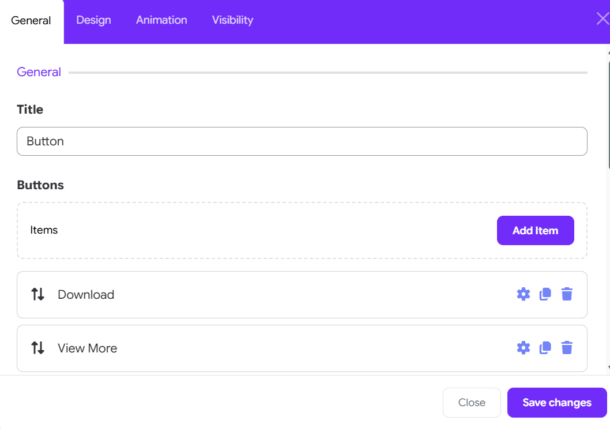
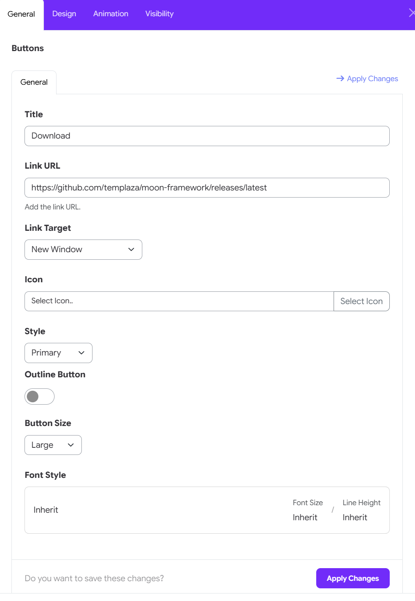
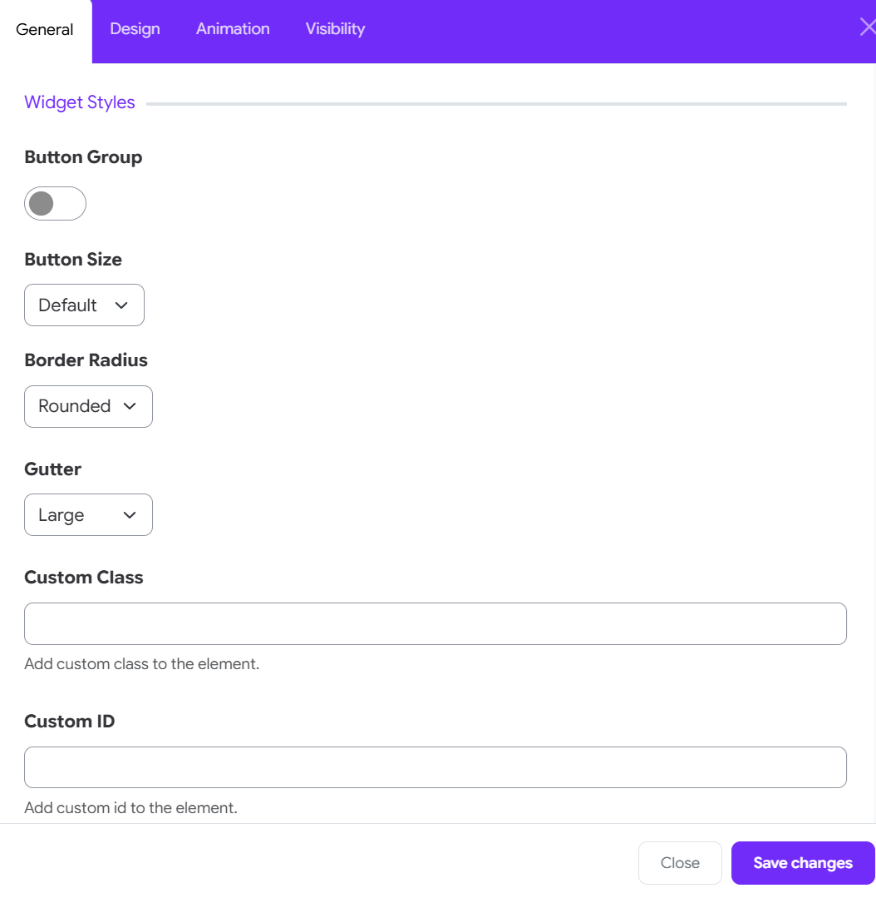

# Button

The **Button Widget** in Moon Framework allows you to create stylish, customizable buttons that link to internal or external pages. You can also configure icons, styles, sizes, and even dynamic content for enhanced flexibility.

## 📌 Where to Find It

1. Go to your Moodle Administrator > Appearance > Themes > Moon theme's settings
2. Open the **Layout** tab
3. Add a new element > choose Button widget

## ⚙️ General Settings

Click on the Add Item button to add a new button

### Title
- This is the visible label of the button.

### Link
- The URL the button will point to.
- You can use any internal or external link (e.g., `https://astroidframe.work/`).

### Link Target
- Choose how the link opens:
    - `Default`: Follows the normal behavior.
    - `_blank`: Opens in a new window/tab.
    - `_parent`: Opens in the parent frame.
    - `_top`: Opens in the full window.

### Icon
- Add an icon next to the button label.
- You can choose from the icon library.

### Style
- Choose from default Bootstrap button styles:
    - Primary, Secondary, Success, Danger, Warning, Info, Light, Dark, Link, Text, Custom.

### Outline Button

- **Outline**: Toggle an outline style.

### Font style

- Configure font style of the button text.

## 🎨 Widget Styles

### Button Group

- Toggle to group multiple buttons together for aligned display.

### Button Size
- Default
- Large (`btn-lg`)
- Small (`btn-sm`)
- Custom
    - Font family, font size, and line height can be adjusted.
    - When size is set to Custom, you can manually adjust padding.

### Border Radius
- Choose from:
    - Rounded (default)
    - Square (`rounded-0`)
    - Circle (`rounded-pill`)

### Gutter

- Adjust spacing between buttons in group layout.

 