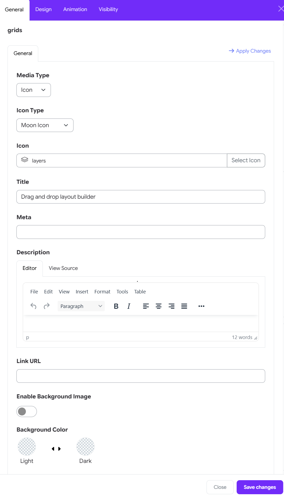
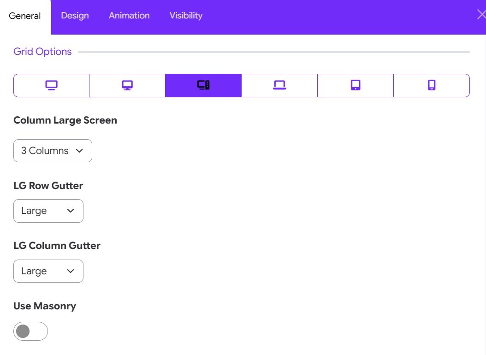
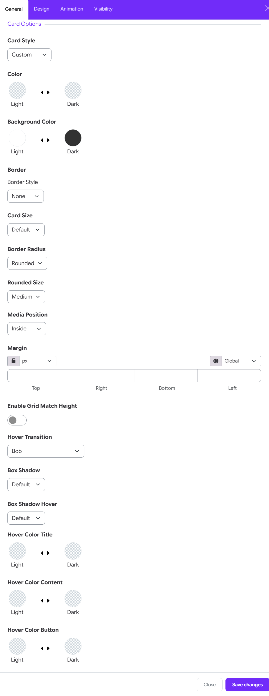
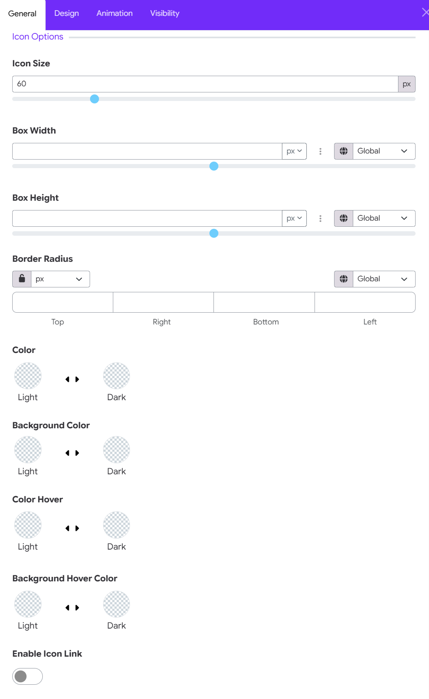
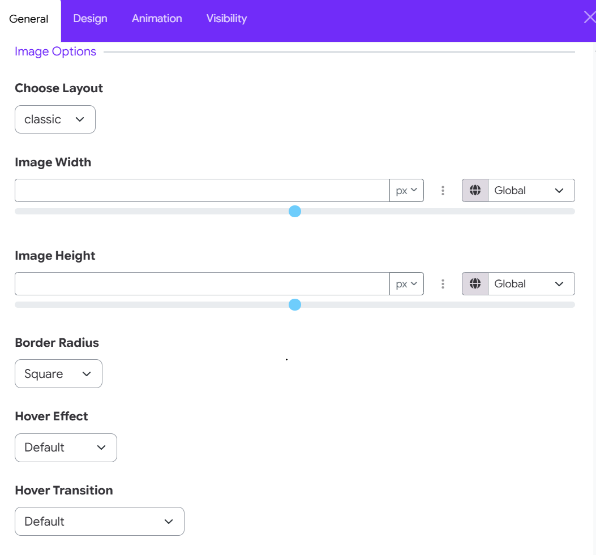
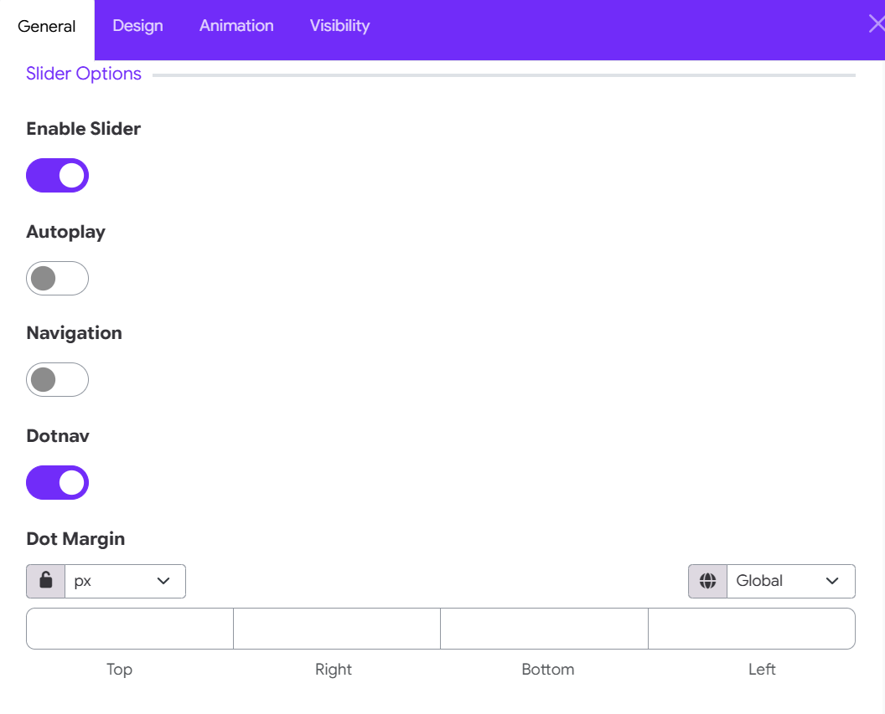
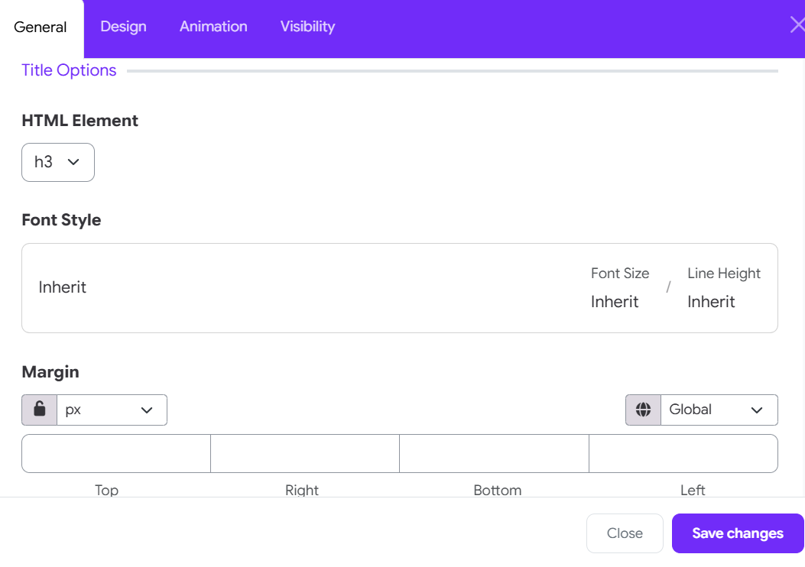
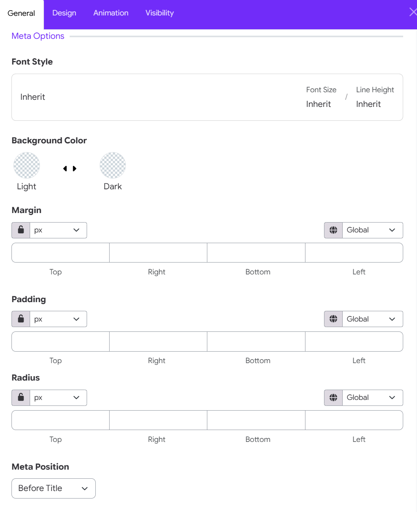
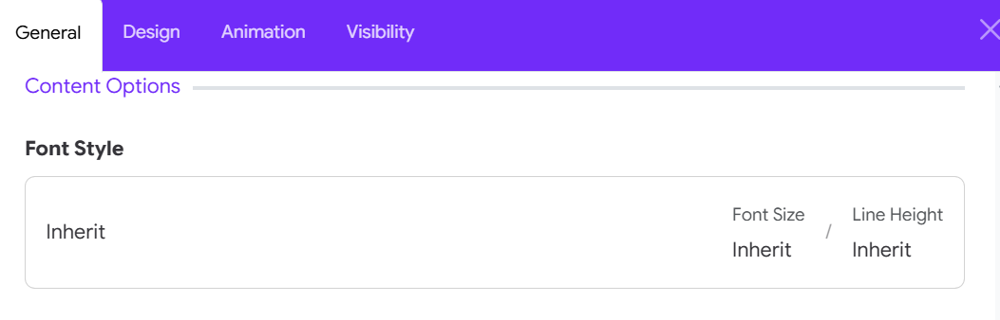
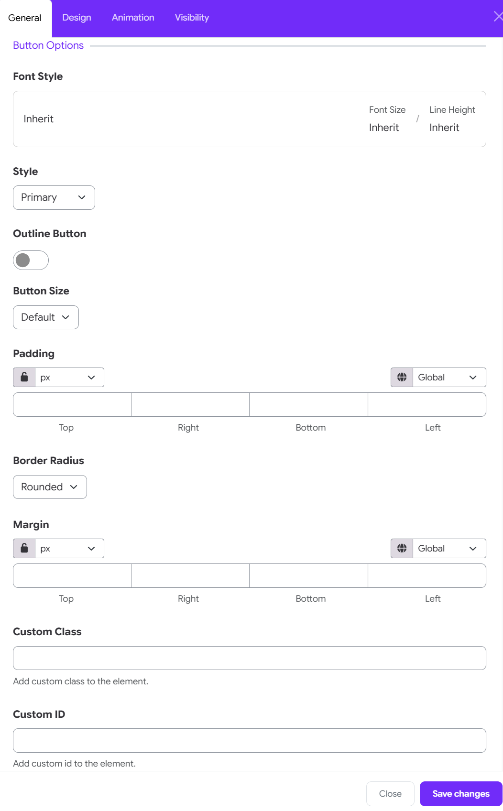

# Grid Widget

The **Grid Widget** helps you create sections with multiple columns. You can place different content in each column (like text, images, buttons) and make your page look clean, organized, and responsive.
The Grid Widget is like a container that holds **columns**. Each column can have different content.

For example:
- You can split your page into **2 or 3 columns**
- In each column, you can add **Text, Images, Buttons, etc.**

# When to Use It?

- To show **text and image side by side**
- To create a **3-column feature section**
- To display **team members**, **services**, or **product boxes**

# How to Use Grid Widget

## 1. Add a Grid Widget
1. Go to your **Layout Builder**
2. Click **Add Element**
3. Choose **Grid** from the list

## 2. Add Grid Items

- Click **“Add Item”** inside the Grid
- You can add **2, 3, or more items**

### Media & Icon Setup

- **Media Type**: Select Icon (or Image, depending on your design preference).   

- **Icon Type**: Choose an icon type (Moon Icon, Fontawesome or Custom).

- **Icon**: Choose an icon from the library.

Type the icon key name directly (e.g., layers) into the text field. Alternatively, click Select Icon to pick a visual icon from the popup library.

### Content Details

- **Title**: Enter the primary heading for the grid item card (e.g., Drag and drop layout builder).

- **Meta**: Add optional metadata, tags, or subtitle text in this field (leave blank if not needed).

- **Description**: Use the WYSIWYG editor to add the main text body:   
  
   * Switch between the Editor view and View Source (HTML mode).
   * Format text with headers, bold, italics, alignment, or lists.   

## Link & background

- **Link URL**: Paste a relative Moodle link or external URL to make the entire grid item clickable.

- **Enable Background Image**: Toggle the switch to ON if you want to upload a background photo for this specific item.

- **Background Color**: Choose custom color themes for both Light and Dark modes using the color pickers.

## 3. Grid Options

### Set Responsive Viewport Settings

At the top of the panel, click on a device icon to customize the layout for specific screen resolutions:

- Extra Large Displays / TV: Ultra-wide desktop screens.

- Large Desktop: Standard widescreen monitors.

- Medium Desktop / Laptop: Laptops or smaller monitors.

- Small Tablet / Horizontal: Landscape tablet orientation.

- Portrait Tablet: Standard tablet orientation.

- Mobile Devices: Mobile phone screens.

### Configure Screen Layout & Spacing

- **Column layout**: Column [Viewport Size]: Choose the number of grid columns displayed simultaneously for the selected device breakpoint (e.g., 3 Columns).

- **Row Gutter**: Set the vertical spacing between grid rows (e.g., Large, Medium, Small, or None).

- **Column Gutter**: Set the horizontal spacing between grid columns.

### Dynamic Layout Controls

- **Use Masonry**: Toggle ON to enable dynamic tile positioning based on content height, filling in empty vertical spaces automatically.

## 4. Card Options

### Style & Preset Theme

- **Card Style**: Select a predefined card design or set to Custom to manually adjust individual styling options.

- **Color**: Choose text and general item colors for both Light and Dark site themes.

- **Background Color**: Set custom background fill colors for Light and Dark modes.

### Border & Sizing

- **Border Style**: Choose the outline style (e.g., None, Solid, Dotted).

- **Card Size**: Adjust overall card padding and scale (e.g., Default, Compact, Large).

- **Border Radius & Rounded Size**: Set corner rounding (e.g., Rounded, Square) and choose the curve intensity (e.g., Medium).

### Layout, Spacing & Alignment

- **Media Position**: Determine where the icon/image sits relative to card content (e.g., Inside, Top, Left).

- **Margin**: Set outer spacing for Top, Right, Bottom, and Left sides.

Use the Unit Selector (e.g., px, em, %) and toggle the Lock Icon to adjust sides individually or together.

- **Enable Grid Match Height**: Toggle ON to automatically force all cards in the same row to match the height of the tallest card.

### Shadows & Animations

- **Hover Transition**: Choose an interactive animation when users hover over a card (e.g., Bob, Zoom, Lift).

- **Box Shadow**: Select the default shadow level (depth) for resting cards.

- **Box Shadow Hover**: Set the shadow intensity when the card is actively hovered.

### Hover Color Customization

Set dynamic hover colors for Light and Dark themes across specific elements:

- **Hover Color Title**: Defines the title text color on hover.

- **Hover Color Content**: Defines description and body text colors on hover.

- **Hover Color Button**: Defines action button colors on hover.

## 5. Icon Options

### Icon & Container Sizing

- **Icon Size**: Adjust the icon size using the numerical input field or slider (e.g., 60px).

- **Box Width**: Set the width of the container box enclosing the icon using the slider or dropdown unit selector (px, %, em).

- **Box Height**: Set the height of the container box enclosing the icon using the slider or unit selector.

### Container Border Radius

Border Radius: Customize the corner rounding of the icon box container for Top, Right, Bottom, and Left edges.   
- Select your unit (e.g., px).   
- Toggle the Lock Icon to adjust all sides together or edit each corner individually.

### Configure Colors & Hover States

- **Color**: Choose the default icon color for both Light and Dark themes.   
- **Background Color**: Set the background color for the icon's container box for Light and Dark themes.
- **Color Hover**: Define the color the icon changes to when hovered over in Light and Dark modes.   
- **Background Hover Color**: Define the container box background color on hover for Light and Dark modes.

### Configure Icon Behavior

- **Enable Icon Link**: Toggle ON if you want the icon itself to act as an independent clickable link

## 6. Image Options

### Configure Layout & Dimensions

- **Choose Layout**: Select how the image will be positioned or displayed within the grid card (e.g., classic, overlay, full width).
- **Image Width**: Adjust the width of the media container using the slider or input field. Choose your unit of measurement (px, %, em) via the dropdown menu.   
- **Image Height**: Control the height of the image using the slider or input field with the unit selector.

### Borders & Interactive Effects

- **Border Radius**: Select the corner curvature style for the image (e.g., Square, Rounded, Circle).
- **Hover Effect**: Choose a visual filter or effect when users hover over the image (e.g., Default, Grayscale, Blur, Brightness).   
- **Hover Transition**: Choose a motion or animation style applied during the hover state (e.g., Default, Zoom In, Rotate, Slide).

## 7. Slider Options

### Configure Slider Behavior & Navigation

- **Enable Slider**: Toggle ON to transform your grid layout into a horizontal carousel/slider.   
- **Autoplay**: Toggle ON to automatically cycle through grid items without user interaction.   
- **Navigation**: Toggle ON to display directional arrow controls (previous/next).   
- **Dotnav**: Toggle ON to display pagination dots beneath the slider.   
- **Dot Margin**: Set outer spacing for the pagination dots using Top, Right, Bottom, and Left inputs.   
  * Select your unit (e.g., px).   
  * Toggle the Lock Icon to adjust all sides together or set them individually.

## 8. Title Options

### Configure Hierarchy, Typography & Spacing

- **HTML Element**: Select the HTML tag for the card title (e.g., h1, h2, h3, h4, h5, h6, p, or div).   
Default: h3. Using heading tags helps search engines and screen readers parse the document structure correctly. 

- **Font Style**: Click to customize specific typography properties for the card title, or leave set to Inherit to adopt the default theme settings:   Font Size: Override default font sizing (e.g., set explicitly or keep as Inherit).   
- **Line Height**: Adjust line spacing for multi-line titles (e.g., set explicitly or keep as Inherit).
- **Margin**: Set outer spacing around the title element for Top, Right, Bottom, and Left edges.   
   * Choose your unit of measurement (e.g., px, %, em) via the dropdown menu.   
   * Toggle the Lock Icon to link all four sides together or unlock it to set custom spacing per side. 

## 9. Meta Options 

### Configure Typography, Colors & Spacing

- **Font Style**: Customize text properties for the meta field (e.g., set explicit Font Size or Line Height), or leave as Inherit to use theme defaults.
- **Background Color**: Set custom fill colors for the meta badge/container across Light and Dark site themes.
- **Margin**: Set outer spacing around the meta container for Top, Right, Bottom, and Left edges.   
- **Padding**: Set inner spacing between the meta text and its container border for Top, Right, Bottom, and Left edges.   
- **Radius**: Customize corner rounding for the meta badge container across Top, Right, Bottom, and Left corners.   
- **Controls**: For Margin, Padding, and Radius, select your preferred unit (px, %, em) and use the Lock Icon to link or unlink sides.
- **Meta Position**: Choose where the meta text appears relative to the title (Before title, After title, Top left, Top center, ... )

## 10. Content Options

Click on the setting icon and you can configure body typography:

* Font Family
* Font Size
* Font Weight
* Text Transform
* Font Style
* Letter Spacing
* Line Height

## 11. Button Options

### Typography & Theme Preset

- **Font Style**: Click to adjust Font Size or Line Height, or leave set to Inherit to match site theme default typography.   
- **Style**: Choose a button theme variant from the dropdown (e.g., Primary, Secondary, Success, Danger).   
- **Outline Button**: Toggle ON to display a transparent background with a colored border instead of a solid fill. 

### Size, Shape & Spacing

- **Button Size**: Select the pre-defined button scale (e.g., Default, Small, Large).   
- **Padding**: Customize internal spacing between button label text and borders for Top, Right, Bottom, and Left edges.   
- **Border Radius**: Choose corner curvature style (e.g., Rounded, Square, Pill).   
- **Margin**: Set outer spacing around the button for Top, Right, Bottom, and Left sides.   
  
     * Controls: For Padding and Margin, choose your unit (px, %, em) and toggle the Lock Icon to set sides together or unlinked. 