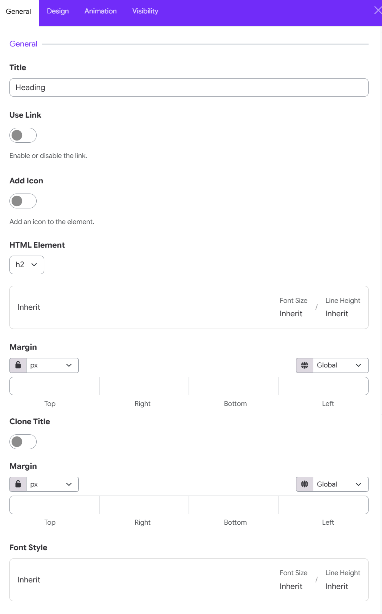
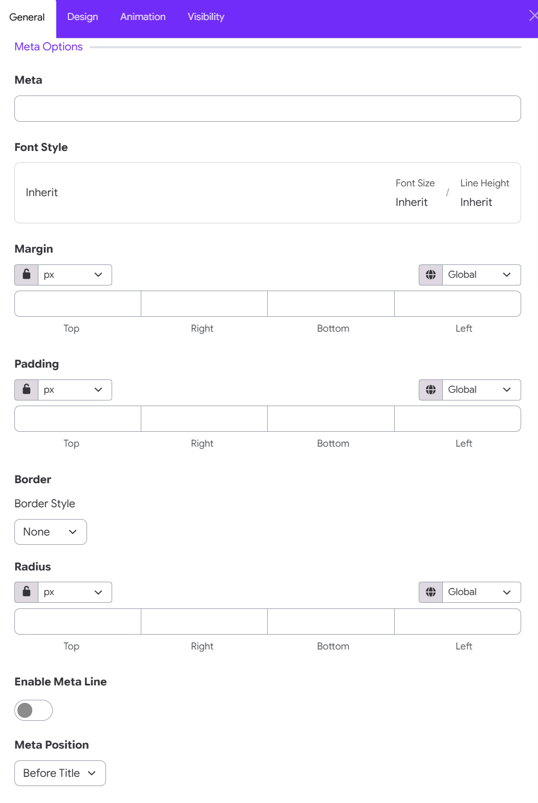

# Heading Widget

The Heading Widget in Moon Framework allows you to add clear, structured headings to any section of your Moodle website. It is ideal for page titles, section headings, subtitles, and short introductory headings.

Unlike the Text Widget, which is designed for headings together with longer formatted content, the Heading Widget focuses specifically on creating clean, visually consistent headings.

## 1. How to add the Widget

To add a Heading Widget to your layout:

1. Open the **Moon Layout Builder**.
2. Open an existing layout or create a new one.
3. Select the **Section**, **Row**, and **Column** where you want to place the text.
4. Click **Add Element**.
5. Select **Text**.
6. Open the Heading Widget settings.
7. Configure the content and design options.
8. Click **Save changes**.

## 2. Configure General Settings

The General tab contains the core options for configuring the Heading widget, including the heading text, link, icon, HTML element, spacing, and typography.

### Title

Enter the text you want to display as the heading.

### Use Link

Enable this option to make the heading clickable and link it to a specified URL. When enabled, additional link settings become available.

> **Enable or disable the link.**

### Add Icon

Enable this option to add an icon to the heading. This can be useful for adding a visual element before or after the heading text.

>Tip: Choose an icon that supports the meaning of the heading rather than using decorative icons excessively.

### HTML Element

Select the HTML element used to render the heading. Available heading levels include **H1, H2, H3, H4, H5, and H6**.

Choosing the appropriate heading level helps maintain a clear content hierarchy and improves accessibility and SEO.

### Font Size & Line Height

Configure the heading's **Font Size** and **Line Height**.

You can use the **Inherit** value to inherit typography settings from the corresponding global or theme styles.

### Margin

This allows you to control the distance between the heading and other elements. You can configure the margin for:

* **Top**
* **Right**
* **Bottom**
* **Left**

Use the unit selector to choose the desired measurement unit, and use the **Global** option to apply responsive or global values where supported.

### Clone Title

Enable this option to create a cloned version of the heading title.

The cloned title can be styled independently, allowing you to create additional visual effects or decorative heading treatments.

### Clone Title Margin

When **Clone Title** is enabled, use this setting to control the spacing around the cloned title.

- You can specify separate values for: Top, Right, Bottom, Left.
- This is useful when the cloned title needs different spacing from the primary heading. 
- If Clone Title is disabled, these settings generally do not need to be configured.

### Font Style

Customize the typography of the heading and, when applicable, the cloned title.

The font style settings can inherit the site's global typography settings or use custom values. **Font Size** and **Line Height** are displayed for quick reference and can be adjusted through the available typography controls.

## 3. Meta Options

### Content & Typography

- **Meta**: Enter the secondary subtitle or badge text (e.g., FEATURED, SUBTITLE, or STEP 01).   
- **Font Style**: Click to customize Font Size or Line Height for the meta text, or leave as Inherit to adopt site theme defaults.   

### Spacing & Dimensions

- **Margin**: Set outer spacing around the meta element for Top, Right, Bottom, and Left edges.   
- **Padding**: Set inner spacing between the meta text and its background/border container for Top, Right, Bottom, and Left edges.

### Border & Badge Shape

- **Border Style**: Select an outline style for the meta badge (e.g., None, Solid, Dotted).   
- **Radius**: Customize corner rounding for Top, Right, Bottom, and Left edges.   Controls: Select your preferred measurement unit (px, %, em) and toggle the Lock Icon to adjust all sides uniformly or unlinked. 

### Meta Layout & Position

- **Enable Meta Line**: Toggle ON to add a horizontal divider line alongside or beneath the meta text.   
- **Meta Position**: Choose where the meta text appears relative to the main heading title: Before title, after title,   

