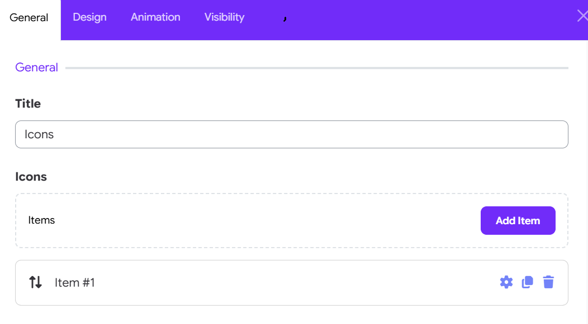
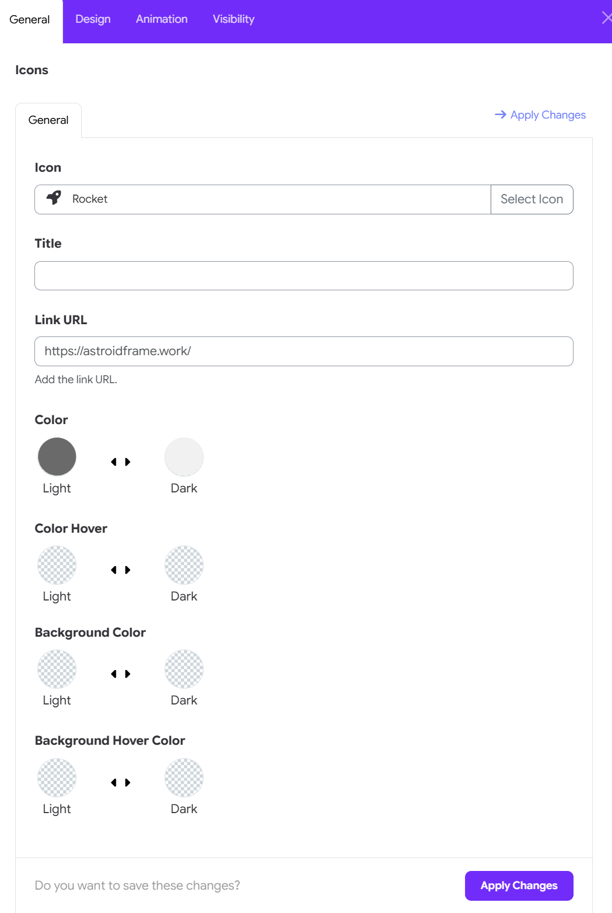
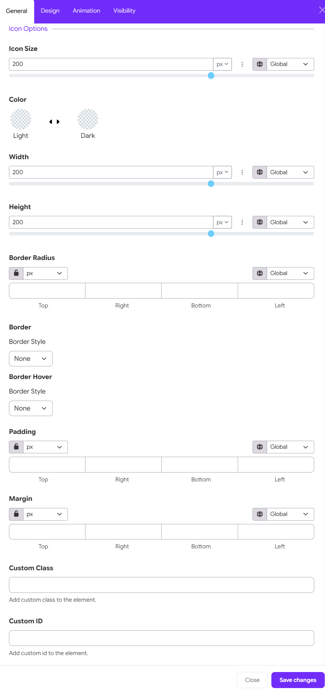

# Icons Widget

The **Icon Widget** in the Moon Framework allows you to display a collection of icons with links, custom colors, and tooltips. It’s ideal for showcasing social media icons, feature highlights, or quick links.

## 1. How to add the widget

In your layout builder, find the section you would like to add the widget
- Click **Add Element**
- Select **Icons Widget** from the list

## 2. Widget's general Options

- **Title**  
  The heading or tooltip for the icon. This can be left blank.

- **Icon**  
  Choose from the built-in icon library (FontAwesome or custom icon sets). Example: `fas fa-star`.

- **Link URL**  
  Add a URL to make the icon clickable. Example: `https://facebook.com`.

- **Color**:  Pick the default icon color.
- **Color Hover**: Choose a different color for when the icon is hovered.
- **Background Color**: Choose a background color of icons.
_ **Background Hover Color**: Choose background color of the icon when hovering the icon.

You can add **multiple icons** in a list format using the subform under this section.

## 3. Configure Icon Options

The Icon Options section allows you to customize the appearance, size, spacing, borders, and CSS settings of the icon.

### Icon Size

Set the overall size of the icon.

- Enter a value manually or use the slider.
- Select the desired unit, such as px.
- Use the Global option to apply a predefined global value.

### Color

Set the icon colors for different states:

- **Light** – Choose the icon color for the light theme or light state.
- **Dark** – Choose the icon color for the dark theme or dark state.

### Width 

Controls the width of the icon. Enter a value or adjust the slider, then select the appropriate unit.

### Height

Controls the height of the icon. Adjust the value to control the icon's vertical dimensions.

### Border Radius

Adjust the roundness of the icon's corners.

- Set individual values for Top, Right, Bottom, and Left.
- Use the lock icon to link the values and apply the same radius to all sides.
- Select the required unit from the dropdown.

### Border

Defines the default border around the icon.

- **Border Style**: Select a border style such as None, solid, dashed, or other available styles. Additional border settings can be configured when a border style is enabled.

### Border Hover

Controls the border appearance when the user hovers over the icon.

- Border Style: Select the desired hover border style.
- Use this option to create a visual interaction effect when the cursor moves over the icon.

### Padding

Controls the internal spacing around the icon.

- Set separate values for Top, Right, Bottom, and Left.
- Use the lock icon to keep all sides synchronized.
- Select the required unit.
- The Global option can be used when a global spacing value is available.

### Margin

Controls the external spacing around the icon.

- Set individual values for Top, Right, Bottom, and Left.
- Lock the values to apply equal spacing on all sides.
- Select the desired unit or use a global value.

### Custom Class

Add a custom CSS class to the icon element. Use this field when you want to apply custom CSS styling or target the icon with existing theme styles.

>Example: my-custom-icon

### Custom ID

Add a unique CSS ID to the icon element. This can be useful for custom CSS, JavaScript targeting, or linking directly to the element.

>Example: campus-icon

## 4. Example Use Case

You want to display three social media icons (Facebook, Twitter, Instagram):
1. Add three icon items.
2. Set appropriate icons: `fab fa-facebook-f`, `fab fa-twitter`, `fab fa-instagram`.
3. Link each to the respective URLs.
4. Set size to `24px` and gutter to `3` (medium).
5. Customize colors to match your branding.

## 5. Notes

- Icons are rendered using icon fonts. Make sure your theme includes the appropriate font library (e.g., FontAwesome).
