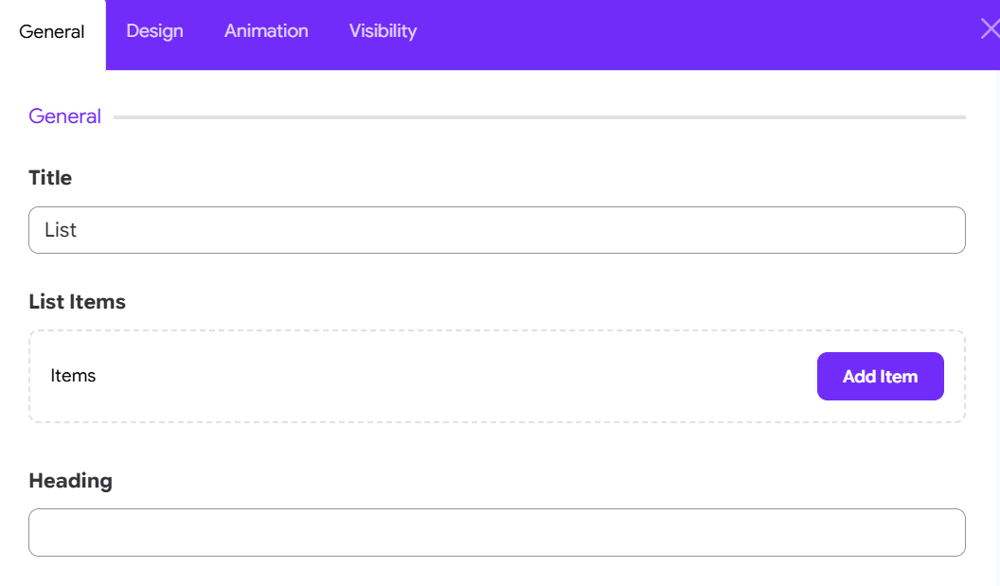
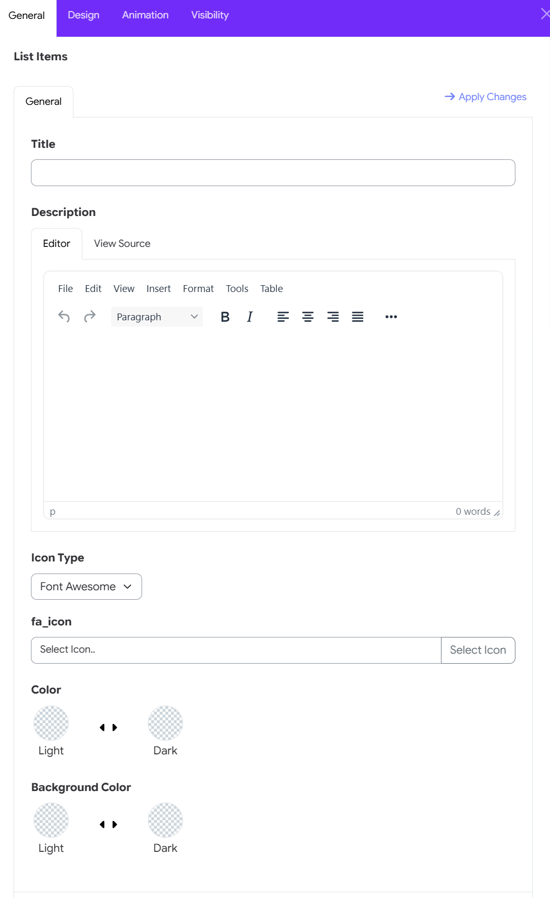
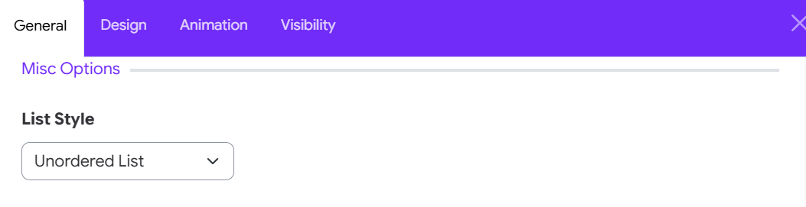
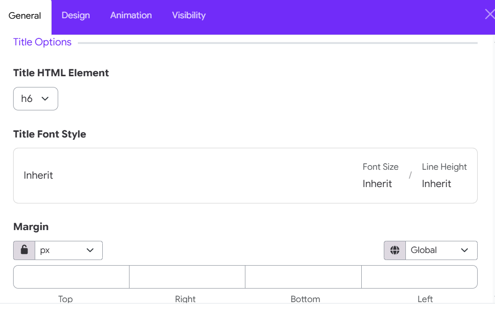
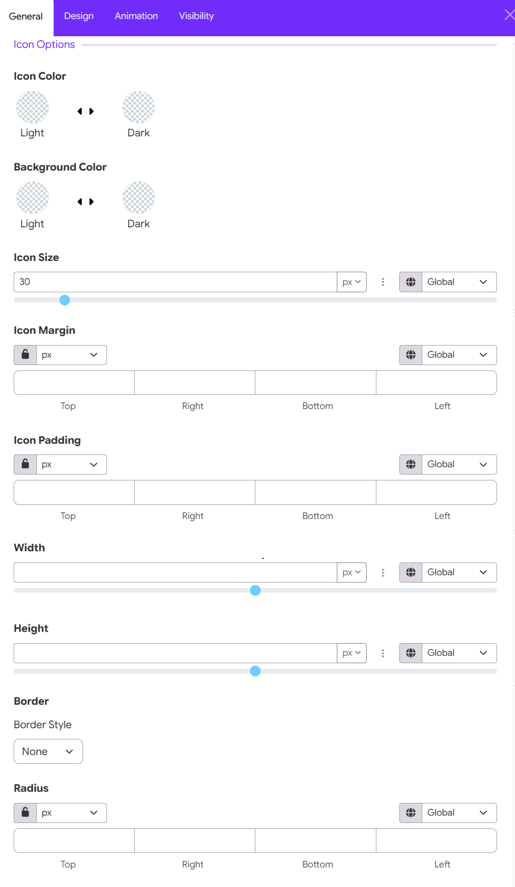
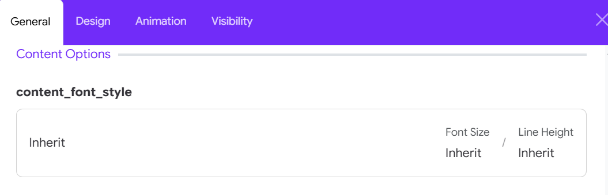
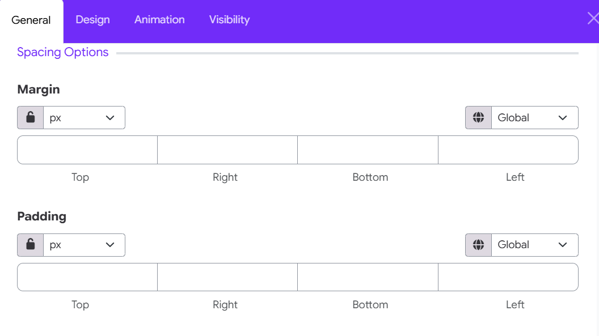

# List Widget

The **List Widget** in Moon Framework helps you create styled lists with icons, descriptions, and various formatting options. It's perfect for displaying feature lists, contact details, or any list-based content in a customizable layout.

## 🚀 How to add the List Widget

- Open your layout editor, find the section where you want to place the widget.
- Click on **Add Element**.
- Choose **List widget** from the widget list.

## ⚙️ General Settings

### Add List Items

You can add multiple list items, each with the following:

- **Title**: Enter the main text for your list item.
- **Description**: Optional. Add supporting text under the title.
- **Icon Type**:
    - `Font Awesome`: Choose an icon from Font Awesome library.
    - `Custom`: Provide your own CSS class for a custom icon.
- **Fa_Icon**: Select an icon or enter a custom class depending on the type.

## Misc Options

Set the overall style of the list using the **List Style** dropdown:
- `Unordered List`: Default bullet list.
- `Ordered List`: Numbered list.
- `Unstyled List`: No bullets or numbers.
- `Inline`: Items appear inline.
- `Description List`: Items display as title-description pairs.
- `List Group`: Bootstrap styled group.
- `List Group Flush`: Removes padding.
- `List Group Numbered`: Numbered group list.

> 💡 If you choose **Description List**, you can also adjust the **Title Width** using a column range (1-12 columns).

## Title Options

- **HTML Element**: Choose the tag for item titles (`h1` to `h6`, or `div`).
- **Title Font Style**: Adjust the typography for titles.
- **Title Heading Margin**: Customize spacing around the title.

## Icon Options

### Color CustomizationIcon 
- **Color**: Set the icon color for both Light and Dark site modes.   
- **Background Color**: Choose the container fill color behind the icon for Light and Dark site modes.

### Size & Container Dimensions

- **Icon Size**: Use the numerical input field or slider to set the icon glyph scale (e.g., 30px). Choose unit measurement (px, %, em).   
- **Width**: Adjust the total width of the icon background container.   
- **Height**: Adjust the total height of the icon background container.

### Size & Container Dimensions

- **Icon Size**: Use the numerical input field or slider to set the icon glyph scale (e.g., 30px). Choose unit measurement (px, %, em).   
- **Width**: Adjust the total width of the icon background container.   
- **Height**: Adjust the total height of the icon background container.

### Spacing & Margins

- **Icon Margin**: Control outer spacing around the icon container for Top, Right, Bottom, and Left edges.   
- **Icon Padding**: Set inner spacing between the icon glyph and its background container border for Top, Right, Bottom, and Left edges.

### Border & Corner Radius

- **Border Style**: Select an outline frame style for the icon box (e.g., None, Solid, Dotted).   
- **Radius**: Customize corner rounding for the container box for Top, Right, Bottom, and Left corners.   
- **Controls**: For Margin, Padding, and Radius, select your preferred unit (px, %, em) and use the Lock Icon to set all sides uniformly or individually.

## Content Options

- **Content Font Style**: Adjust the typography for the description (if used).

## Spacing Options

- **Item Margin**: Set the spacing between list items.
- **Item Padding**: Set internal spacing within each item.

