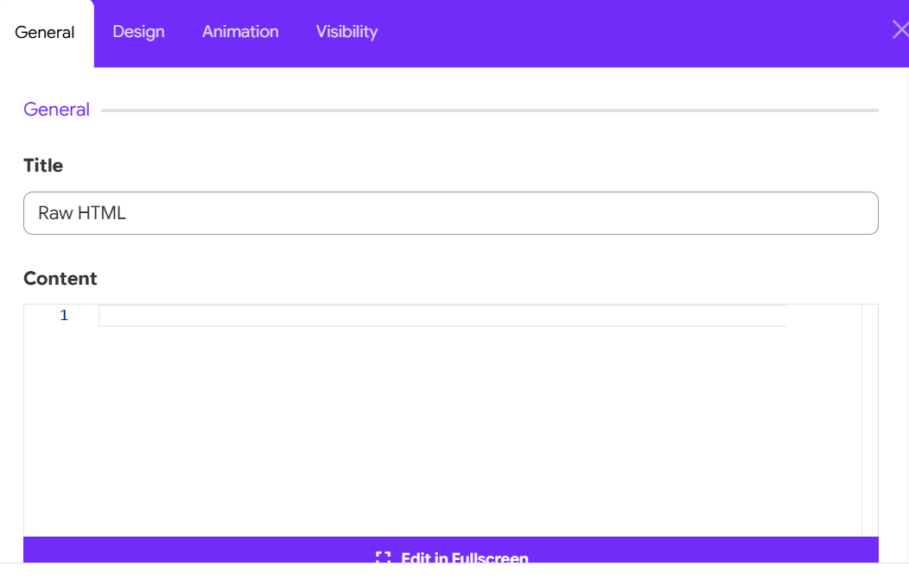

# RawHTML

This widget is used to inject raw HTML into your layout without the editor filtering or modifying it. This is useful for embedding custom elements, third-party scripts (like widgets or iframes), or advanced layout tweaks. Ideal for developers and advanced users who want full control over their markup.

## 1. How to add the Widget
- Go to your Moodle Administrator > Appearance > Themes > Moon theme's settings
- Edit a layout > layout editor.
- Click on **Add Element**.
- Choose **Raw HTML** from the widget list.

## 2. Configure General Settings



Paste any HTML code you want to inject into the content section. Example:

  ```html
  <div class="my-box">
      <h3>Hello from HTML!</h3>
      <p>This is a custom message.</p>
  </div>
  ```

## 3. Use Cases

- Embedding third-party HTML snippets (like forms, iframes, or YouTube embeds).
- Adding custom Bootstrap containers or layouts.
- Inserting tracking codes or custom components.

Enjoy full control over your layout with the RawHTML Widget in Moon framework!