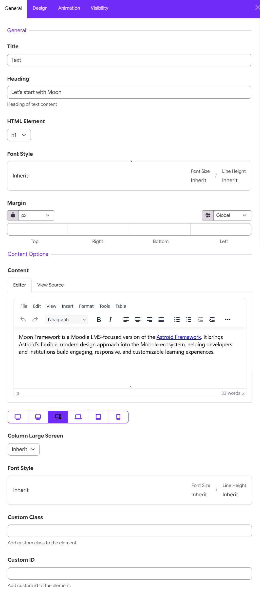

# Text Widget

The **Text Widget** in Moon Framework allows you to add and format text content within any section of a Moon Layout Builder layout. It is useful for headings, descriptions, introductory content, announcements, and other text-based content.

The widget provides controls for **text content, HTML heading levels, typography, spacing, responsive settings, custom classes, and custom IDs**.



## 1. Add the Text Widget

To add a Text Widget to your layout:

1. Open the **Moon Layout Builder**.
2. Open an existing layout or create a new one.
3. Select the **Section**, **Row**, and **Column** where you want to place the text.
4. Click **Add Element**.
5. Select **Text**.
6. Open the Text Widget settings.
7. Configure the content and design options.
8. Click **Save changes**.

## 2. General Settings

The **General** tab contains the main settings for the Text Widget.

### Title

The **Title** identifies the widget within the layout builder.

For example:

- Text
- Homepage Introduction
- Course Description

### Heading

The **Heading** field allows you to enter the main heading associated with the text content.

For example: Let's start with Moon

Use this field when you want the Text Widget to display a heading above the main text content.

#### Example

**Heading:**

> Let's start with Moon

**Content:**

> Moon Framework is a Moodle LMS-focused framework designed to help institutions create engaging, responsive, and customizable learning experiences.

This creates a heading followed by descriptive content.

### HTML Element

The **HTML Element** setting determines which HTML heading element is used for the heading.

The available options can include standard heading levels such as:

* **H1**
* **H2**
* **H3**
* **H4**
* **H5**
* **H6**

#### Choosing the appropriate heading

Use heading levels according to the structure of your page.

```text
H1 → Main page heading
H2 → Major section
H3 → Subsection
H4 → Smaller subsection
```

#### Recommended practice

Avoid using multiple **H1** elements simply because you want larger text. Heading levels should represent the logical structure of the page.

For example:

```text
H1
 ├── H2
 │    ├── H3
 │    └── H3
 └── H2
```

This also helps maintain a meaningful document structure for accessibility and search engines.

### Font Style

The **Font Style** control allows you to configure typography for the heading. The control displays the inherited font settings and provides information such as:

* Font
* Font Size
* Font weight
* Letter Spacing
* Line height
* Font color
* Text transform
* Font style

When the values are set to **Inherit**, the widget uses the typography settings inherited from the global settings.

>Use **Inherit** when you want the Text Widget to follow the site's global typography. This is recommended when you want to maintain consistent typography throughout your website.

#### Custom typography

If the widget supports overriding the inherited values, you can specify different typography for a particular text element.

For example, you may make a homepage heading larger than the standard theme heading.

### Margin

The **Margin** setting controls the spacing around the Text Widget. You can specify separate values for: Top, right, bottom, left. 

For example:

```text
Top: 20px
Right: 0px
Bottom: 30px
Left: 0px
```

This can be useful for creating additional space between the heading/text and other elements in the layout.

>The lock icon allows you to link the margin values together. When linked, changing one value can apply the same value to the other sides. When unlocked, each side can be configured independently.

## 3. Content Options

The **Content Options** section contains the main text editor.

### Content Editor

Moon Framework provides a rich text editor for entering and formatting your content. The content area provides two editing modes:

#### Editor

Use **Editor** for normal visual editing. This is the recommended option for most users.

#### View Source

Use **View Source** when you need to inspect or edit the underlying HTML. For example, advanced users may use source editing to create custom HTML structures or make precise formatting adjustments.

> **Tip:** Only edit the HTML source if you are familiar with HTML. Incorrect markup can affect the appearance or structure of your page.

### Column Device Screen

The **Column Device Screen** setting controls the column behavior for the selected large-screen breakpoint.

When set to **Inherit**, the widget follows the column configuration defined elsewhere in the layout. If you need the text element to behave differently at a particular breakpoint, select the appropriate responsive device and configure the column setting accordingly.

#### Why use responsive column settings?

Responsive column settings help you create layouts that adapt naturally to different screen sizes. For example, a layout might display:

**Desktop**

```text
Text | Image
```

while on mobile it becomes:

```text
Text
Image
```

### Font Style

The **Font Style** setting can also be configured for the selected responsive breakpoint. This allows you to adjust typography according to the device.

For example:

| Device  | Font Size |
| ------- | --------: |
| Desktop |      48px |
| Tablet  |      36px |
| Mobile  |      28px |

This is particularly useful for large headings that may look appropriate on desktop but become too large on smaller screens.

If no custom value is required, leave the setting as **Inherit**.

### Custom Class

The **Custom Class** field allows you to add a CSS class to the Text Widget. For example: highlight-text

You can then target the element with custom CSS. For example:

```css
.highlight-text {
    /* Custom styling */
}
```

This feature is intended primarily for users who need additional customization beyond the standard widget settings.

### Custom ID

The **Custom ID** field allows you to assign a unique HTML ID to the Text Widget.

For example: about-moon

The ID can be used for:

* Custom CSS
* JavaScript
* Anchor links
* Targeting a specific element

For example, an anchor link can target:

```text
#about-moon
```
A Custom ID should normally be **unique on the page**. Avoid assigning the same ID to multiple elements.


