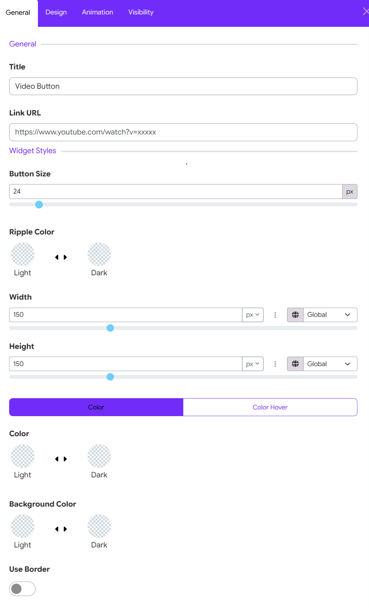

# Video Button Widget

The **Video Button** widget in Moon Framework allows you to add a prominent video button to any layout and link it directly to an online video, such as a YouTube or Vimeo video. It is especially useful for homepage hero sections, promotional areas, course introductions, and video-based calls to action.

## 1. Add the Video Button Widget

The Video Button is added through the **Moon Layout Builder**.

1. Go to **Moodle Site Administration**.
2. Navigate to **Appearance → Themes**.
3. Open the settings for your **Moon** theme.
4. Open the **Layout** tab.
5. Open an existing layout or create a new layout.
6. Select the **column** where you want to place the widget.
7. Click **Add Element** and choose **Widget**.
8. Select **Video Button**.
9. Open the widget settings to configure its content and appearance.

Moon's Layout Builder uses a hierarchical structure of **Sections → Rows → Columns → Elements**, with widgets added as elements inside columns.

## 2. General Settings

The **General** tab contains the basic content and appearance settings for the Video Button.



### Title

The **Title** determines the accessible/name label associated with the video button.

You can replace it with a more descriptive title such as:

* Watch Video
* Watch Introduction
* Watch Our Story
* Play Campus Tour
* Watch Course Preview

>**Tip:** Use a short, meaningful title that clearly tells users what will happen when they click the button.

### Link URL

Enter the URL of the video you want the button to open. You can use a video hosted on an external video platform such as **YouTube** or **Vimeo**, provided the video is accessible to your visitors.

For example:

```text
https://www.youtube.com/watch?v=123456789
```

or

```text
https://vimeo.com/123456789
```

Moodle itself supports linking to externally hosted videos such as YouTube and Vimeo, although access may depend on whether those services are available to your users. ([Moodle Docs][3])

**Important:** Make sure the URL is complete and publicly accessible to the intended audience.

## 3. Widget Styles

The **Widget Styles** section controls the visual appearance of the Video Button.

### Button Size

**Button Size** controls the size of the play/video button. The value is measured in **pixels (px)**.

For example: 24 px

A smaller value creates a more subtle button, while a larger value makes the play button more prominent. Choose a size that is proportional to the surrounding content.

#### Suggested values

| Usage                  | Suggested size |
| ---------------------- | -------------: |
| Small content area     |       20–24 px |
| Standard button        |       24–32 px |
| Hero section           |       32–48 px |
| Large promotional area |         48 px+ |

### Ripple Color

The **Ripple Color** controls the color of the animated ripple effect around the video button. Moon provides separate color options for:

* **Light**
* **Dark**

Choose the option that provides sufficient contrast against the background.

### Width

The **Width** setting controls the width of the video button area. For example: 150 px

You can enter a value manually or adjust the slider. The unit selector allows you to choose the appropriate measurement unit where supported.

#### Global setting

The **Global** option allows the value to follow a global/theme-level setting rather than being completely independent.

This is useful when you want multiple widgets to maintain consistent sizing across your website.

### Height

The **Height** setting controls the height of the video button area. For example: 150 px

As with Width, you can:

* Enter the value manually.
* Adjust the slider.
* Select the appropriate unit.
* Use the **Global** option when you want the widget to follow a shared setting.

**Recommended approach**: For a circular video button, keeping **Width and Height equal** generally produces a balanced appearance.

For example:

```text
Width: 150 px
Height: 150 px
```

### Color and Color Hover

Moon provides two states for the video button's color: Color & Color Hover. Use the tabs to configure each state separately.

#### Color

The **Color** setting controls the normal appearance of the video button. You can configure separate colors for light and dark mode.

This allows the widget to adapt to Moon's light and dark color modes.

#### Color Hover

The **Color Hover** setting controls how the button appears when the visitor moves their mouse pointer over it.

A hover color that contrasts with the normal color provides useful visual feedback and makes the button feel interactive.

#### Recommended combination

For example:

**Normal**

```text
Color → Light
```

**Hover**

```text
Color Hover → Accent/Brand color
```

The exact colors should be chosen according to your site's branding and background.

### Background Color

The **Background Color** controls the background behind the video/play button. As with other color controls, you can configure separate values for:

* **Light**
* **Dark**

This is particularly useful when the Video Button is placed over different backgrounds in light and dark mode. Choose a background that provides sufficient contrast with the play icon and surrounding content.

### Use Border

The **Use Border** toggle allows you to add a border around the video button.

* When the toggle is **OFF**, the button displays without the additional border. This gives the widget a cleaner and more minimal appearance.

* When the toggle is **ON**, a border is applied around the button. This can be useful when:

   * The button needs stronger visual separation.
   * The button is placed over an image.
   * You want a more outlined design.
   * The button's background has low contrast with the surrounding section.

## 4. Animation Settings

The Animation tab allows you to add motion and interactive effects to the Video Button widget. Moon Framework provides two levels of animation control: Basic Animation and Advanced Transform Scenes.

### Animation Type

The Animation Type setting lets you select a predefined animation for the Video Button. Select an animation type from the dropdown menu to apply a preset entrance or motion effect to the widget.

This option is ideal when you want to add a simple animation without creating a complex animation sequence.

>**Recommended use**: Choose a subtle animation for important elements such as a video button so that it attracts attention without distracting users from the page content.

### Transform Scenes

The Transform Scenes section provides advanced control for creating custom, multi-step animations. Click Add Item to create a new transform scene.

A transform scene can define how the Video Button changes during user interaction, such as:

- Scrolling the page
- Moving the mouse
- Progressing through multiple animation stages
- Applying different transform properties at different points in the animation

Each scene can have its own animation properties, allowing you to build more sophisticated interactive effects.

## 5. Visibility Settings

The **Visibility** tab controls when and where the Video Button should be displayed. This is useful when you want different behavior across devices or page layouts.

For example, you may want the video button to:

* Appear on desktop.
* Appear on tablets.
* Be hidden on mobile.
* Display only under specific visibility conditions.

Moon's Layout Builder provides responsive configuration for different device sizes, including XXL, XL, LG, MD, SM, and XS. Always preview the layout on different screen sizes after changing visibility settings.
