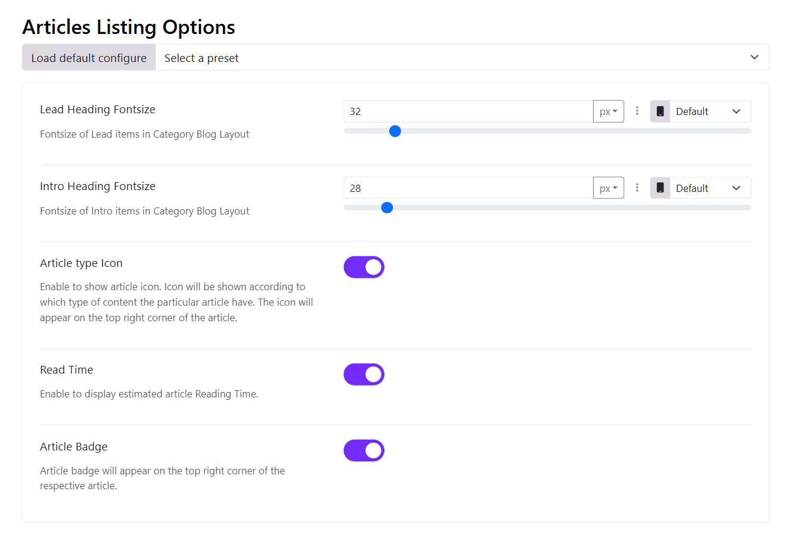

# Article Listing Options

The Article Listing Options in Moon Framework allow you to customize how articles are displayed in a list format, such as in blog layouts or category views. This feature provides flexibility in presenting content to users, enhancing the overall user experience.

* **Lead Heading Font size**: Set the font size of the lead heading titles in the Category Blog Layout
* **Intro Heading Font size**: Set the font size of Intro items in Category Blog Layout.
* **Article type Icons**: Article type icons illustrate which type of content that particular article (post) has. The icon appears in the top right corner of the article. Enable or Disable it to show/hide it on the articles listing view.
* **Article Badge**: Use an article badge to indicate a specific post. It appears on the top left corner of the respective post. Enable/Disable it to show the badges for listing view.
* **Read Time**: This option shows the estimated reading time of the article. Choose to show/hide it on the articles list view.