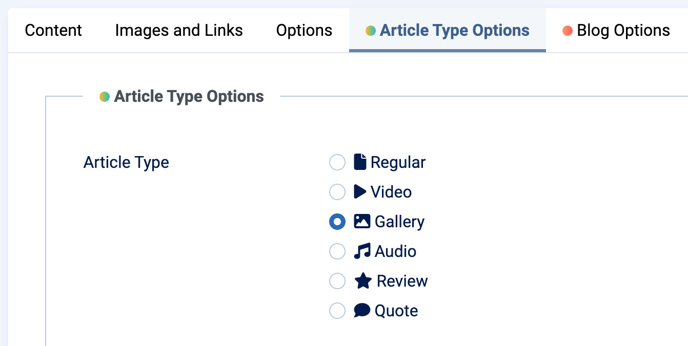

# Article Types

Moon Framework offers a powerful system for enhancing your articles through various **Article Types**. Each type comes with specific options and settings tailored for different content formats like videos, galleries, reviews, quotes, and more.

  <iframe
    src="https://www.youtube.com/embed/UukpjmndCHQ"
    frameborder="0"
    allow="accelerometer; autoplay; clipboard-write; encrypted-media; gyroscope; picture-in-picture"
    allowfullscreen>
  </iframe>

## 1. Selecting an Article Type

In the **Article Type** field, you can choose from the following types:

| Article Type | Description |
|--------------|-------------|
| **Regular**  | A standard article without multimedia features. |
| **Video**    | Embed videos from YouTube, Vimeo, or local files. |
| **Gallery**  | Create image sliders or photo galleries. |
| **Audio**    | Embed audio from SoundCloud or Spotify. |
| **Review**   | Articles with ratings and review criteria. |
| **Quote**    | Highlight a quote or testimonial-style article. |

---

## 2. Configuration per Article Type

### 2.1. Video

- **Video Sources**: `YouTube`, `Vimeo`, or local file upload (`.mp4`, `.webm`, etc.).
- **Settings**:
  - `Video Type`: Choose the video source.
  - `Video URL`: Insert the YouTube/Vimeo video ID.
  - `Local File`: Upload a video if using local source.
  - `Autoplay`: Option for autoplay (Vimeo only).
  - `Thumbnail`: Enable thumbnail image display.

### 2.2. Gallery

- Create image sliders with interactive controls.
- **Settings**:
  - `Gallery Width`: Define the width of the gallery.
  - `Bullets` & `Navigation`: Show/hide navigation bullets/arrows.
  - `Thumbnail`: Enable/disable thumbnail display.
  - `Gallery Items`: Add multiple images using the `galleryitem.xml` subform.

### 2.3. Audio

- **Audio Sources**: `SoundCloud` or `Spotify`.
- **Settings**:
  - `SoundCloud Embed Code`: Paste the embed HTML code.
  - `Spotify URI`: Enter the Spotify song URI.

### 2.4. Review

- Designed for product, service, or content reviews.
- **Settings**:
  - `Review Heading`, `Summary`, `What's Good`, `What's Bad`.
  - `Rating`: Star-based score (1 to 10).
  - `Call to Action Button` & `Link`: Add an optional CTA.
  - `Review Criterias`: Add custom review points using the `reviewcriteria.xml` subform.

### 2.5. Quote

- Displays a standout quote block.
- **Settings**:
  - `Quote Text`: Enter the quote content.
  - `Quote Author`: Provide the author or source.

---

## 3. Content Display Position

For all article types except "Regular", you can choose the position where the content block is displayed:

- `Above Title`: Displayed above the article title.
- `Before Content`: Displayed before the main content.
- `After Content`: Displayed after the main content.

---

## 4. Article Badge Options

- **Enable/Disable Badge**: Option to show a visual badge on the article.
- **Badge Type**: Choose from pre-defined styles or use a custom badge.
- **Custom Badge Settings**:
  - Badge text.
  - Badge background color.
  - Badge text color.

---

## 5. Conclusion

The **Article Type** feature in Moon Framework allows you to craft dynamic, engaging content by adding multimedia, interactive galleries, and structured review formats. Simply select the type, configure its fields, and the frontend will automatically adapt to match the article format.
