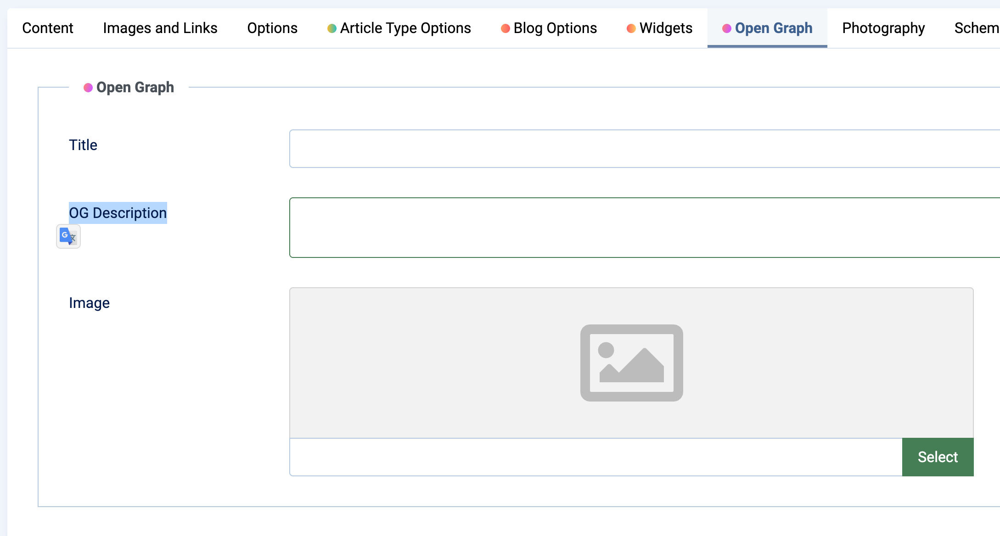

# Open Graph

**Open Graph (OG)** is a protocol developed by Facebook that allows web pages to embed metadata controlling how content is displayed when shared on social media platforms like Facebook, Twitter, Zalo, etc.

In the **Moon Framework**, you can configure Open Graph information for individual articles to improve how your content appears on social platforms.

---

## Field Descriptions

| Field Name    | Type      | Description                                                              |
|---------------|-----------|--------------------------------------------------------------------------|
| `Title`       | `text`    | Open Graph title – used instead of the default article title when shared.|
| `OG Description` | `textarea`| Open Graph description – shown with the title when shared.              |
| `Image`       | `media`   | Open Graph image – displayed when the article is shared.                |

---

## How to Use It in the Backend

1. Go to **Content** → **Articles** in the Joomla admin panel.
2. Open an article you want to configure.
3. Navigate to the **Open Graph** tab.
4. Fill in the title, description, and image as needed.
5. Save the article.

---

## What Happens When You Share the Article

When your article URL is shared on social platforms:

- The **title** will use `Title` (if filled).
- The **description** will use `OG Description`.
- The **image** will use `Image`.

If any of these fields are left blank, the system will fall back to the article's default values (title, intro text, etc.).

---

## Optimization Tips

- The **OG Title** should be short and attention-grabbing.
- The **OG Description** should be around 100–160 characters.
- The **OG Image** should have a 1.91:1 aspect ratio (recommended size: 1200x630px).

---

## Conclusion

Adding Open Graph support in your Astroid-based Joomla site helps improve how your articles appear when shared on social media. Proper use of `Title`, `OG Description`, and `Image` ensures your content is visually appealing and informative when linked externally.