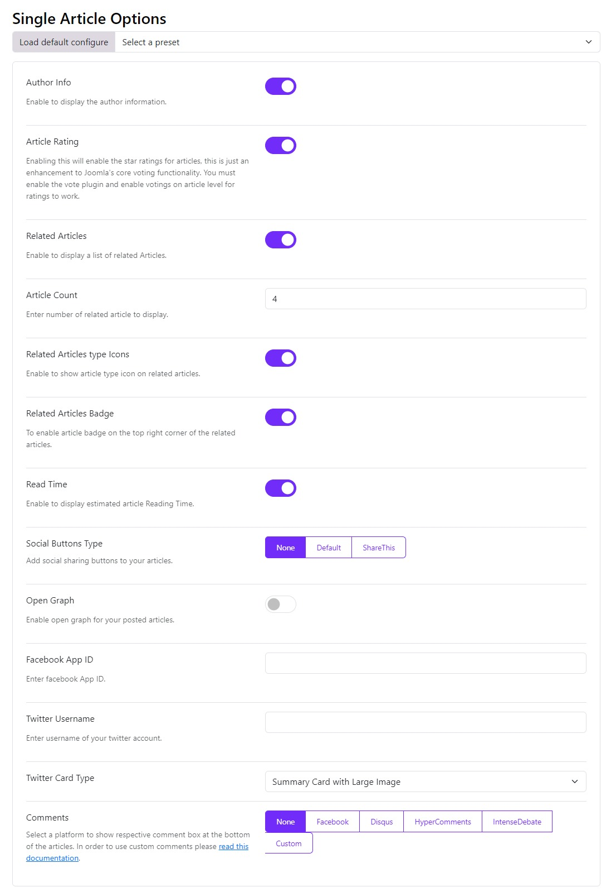

# Single Article Options

The Single Article Options in Moon Framework allow you to customize the display of individual articles, enhancing the user experience and providing flexibility in content presentation.

## Key Features

* **Author Info**: The Author information is displayed underneath the article, the author information is updated in the Author profile in User Tab.
* **Article Rating**: Article rating/review shows the star rating for a single article and allows a user to give a star rating. This enhances Joomla’s core voting functionality feature which displays a drop-down menu to rate the article, instead, it modifies it by allowing the star functionality and also displays the number of votes received.
* **Related Articles**: Allows you to display a list of related posts underneath the article post. The list is based on the meta keyword of the post which makes them more relevant and more likely to display. The settings also allow displaying the number of related article you want to display.
* **Social Buttons Type**: You can also enable Social Share buttons under each article. You can use the default style or ShareThis content-sharing platform to add social buttons.
  * **Default**: The default social button offers you some social channels including Facebook, Twitter, LinkedIn, and Pinterest.
  * **ShareThis**: AddThis provides an HTML and Javascript code that displays sharing tools on your site. Customize the Share button you would like to use.
    * Register to [ShareThis](https://platform.sharethis.com/login) .
    * Navigate to the Share Buttons → Inline Share Buttons tab on the left sidebar.
    * Customize your share buttons accordingly.
    * Get the property ID from the Property Settings page from the lower part of the left sidebar.
    * Paste in the property ID in the ShareThis field
* **Open Graph**: Open Graph allows you to identify which elements of your page you want to show when someone shares your page. Here you don’t need to mess with scripts or tags. Simply add your Facebook App ID and Twitter Username. You can even set different OG Title, OG Description and OG Image for each article.
* **Comments**: This option allows a comment system on each article post so that users will be able to leave comments under their names. Choose between the platforms Facebook, Disqus, HyperComments or IntenseDebate.