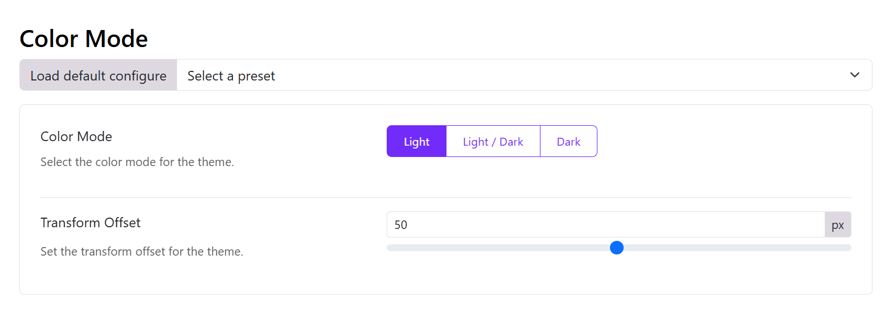

# Color Mode

Go the Appearance > Theme > Theme settings > Basic > Color Mode > Choose a color mode option. There are 3 main color options available: 
- Light
- Light/Dark
- Dark

## Light or Dark Color Mode

- Transform offset: Set the transform offset for the theme.

## Light and Dark Color Mode

If you choose mixed light/dark mode, you can enable the Color Mode Transform

- Enable Color Mode Transform: if you enable this option, you can choose a Transform Type (Color transform is a feature that allows you to change the color from light to dark or vice versa). If it's not enabled, you can choose the Color Mode Default below. 
- Color Mode Default: Select the default color mode for the theme.
- Transform offset: Set the transform offset for the theme.

## Adjust the color modes

After enabling the color mode, you should go to the Color section and set up the color for the body, header, main menu, sticky menu, off-canvas menu, drop-down menu, mobile menu, and footer in both light and dark modes.
If you do not adjust the color between light and dark modes, you will not see changes when changing the color mode in the front end.
