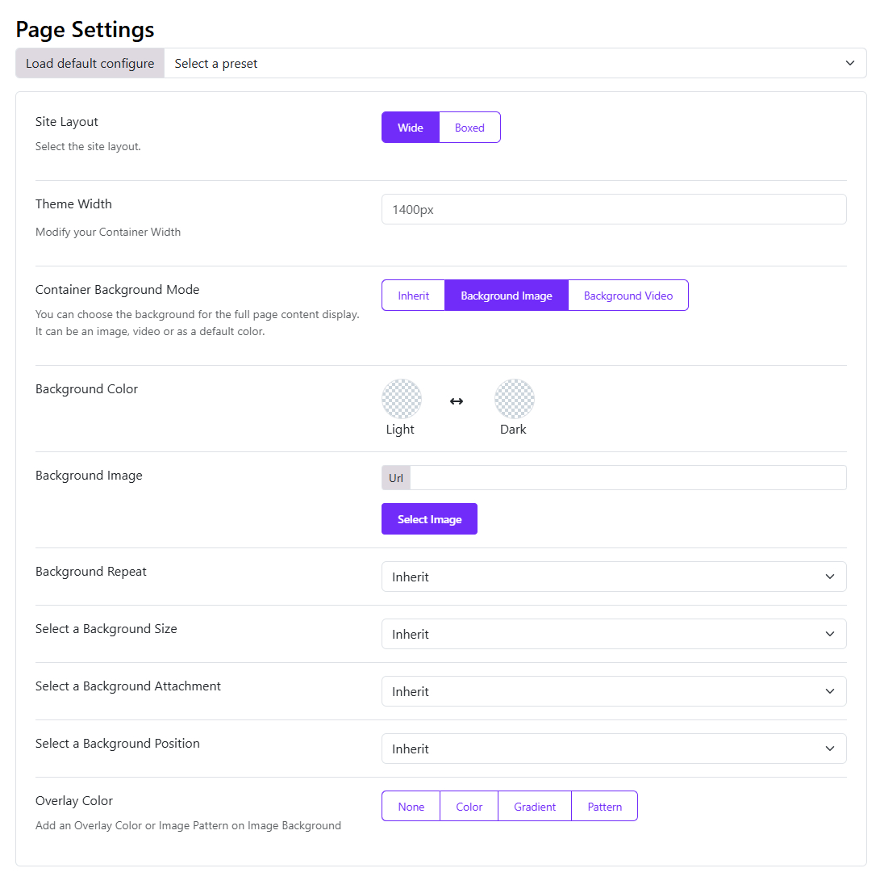
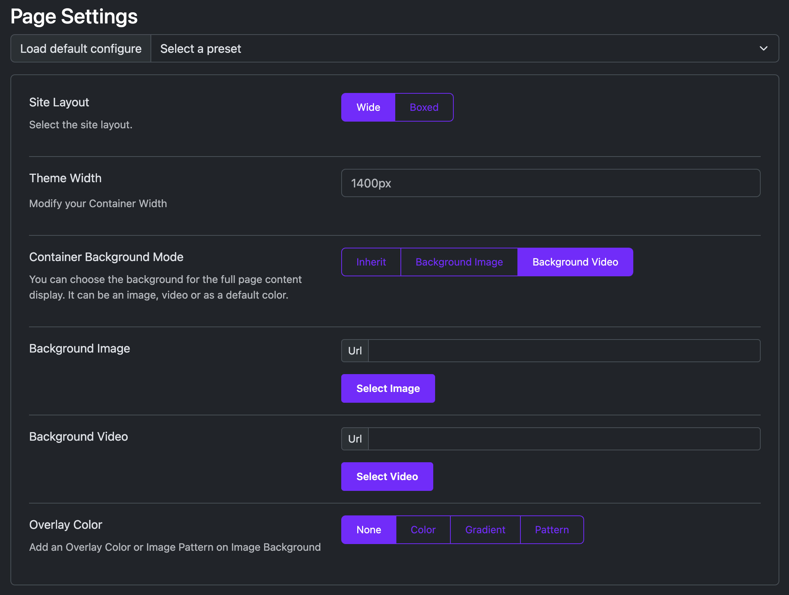

# Container Background Mode

There are options for you to set the background for the full page content: background image, background video or a default color. 

## Default background

If you choose Inherit, the container will inherit the default background color. 

## Background Image

* **Background Color**: Set a favorite custom color code for the background.
* **Background Image**: Choose an image for the background fro the media library or add a URL to the field.
* **Background Repeat**: Sets if/how a background image will be repeated.
* **Select a Background Size**: Specify the size of a background-image.
* **Select a Background Attachment**: Sets whether a background image scrolls with the rest of the page, or is fixed.
* **Select a Background Position**: Sets the starting position of a background image.
* **Overlay Color**: Add an Overlay Color or Image Pattern on Image Background.

## Background Video

* **Background Video**: Add a video URL for the background.
* **Overlay Color**: Add an Overlay Color or Image Pattern on Video Background.

