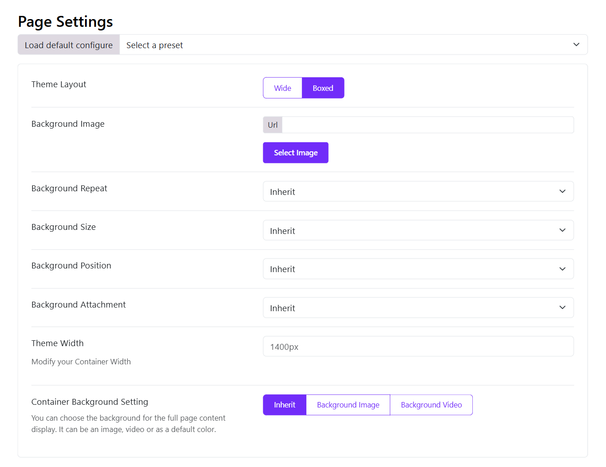

# Page Settings

Moon offers you an option to choose between a wide and box layout. 
You can find the option by going to Appearance > Themes > Theme Settings (Current theme) > Basic > Page Settings > Here you see Site Layout option to choose between wide or boxed layout.

## Boxed layout options

1. **Background Image**: Choose the background image for the site.
2. **Background Repeat**: Choose whether you want to repeat the background image or not from the different options available: Inherit, Repeat All, Repeat Horizontally, Repeat Vertically or No repeat.
3. **Background Size**: Adjust the size of the background image selected from the option provided: Cover, Contain and Inherit.
4. **Background Position**: Adjust the position of the image where you want it to be displayed from the options: Inherit, Left Top, Left Center, Left Bottom, Right Top, Right Center, Right Bottom, Center Top, Center Center, Center Bottom.
5. **Background Attachment**: You can choose whether the image will move with the page scroll or not using: Scroll, Fixed or Inherit.

## Wide Layout

When the wide layout is enabled, you can set the container width and choose the container background. 

