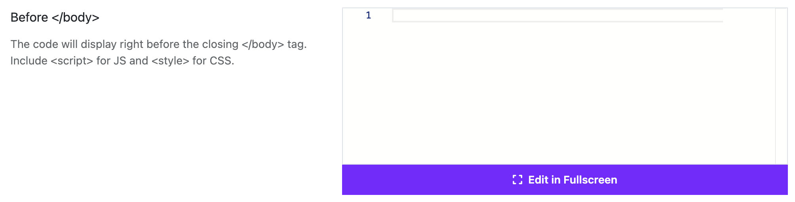

# Before `</body>`

Moon Framework allows you to add custom code before the closing `</body>` tag of your Joomla template. This is useful for adding scripts, styles, or other code that needs to be loaded at the end of the HTML document.

## How to Add Code Before `</body>`
1. Log in to your Joomla Administrator Panel.
2. Go to: `System` → `Site Templates` → `Templates (Site)`.
3. Click on the Astroid template you are using.
4. Click the “Template Options” button.
5. Go to the `Custom Code` tab.
6. Scroll down to the `Before </body>` section.
7. Paste your custom code into the provided textarea. The code will display right before the closing `</body>` tag. Include `<script>` for JS and `<style>` for CSS.
8. Click the `Save` button to apply your changes.

