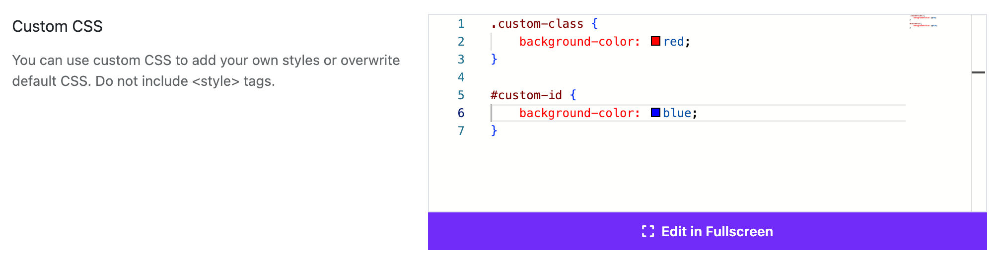
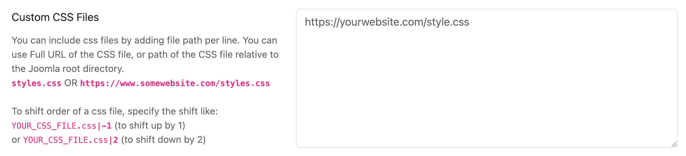
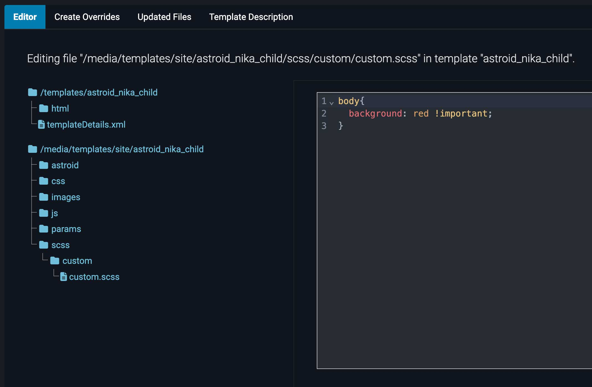

# Custom CSS

Moon Framework allows you to add custom CSS to your Joomla template easily. This is useful for making quick style changes without editing the core template files.

## How to Add Custom CSS
1. Log in to your Joomla Administrator Panel.
2. Go to: `System` → `Site Templates` → `Templates (Site)`.
3. Click on the Astroid template you are using.
4. Click the “Template Options” button.
5. Go to the `Custom Code` tab.
6. Scroll down to the `Custom CSS` section.
7. Paste your custom CSS code into the provided textarea.
8. Click the `Save` button to apply your changes.

## Custom CSS Files

You can create custom.css file and add it to your template. This file will be loaded automatically by Moon Framework.

### To create a custom.css file:
1. Go to your Joomla template directory: `/templates/your_template_name/css/` or `/media/templates/site/your_template_name/css`.
2. Create a new file named `custom.css`.
3. Add your custom CSS styles to this file.
4. Save the file.
5. The custom CSS will be automatically loaded by the Moon Framework.

### You can also add custom CSS files to your template options.
1. To do this, go to the `Custom Code` tab in your template options and scroll down to the `Custom CSS Files` section.
2. Here, you can specify additional CSS files that you want to include in your template.
3. You can add the file paths of your custom CSS files, one per line. You can use either a full URL or a path relative to the Joomla root directory. For example:
   - `custom.css`
   - `https://www.example.com/css/custom.css`
   - `/media/templates/site/your_template_name/css/custom.css`
   - `/templates/your_template_name/css/custom.css`

### To create a custom.scss file:
1. Go to your Joomla template directory: `/templates/your_template_name/scss/custom` or `/media/templates/site/your_template_name/scss/custom`.
2. Create a new file named `custom.scss`.
3. Add your custom SCSS styles to this file.
4. Save the file.
5. Clear Astroid cache from the template options.
6. The custom SCSS will be automatically compiled and loaded by the Moon Framework.

### To create a custom.scss file in child template:
1. Go to your Joomla child template directory: `/templates/your_child_template_name/scss/custom` or `/media/templates/site/your_child_template_name/scss/custom`.
2. Create a new file named `custom.scss`.
3. Add your custom SCSS styles to this file.
4. Save the file.
5. Clear Astroid cache from the template options.
6. The custom SCSS will be automatically compiled and loaded by the Moon Framework.

