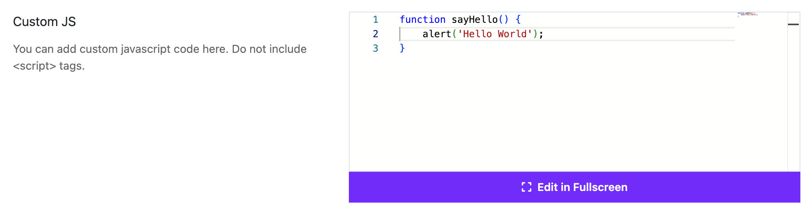
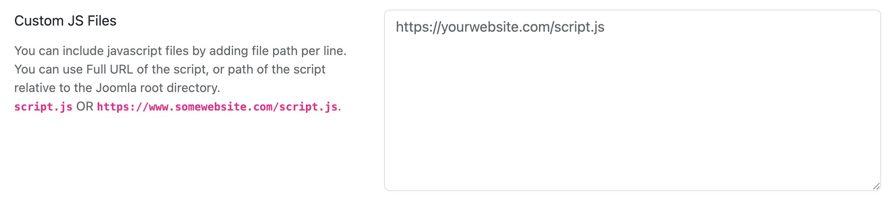

# Custom JavaScript

Moon Framework allows you to add custom JavaScript to your Joomla template easily. This is useful for adding custom scripts or third-party libraries without editing the core template files.

## How to Add Custom JavaScript
1. Log in to your Joomla Administrator Panel.
2. Go to: `System` → `Site Templates` → `Templates (Site)`.
3. Click on the Astroid template you are using.
4. Click the “Template Options” button.
5. Go to the `Custom Code` tab.
6. Scroll down to the `Custom JS` section.
7. Paste your custom JavaScript code into the provided textarea.
8. Click the `Save` button to apply your changes.

## Custom JS Files

You can add custom JavaScript files to your template. This is useful for organizing your scripts or including external libraries.

1. To do this, go to the `Custom Code` tab in your template options and scroll down to the `Custom JS Files` section.
2. Here, you can specify additional JavaScript files that you want to include in your template.
3. You can add the file paths of your custom JavaScript files, one per line. You can use either a full URL or a path relative to the Joomla root directory. For example:
   - `custom.js`
   - `https://www.example.com/js/custom.js`
   - `/media/templates/site/your_template_name/js/custom.js`
   - `/templates/your_template_name/js/custom.js`

