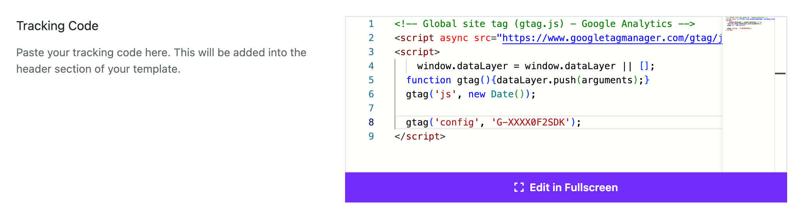

# Tracking Code

The Analytics tracking code is a snippet of JavaScript that collects and sends data to Analytics from a website.

The Analytics tracking code may be directly added directly to the HTML of each page on your site, or indirectly using a tag management system such as Google Tag Manager.

In this Astroid Section, you can paste your tracking code to get started tracking the activity of your website users

