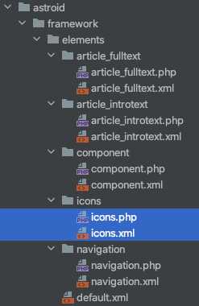
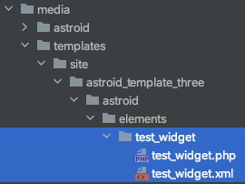
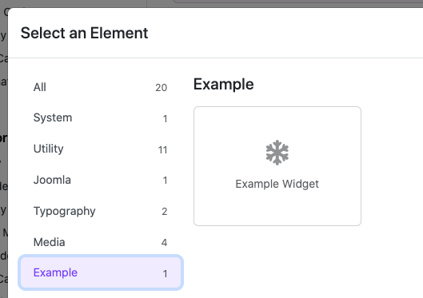
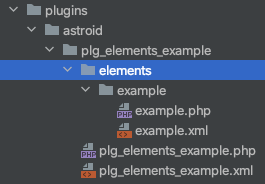

# Create a Widget

Widget is part of Astroid's Element system and is used to create display elements in Layout Builder or Article Builder. The structure of a widget includes an xml file and a php file.

* The XML file is used to declare fields like a Joomla Extension
* The PHP file is used to query, execute and display results



The system will scan widgets from folders with the following priority order:

1. media/templates/site/`{YOUR_TEMPLATE_NAME}`/astroid/elements
2. plugins/astroid/`{YOUR_PLUGIN_NAME}`/elements
3. libraries/astroid/framework/elements

## Create a Widget 

### Using Joomla Template

To create or override a widget you need to create a folder `{WIDGET_NAME}` in the JROOT/media/templates/site/`{YOUR_TEMPLATE_NAME}`/astroid/elements/ folder with an xml file and a php file

* `{WIDGET_NAME}.xml`
* `{WIDGET_NAME}.php`


:::tip[Note]
I created a test_widget and located it at `JROOT/media/templates/site/{template-name}/astroid/elements/test_widget`
:::

### Using Joomla Plugin

You are a Joomla extension developer and want to create widgets for Astroid so that you can easily include them in your templates or 3rd party templates without having to use template override. So using Astroid element plugin is the easiest way.

You can download Example plugin below → extract ZIP file and try with it. This is a Joomla plugin, so you can install it via administrator → System → Install Extensions → Upload package file

:::info[Download Example Plugin]
[💾 plg_elements_example.zip](../../static/files/plg_elements_example.zip)
:::

When you upload plugin successfully. Go to Template Options → Layout → Add Element → You can see it


> Select Example filter you can see Example Widget

Go to `ROOT/plugins/astroid/plg_elements_example/elements` You can see the structure



> You can create your own widget element by this way. Just copy your widget to "elements" folder

## The XML structure

I am taking an example of a simple xml structure of Icons Widget below

* title (required): Declare the name of the Widget you want to create.
* description: Declare the description of the Widget
* icon (required): Font Awesome class you can find them at https://fontawesome.com/
* category (required): Declare the category of the Widget
* element_type (required): There are 3 types of widget_type: `system, widget, article`. You can only choose 1 of the 3.

```xml
<?xml version="1.0" encoding="UTF-8"?>
<element>
    <title>Example Widget</title>
    <description>Example Widget</description>
    <icon>fa-solid fa-snowflake</icon>
    <category>Example</category>
    <element_type>widget</element_type>
    <form>
        <fields>
            <fieldset name="general-settings" label="TPL_ASTROID_GENERAL_SETTINGS_LABEL" addfieldpath="/libraries/astroid/framework/fields">
                <field astroidgroup="general" type="astroidtext" label="Say Hi" name="statement"/>
            </fieldset>
            <fieldset name="assignment-settings" label="TPL_ASTROID_ASSIGNMENT_SETTINGS_LABEL" addfieldpath="/libraries/astroid/framework/fields" articleData="false">
                <field type="astroidlist" name="assignment_type" label="ASTROID_WIDGET_ASSIGN" default="1">
                    <option value="1">ASTROID_WIDGET_ON_ALL_PAGES</option>
                    <option value="0">ASTROID_WIDGET_NO_PAGES</option>
                    <option value="2">ASTROID_WIDGET_SELECTED_PAGES</option>
                </field>
                <field ngShow="[assignment_type]==2" type="astroidassignment" label="ASTROID_ASSIGN_TO_MENU_ITEM" name="assignment"/>
            </fieldset>
        </fields>
    </form>
</element>
```

## The PHP Structure

In PHP file you simply display what you want with widget. You can use `$param->get()` variable to call out the widget params defined in XML file. Let's see the example below.

```php
<?php
// No direct access.
defined('_JEXEC') or die;

extract($displayData);
$statement  = $params->get('statement', 'Hello World!');
echo '<h2>'. $statement .'</h2>';
```

## How to Use

### Step 1: Open the Layout Builder
1. Go to your Joomla **Administrator Panel**
2. Navigate to: `System` → `Site Template Styles` → Click on your **Astroid template**
3. Click the **“Template Options”** button
4. Open the **Layout** tab
5. Launch the **Layout Builder**

### Step 2: Add the Widget
Create a block and Add Element. In the Element selection section, you will see your Widget as shown in the example image below.

