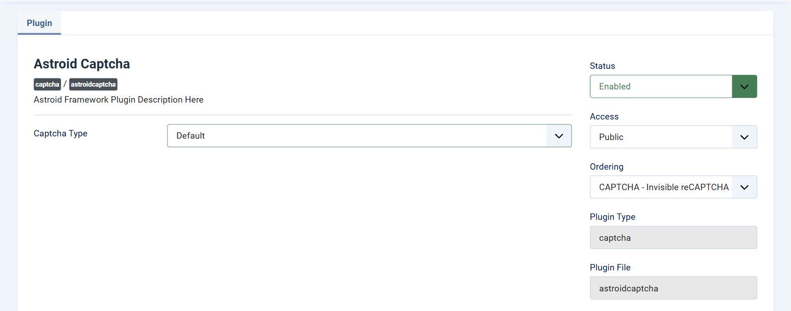
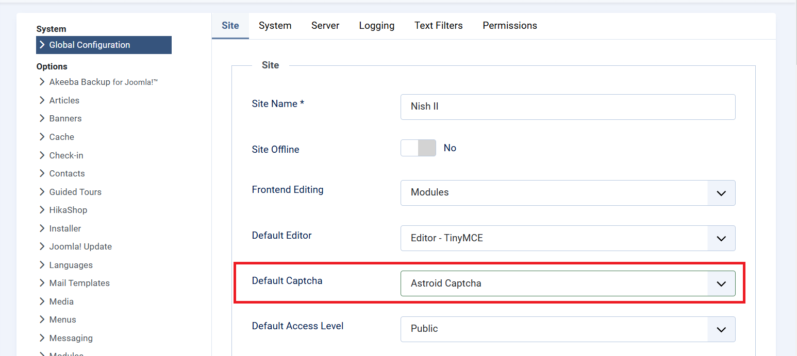

# Captcha - Astroid Captcha

As you know, ReCaptcha plugin is no longer being a part of the core Joomla. So we were well-aware of helping you to avoid the spambot, and that was the reason why Astroid Captcha plugin was included in Astroid 3.1.9.

You can find the Astroid Captcha plugin in the Plugin list, choose a captcha type: **Default, Google reCaptcha, or Cloudflare Turnstile**. 

## How to enable Astroid Captcha

After choosing a captcha type, you can go to Global Configurations > Site > Default Captcha > Select Astroid Captcha > Save.

## Basic Settings

You’ll find settings under:

`Extensions → Plugins → Captcha - AstroidCaptcha`

## Choose Captcha Type

**Field**: `Captcha Type`  
**Options**:
- `Default` – Uses Astroid’s basic CAPTCHA
- `reCaptcha` – Google’s spam protection
- `Turnstile` – Cloudflare’s privacy-first CAPTCHA

---

## Google reCAPTCHA Setup

To use **Google reCAPTCHA**, choose "reCaptcha" and configure the following:

| Setting | Description |
|--------|-------------|
| **Site Key** (`g_site_key`) | Get this from [Google reCAPTCHA Console](https://www.google.com/recaptcha/admin) |
| **Secret Key** (`g_secret_key`) | Also from the Console |
| **Size** | `normal`, `compact`, or `invisible` |
| **Badge Position** (if using invisible) | `bottomright`, `bottomleft`, or `inline` |
| **TabIndex** | Tab order index for accessibility |
| **Callback Functions** | Optional JavaScript callback functions (for advanced users) |

> ✅ Tip: Use **invisible reCAPTCHA** for a cleaner form look, but ensure you handle callbacks properly if needed.

---

## Cloudflare Turnstile Setup

If you prefer **Cloudflare Turnstile**, choose "Turnstile" as the Captcha type.

| Setting | Description |
|--------|-------------|
| **Site Key** (`t_site_key`) | Get from your [Cloudflare Dashboard](https://dash.cloudflare.com/) |
| **Secret Key** (`t_secret_key`) | Provided by Cloudflare |
| **Size** | Options: `normal`, `compact`, or `flexible` |
| **Callback Functions** | Similar to reCAPTCHA if needed |

> ℹ️ Turnstile is privacy-friendly and does not use cookies or track users.

---

## Saving and Testing

Once you configure your desired CAPTCHA:
1. Click **Save & Close**
2. Visit a form (e.g., Contact Form) on your site
3. Ensure CAPTCHA appears and functions correctly
4. Try submitting the form to test it

---

## Troubleshooting

- CAPTCHA not showing?  
  → Make sure the plugin is **enabled** and the correct **keys are entered**.

- Still seeing spam?  
  → Switch to a more robust CAPTCHA like **reCAPTCHA Invisible** or **Turnstile**.

- Console errors?  
  → Double-check your keys and **domain match** in Google or Cloudflare settings.

---

## Automatic Updates

This plugin supports automatic updates via GitHub.

> ✅ You’ll receive update notifications in Joomla’s Extension Manager.