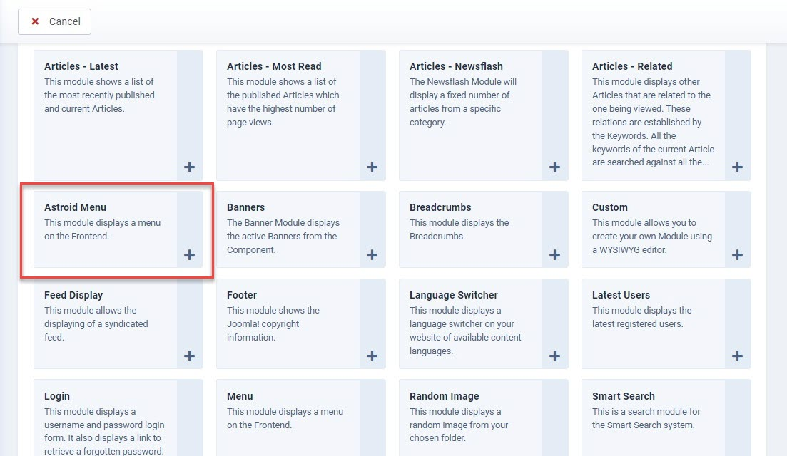
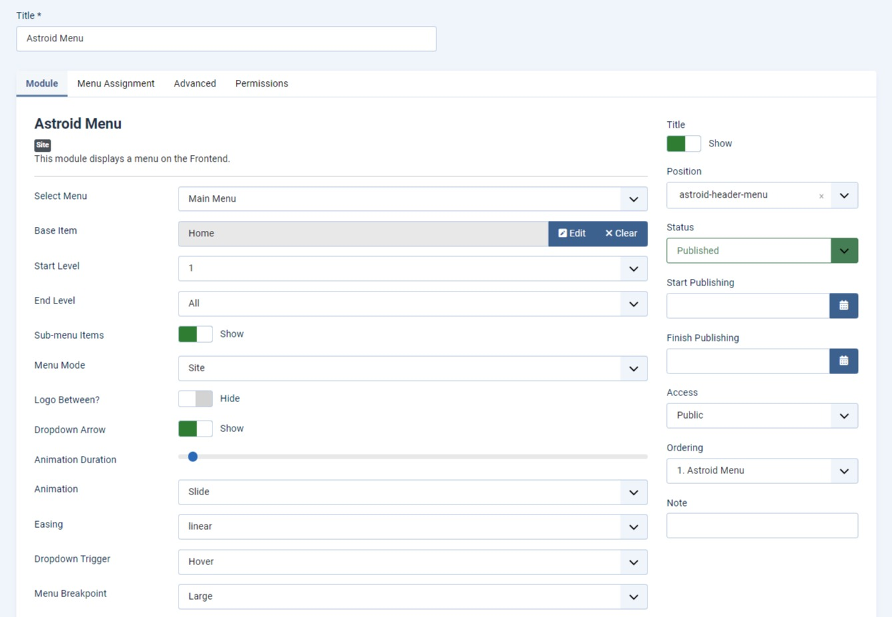
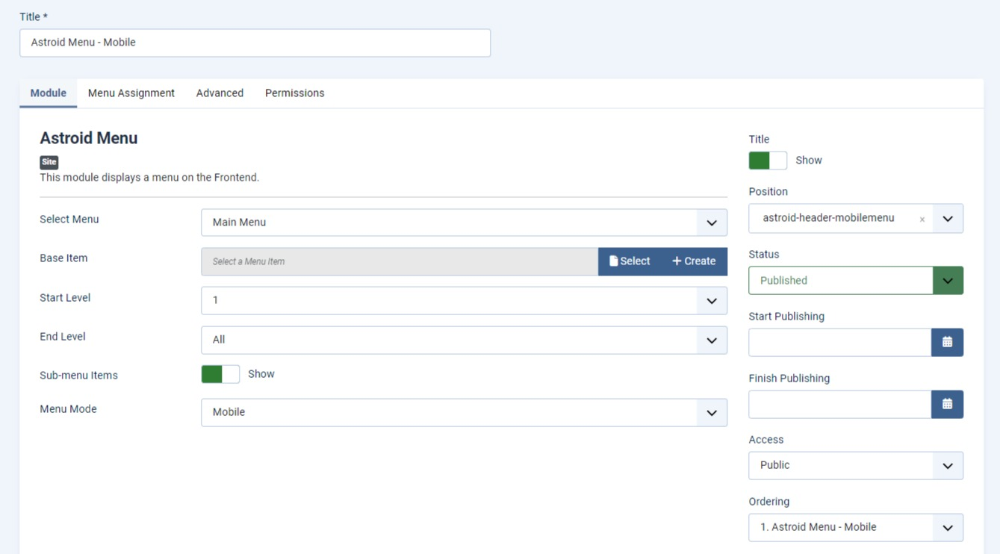
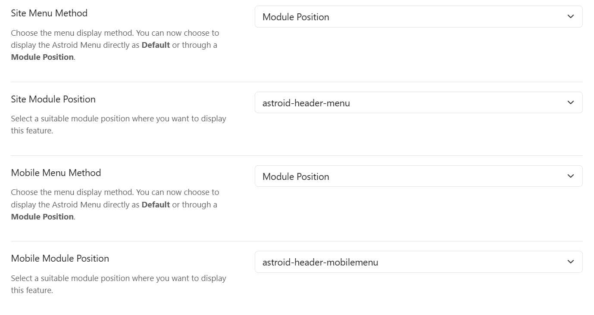

# Display Main Menu in module

Since Astroid 3.0.15, you can find a new feature about the site menu module that allows you to choose a menu display method. By default, the site presents the default Joomla menu directly.

However, thanks to the new feature, you can choose a menu module to present the menu. When you enable to display menu position, you'll see options to choose the module position for both desktop and mobile menus. 

## Create Astroid menu modules

Create a new module with the module type "Astroid Menu".

### Create Astroid menu module for site mode:
* **Module position**: assign the module to the position "Astroid-header-menu"
* **Select menu**: Choose a menu.
* **Base item**: Choose a menu's base item.
* **Start level**: Set the menu's start level
* **End level**: Set the menu's end level
* **Sub-menu items**: Enable this option to show sub-menu items.
* **Menu mode**: Choose a menu mode that you want to display the menu module on. (Choose Site).
* **Dropdown arrow**: Enable this option to show the dropdown arrow beside a menu item containing sub-menus.
* **Animation duration**: Set the length of time that an animation takes to complete one cycle.
* **Animation**: Choose an animation from the drop-down list.
* **Easing**: Choose an easing option.
* **Drop-down trigger**: Choose a type of dropdown trigger (Hover or Click).
* **Menu breakpoint**:  Choose a breakpoint on which the burger button shows up.

### Create Astroid menu module for mobile mode:

* Choose the menu mode "Mobile".
* Assign the menu module to the position: "Astroid-header-mobilemenu"

## Display Astroid menu module in the header

To display the Astroid menu module in the header, you need to go to the Template Options > Header > Site Menu Method/Mobile Menu Method and select the "Module Position".

* **Site menu method**: Choose a menu method for the desktop menu: "Default" or module position.
* **Site module position**: if module position is selected, you can choose a module position of the menu module you want from the drop-down list. (Choose the module position: Astroid-header-menu).
* **Mobile menu method**: Choose a menu method for the mobile menu (Default or module position).
* **Mobile menu position**: If the module position is selected above, you can choose a module position of the menu module you want for the mobile menu from the drop-down list. (Choose the module position: Astroid-header-mobilemenu).