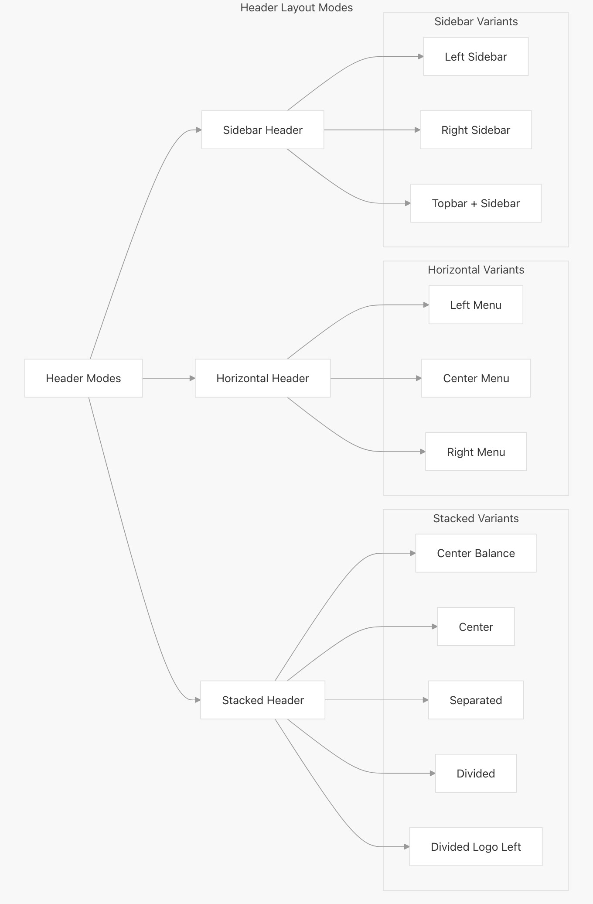
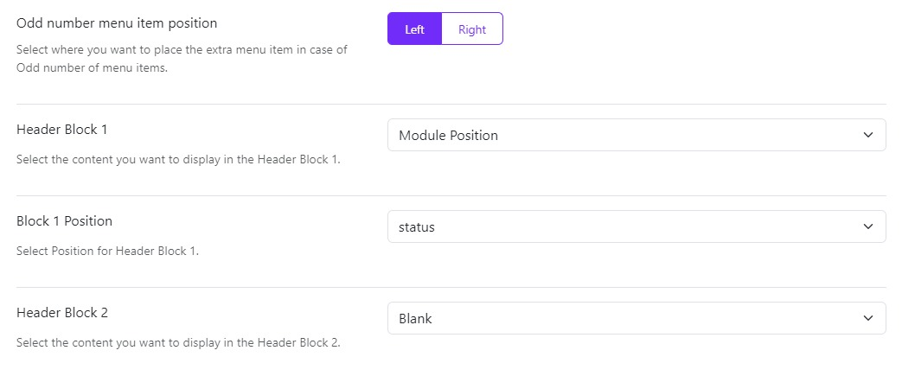
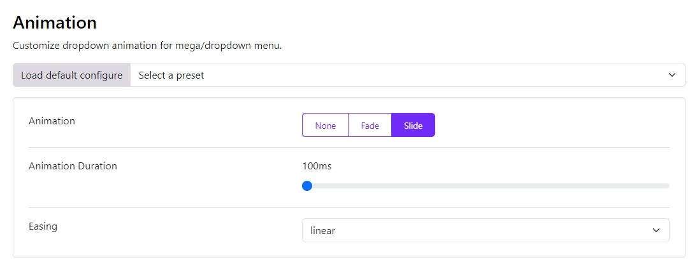

# Header Modes

The Astroid Header System supports three primary modes, each with its own layout options and configuration parameters.

  <iframe
    src="https://www.youtube.com/embed/GgesR1MXnBY"
    frameborder="0"
    allow="accelerometer; autoplay; clipboard-write; encrypted-media; gyroscope; picture-in-picture"
    allowfullscreen>
  </iframe>

---

To select a header mode, follow these steps:
1. Go to **Template Styles** in the Joomla administrator panel.
2. Open your template style.
3. Navigate to **Template Options** > **Header** > **Header**.
4. Select a **Header Mode** option.
5. Save your changes.

## Horizontal Header

The horizontal header layout arranges elements in a row across the page. It offers three different menu placement options: left, center, and right.

* **Left**: The logo and the menu items are positioned to the left and the header block is to the right
* **Center**: Here the logo is to the left, menu items are in the center and the header block is on the right
* **Right**: Here the logo is to the left, the menu items and header block are to the right

## Stacked Header

The stacked header provides more complex layouts with elements stacked in multiple rows. It supports five layout variants:

* **Center Balance** - Logo centered between left and right sections
* **Center** - Logo and menu centered
* **Separated** - Logo with menu items separated evenly
* **Divided** - Logo on left, menu below
* **Divided** Logo Left - Logo on left in a fixed width column with menu and other elements in adjacent columns

### Odd number menu item position

When you select Stacked Separated it displays an extra option of Odd number menu item position to select where you want to display the extra menu item:
Select where you want to place the extra menu item in case of Odd number of menu items.

## Sidebar Header

The sidebar header positions elements in a vertical column on the side of the page. It offers three placement options:

* **Left** - Vertical header on the left side
* **Right** - Vertical header on the right side
* **Topbar** - Combination of horizontal topbar with vertical sidebar

## Header Blocks 
Choose what you want to display in the header blocks from the given options in the dropdown that is:

* **Blank**: Leave a blank space
* **Module Position**: Publish a module whose position you can choose in the next option Block Position
* **Custom HTML**: You can also publish a custom HTML in the header block, simply writing your code in the next option Block 1 Custom HTML

:::info[Note]
Some Header Blocks will only work on Desktop, not for tablets and mobile.
:::

## Site Menu Options

### Site Menu Method

Choose the menu display method. You can now choose to display the Astroid Menu directly as Default or through a Module Position.

### Site Menu
If you have more than one main menu created then you can choose which menu you want to show on your main site from the dropdown list.

* **Start Level**: The level to start rendering the menu at. Setting the start and end levels to the same level will only display that single level.
* **End Level**: You can even set up to which level you want to show the sub-menu items. By default, it is set to “ALL” which means all the sub-menu items will be visible.

### Header Breakpoint

Choose a breakpoint so the header will collapse when the width is less than the selected breakpoint parameter. The lg is set as default breakpoint to suit most of the cases.

### Mobile Menu

You also choose which menu you want to show on the mobile view of your site if you have 2 or more menus created.

### Dropdown Trigger

Choose the action to view the dropdown menu or the mega menu that is either on Hover or Click.

### Dropdown Arrow

Choose whether you want to display the dropdown arrow or not. If you select Yes, then the dropdown arrow will be displayed next to the menu item that has a sub-menu.

## Dropdown Animation

Choose the animation for the dropdown menu or the mega menu. You can choose from the following options:

* **Animation**: You can also customize the animation of your megamenu, and drop-down menus, you can set it to None, Slide or Fade.
* **Animation Duration**: Depending upon the animation you choose from the Animation option you can also set its speed. The value is set in milliseconds and its maximum value can be up to 4000ms.
* **Easing**: This function specifies the speed at which an animation progresses at different points within the animation. You can choose the type of easing from the various options provided: linear, swing, EaseInQuad, EaseOutQuad, EaseInOutQuad, EaseInCubic, EaseOutCubic, EaseInOutCubic, EaseInQuart, EaseInQuart, EaseInQuart, EaseInQuint, EaseOutQuint, EaseInOutQuint, EaseInSine, EaseOutSine, EaseInOutSine, EaseInExpo, EaseOutExpo, EaseInOutExpo, EaseInCirc, EaseOutCirc, EaseInOutCirc, EaseInElastic, EaseOutElastic, EaseInOutElastic, EaseInBack, EaseOutBack, EaseInOutBack, EaseInBounce, EaseOutBounce and EaseInOutBounce.

