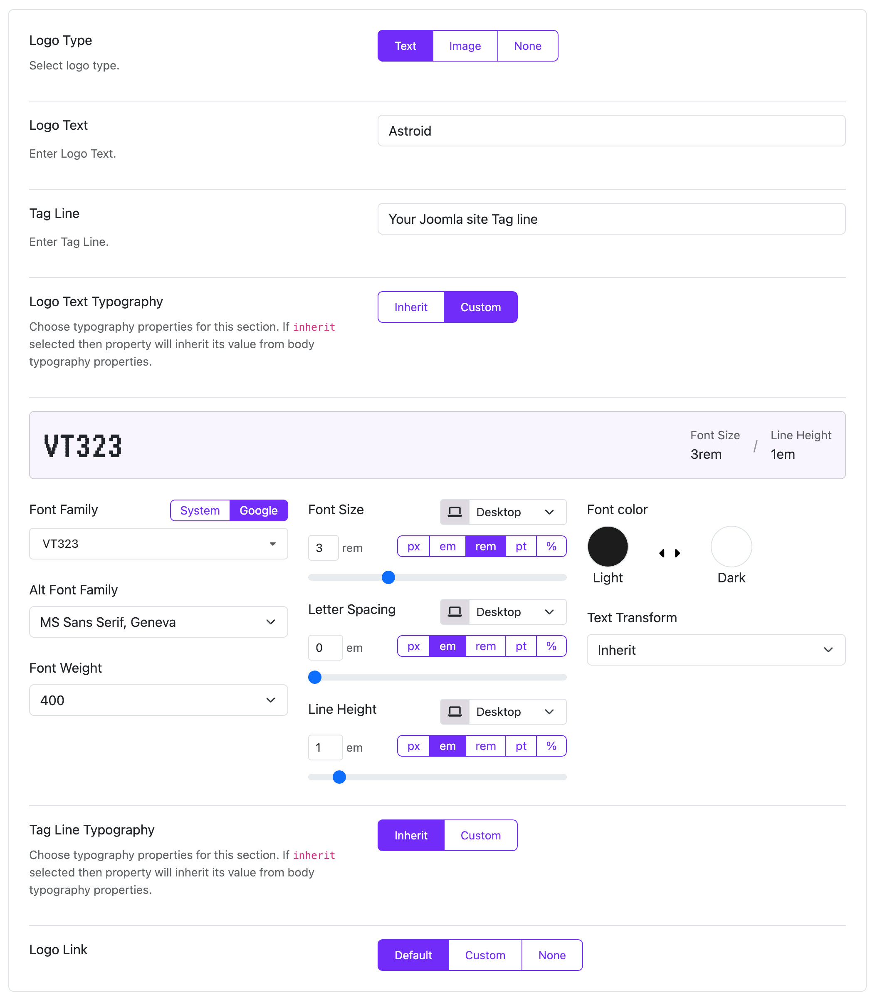
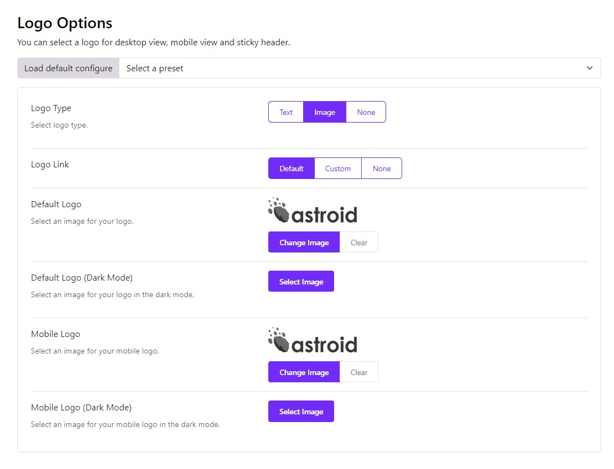

# Logo Options

Moon Framework allows you to set the logo for your site. You can also set the logo for the mobile version of your site. Logo Type: Choose the logo type for your site that is either Text, Image or None.

## Text Logo

If you choose a Text logo then you have the following options:

* **Logo Text**: Enter the text for the logo.
* **Tag Line**: Enter the tagline text for your text logo.
* **Logo Link**: Choose the type of link you wish to add to the logo text either Default or a Custom link.
* **Logo text typography**: if you want to customize the logo text, choose the custom option and adjust the typography.
* **Tagline typography**: choose the custom option and you'll be able to adjust the typography of the tagline according to your needs.

## Image Logo

If you choose an Image logo then you have the following options:

* **Default Logo**:  Choose the logo image for your site.
* **Default Logo (Dark Mode)**: Choose a logo for the dark mode.
* **Mobile Logo**: You can also customize the logo of your site in mobile view by choosing a different logo image here.
* **Mobile Logo (Dark Mode)**: Choose a logo image for the dark mode.
* **Logo Link**: Choose the type of link you wish to add to the logo text either Default or a Custom link.

:::info[Note]
In case you enable the color mode, the logo options will offer the default logo (dark mode) and mobile logo (dark mode).
:::

