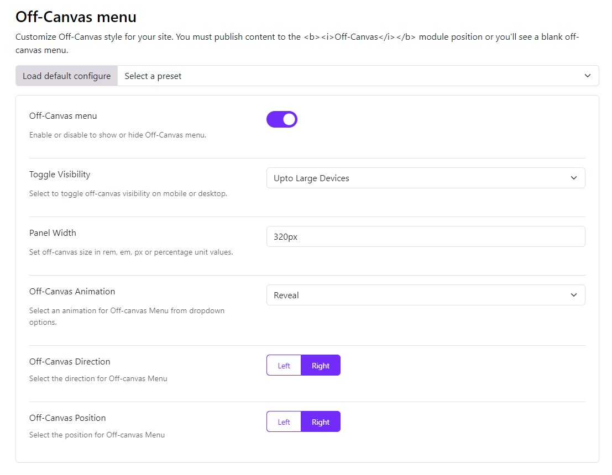
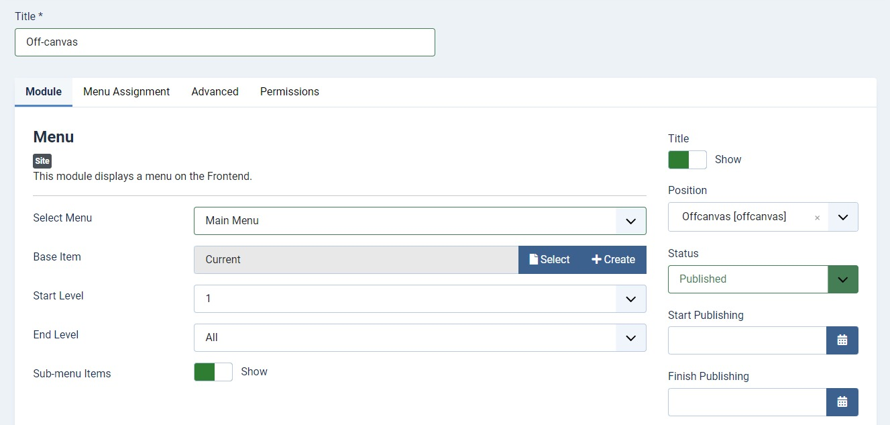

# Off Canvas Menu

The off-canvas menu is a hidden menu that can be toggled to slide in from the side of the screen. This feature is particularly useful for mobile devices or when you want to save screen space.

## Enable Off Canvas Menu

To enable the off-canvas menu, go to **Template Options > Header > Off Canvas Menu** and toggle the switch to enable it.

* **Toggle Visibility**: Choose on which devices will the off-canvas menu be visible that is on All devices, Only on extra small devices, Up to Small devices, Up to medium devices, Up to Large devices or only on extra large devices. By default, it's set to All devices.
* **Panel Width**: Set the size of the off-canvas menu either in px or em or rem.
* **Off-Canvas Animation**: Select how you want the off-canvas menu to open which is either Slide on Top, Push or Reveal animations.
* **Off-Canvas Direction**: You can choose between Left and Right for the position from where you want to open the Off-Canvas menu.

## Create a module for the off-canvas menu

Go to Extensions > Modules > New. Create a New module of the type Menu.
* **Title**: Give a title to the module.
* **Position**: Assign the module to the position "offcanvas".
* **Input Content**: Add content to the module.
* **Publish**: Set the module to publish.
* **Save**: Save the module.

