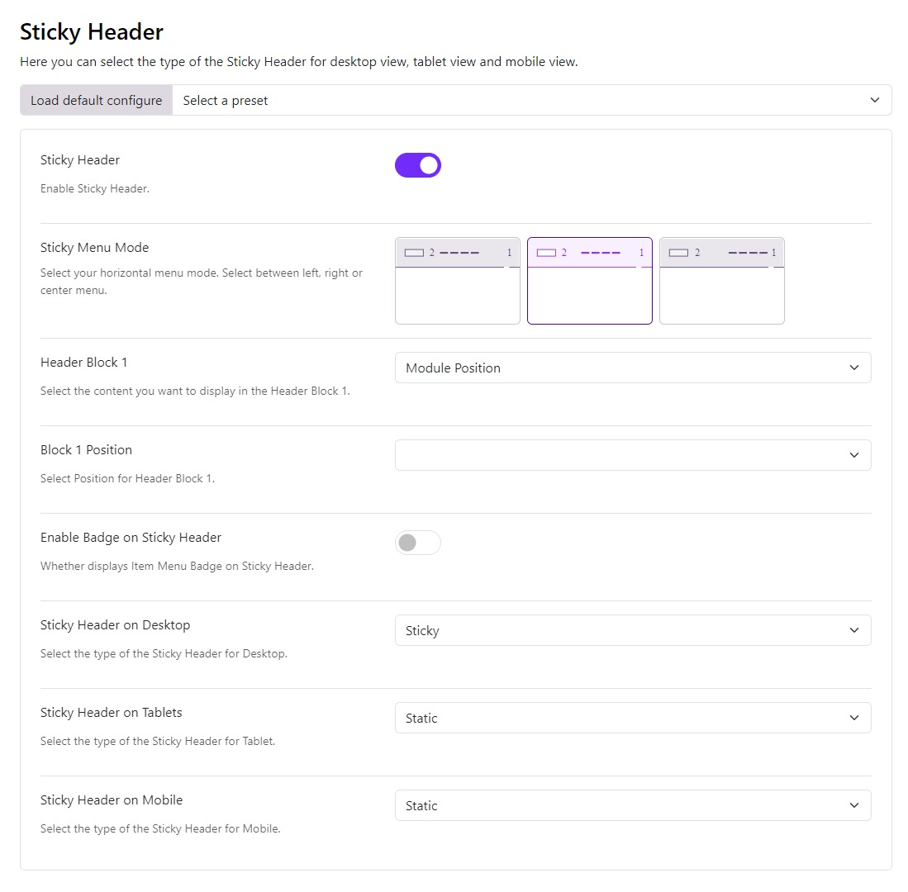

# Sticky Header

A sticky header is something that sticks to the top of the page while the scroll is scrolling down or decides to go back up.

Sticky Header: Choose whether you want to display the Sticky header or not. If yes then the following options will be visible:

There are 2 different ways you can show the sticky header.

1. **Sticky Menu Mode**: Here we have 3 modes:
   - **Left**: The logo and the menu items are positioned to the left and the header block is to the right.
   - **Right**: Here the logo is to the left, the menu items and header block are to the right
   - **Center**: Here the logo is to the left, menu items are in the center and the header block is on the right
2. **Header Block 1**: Choose what you want to display in the header blocks from the given options in the dropdown:
   - **Blank**: Leave the space blank
   - **Module** Position: Publish a module whose position you can choose in the next option Block Position 1
   - **Custom HTML**: You can also publish custom HTML in the header block, simply writing your code in the next option Block 1 Custom HTML

- **Enable Badge on Sticky Header**:
Turn on this option if you wish to have the menu's badges displayed on the sticky header.
- **Sticky Header Logo**:
This option allows you to choose a different logo image for the sticky header (i.e. if you want to upload a smaller logo so the sticky header doesn’t take a lot of space)
- **Sticky Header on Desktop**:
Choose how you want the sticky to be Sticky or Sticky on Scroll up in desktop view.
- **Sticky Header on Tablets**:
Choose how you want the sticky to be Static, Sticky or Sticky on Scroll up in the tablet view of your site.
- **Sticky Header on Mobile**:
Choose how you want the sticky to be Static, Sticky or Sticky on Scroll up in the mobile view of your site.