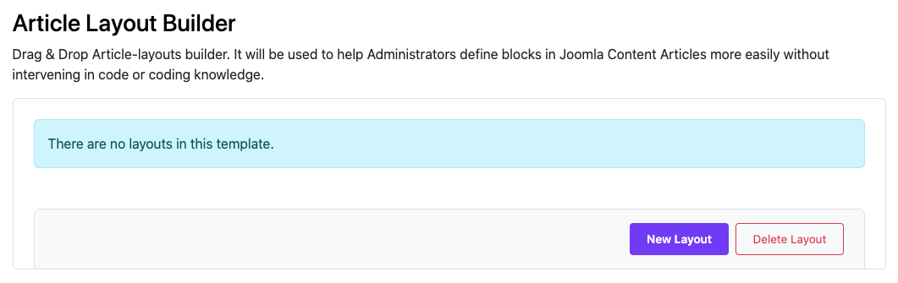
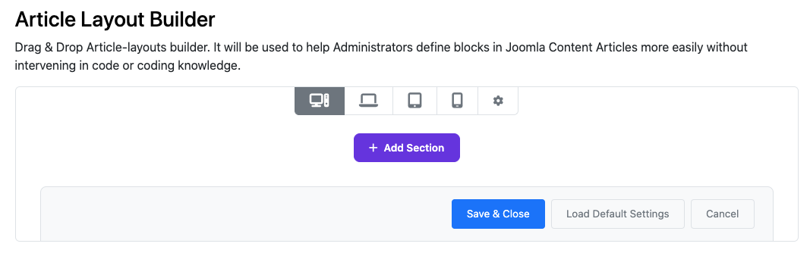
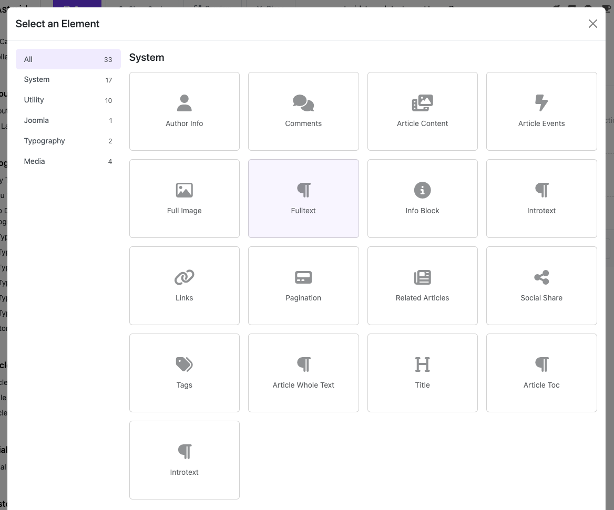
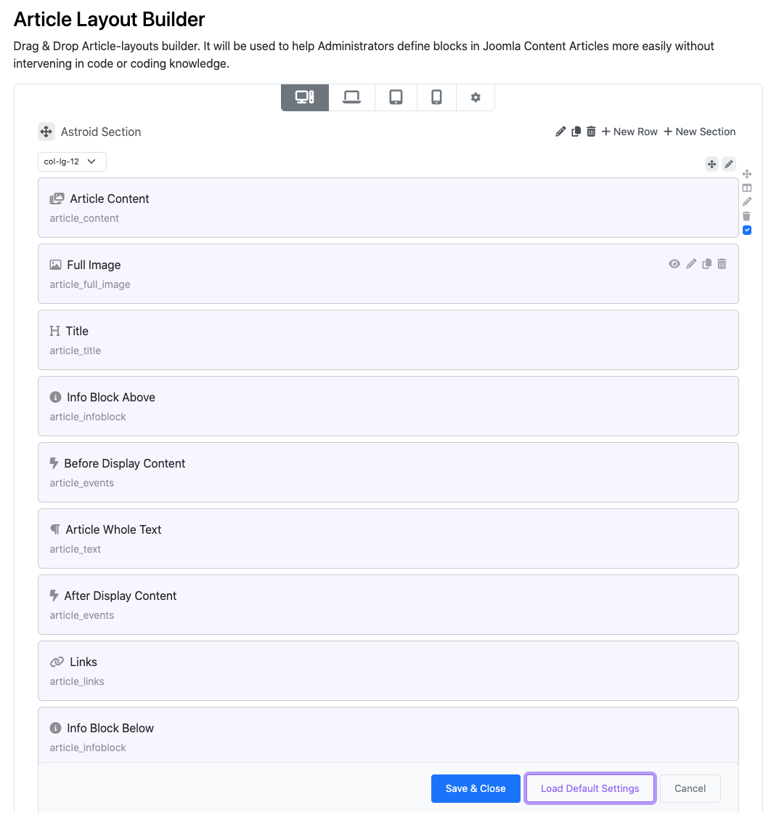
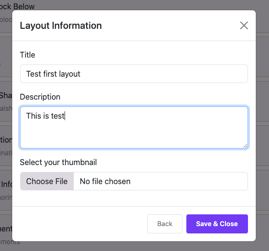
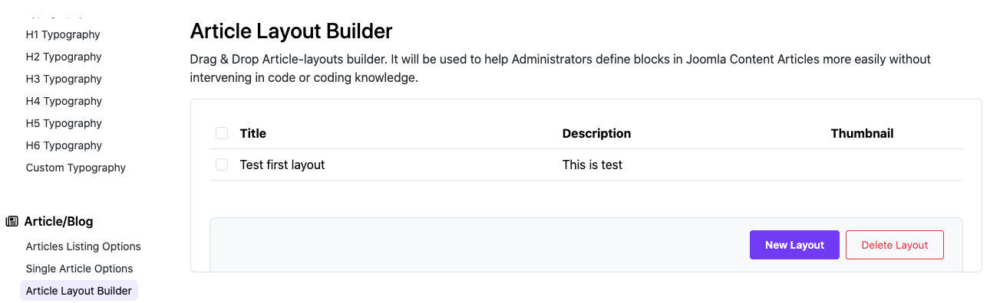
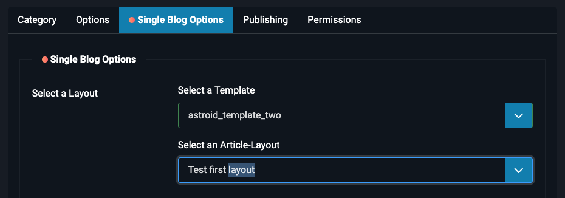
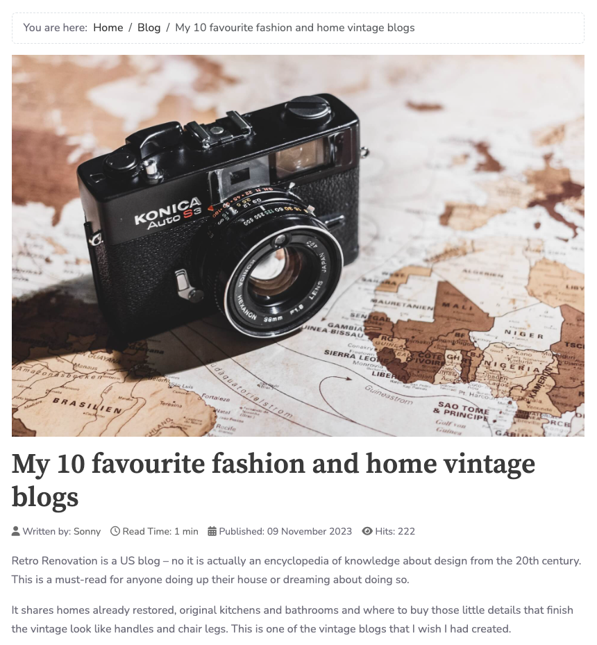
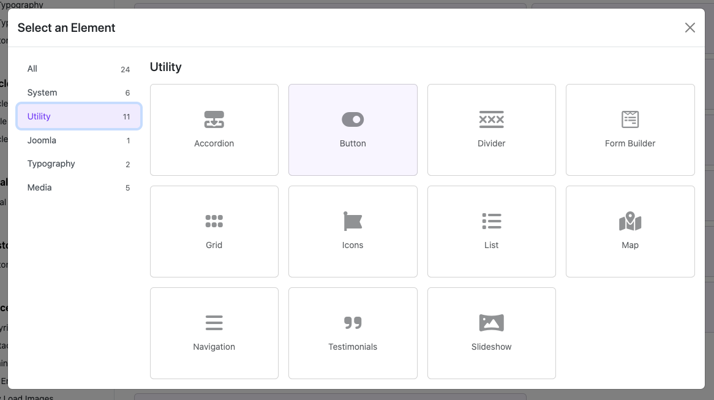
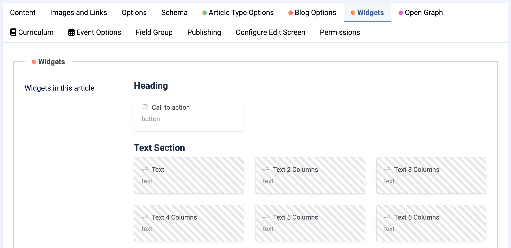

# Article Layout Builder

This is a special function only available on Moon Framework. It is a function that allows Admins to define the display layout for detailed articles of Joomla Content.

  <iframe
    src="https://www.youtube.com/embed/87__uJKNNCQ"
    frameborder="0"
    allow="accelerometer; autoplay; clipboard-write; encrypted-media; gyroscope; picture-in-picture"
    allowfullscreen>
  </iframe>

## How to create an Article's layout

To create sub-layouts, go to:

* Administrator → Templates: Styles → Edit your Astroid template → Template Options
* Article/Blog → Article Layout Builder
* Click "New Layout"

> You can click Add Section to build your manual layout or Click "Load Default Settings" to load default setting.

> Add Section → Add Element you can build your article layout with article and widget blocks

> To save time. Click to "Load Default Settings". I got default setting from Astroid.

> Edit your layout and save it

> You can see your layout here

## How to use an Article's layout

To use Article Layout.

1. Go to Administrator → Content → Categories → Edit a category
2. Switch to Single Blog Options
3. Select a Layout → Select a template & select an article-layout
4. Save category.

> Go to Front-end → Your Joomla Blog → Click on the article in the category you edited to view detail. And you can see how it works.

## How to use Widget in Article Layout?

As you know, Astroid has a rich Widget system that allows you to create unique styles for your website without any coding knowledge. What’s great is that you can use this Widget system on Article Layout as well. So let’s find out how you can use Widgets to build your articles.

### Create and set default values

Like Layout Builder to create Widget in Article Layout you follow these steps.

1. In layout builder → Click "Add Element" → Choose one of available widgets
2. In the modal you can set default values of Widget. These values can be overrides on each article.

### Override values in the article

You have finished building the layout for your article. The next step is to change the Widget data for each of your articles. If you use the default value, you do not need to change anything in the article. The system will display the default value as you have set in the Article Layout Builder. But if you need to change the widget data in each article to ensure uniqueness and uniqueness. It is very easy, just follow the steps below.

1. Go to Administrator → Content → Articles → Edit or Create an article
2. Find Widgets Tab, All widgets will be listed here
3. Click to edit a Widget. Now you can override the default values of Widget on the modal.

### Some great Examples of Article Layout.

* An example for Tour Travel: https://demo.moonframe.work/article-layouts/tours-example
* An example for Photography:  https://demo.moonframe.work/article-layouts/photography-example