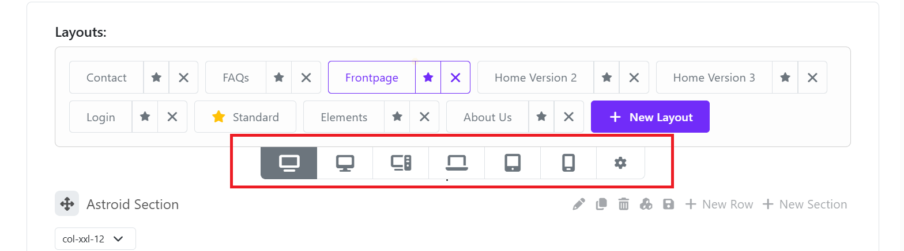
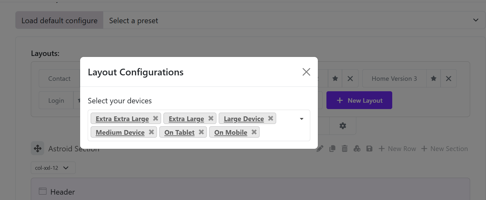
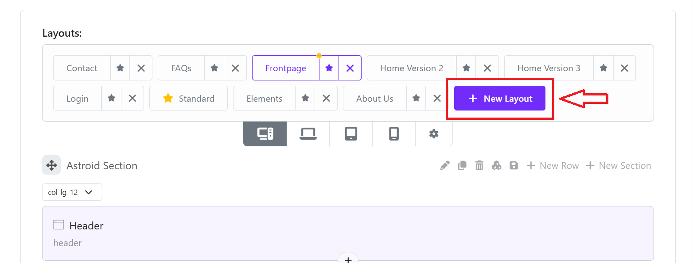
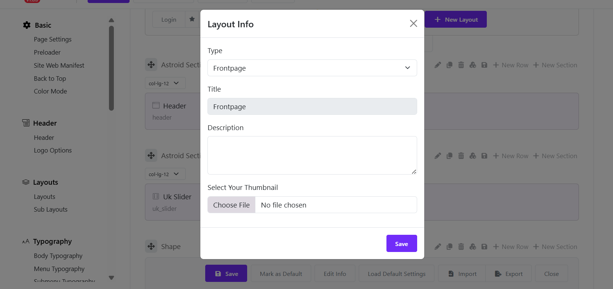
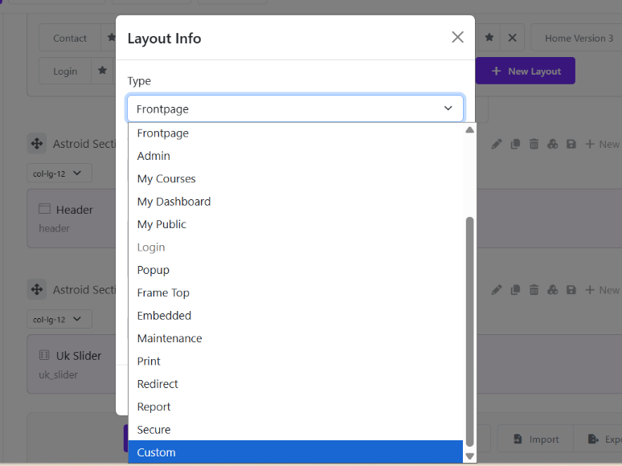
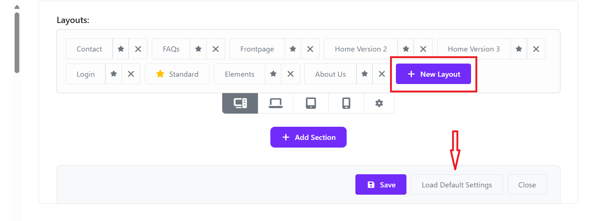
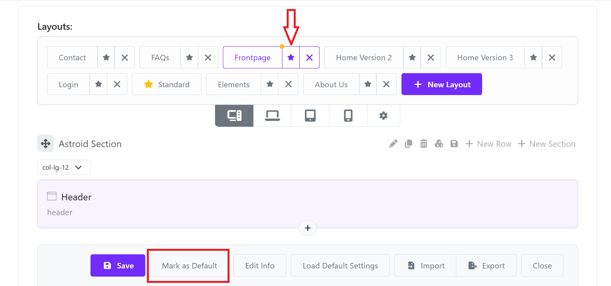
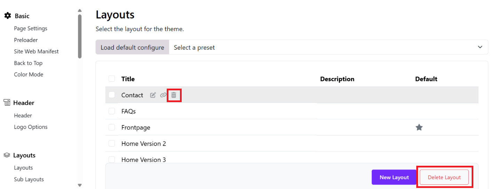
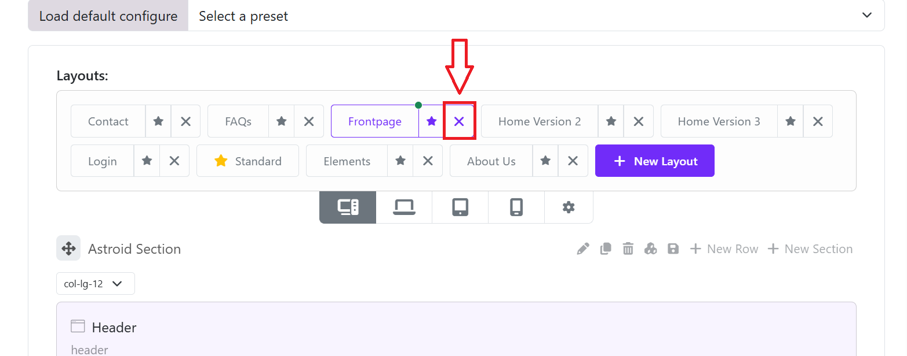
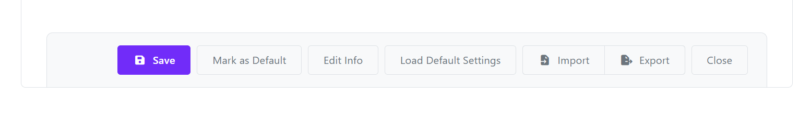

# Layout Builder

The Layout Builder is a visual and intuitive tool in the Moon Framework that allows you to design your Moodle website’s layout using a drag-and-drop interface. 
It enables you to structure your site without writing any code.

## Overview

Moon Framework’s Layout Builder gives you full control over your Moodle theme’s structure using a visual drag-and-drop interface. The layout is organized as a nested tree:

``` 
root  
└── sections  
    └── rows  
        └── cols  
            └── elements (components, modules, widgets, etc.)
```


## Layout Hierarchy Breakdown

* **Root**: The top-level container for your layout.
  * The top-level container that holds all sections.
  * Usually corresponds to the entire template layout.
  * Not editable directly but serves as the parent container.
* **Sections**: A section is a major block of layout, commonly used to separate different parts of the page like Header, Main Content, Footer, etc.
  * Parent: root
  * Children: rows
  * Configurable Properties:
    * Name (label)
    * Background (color/image/video)
    * Width (container/container-fluid/full-width)
    * Padding & margin
    * Custom classes and IDs
* **Rows**: Rows are horizontal containers within sections that can hold multiple columns.
  * Parent: section
  * Children: cols
  * Configurable Properties:
    * Name (label)
    * Background (color/image/video)
    * Padding & margin
    * Custom classes and IDs
* **Columns**: Columns are vertical containers within rows that hold elements like text, images, modules, etc.
  * Parent: row
  * Children: elements
  * Configurable Properties:
    * Name (label)
    * Width (Bootstrap grid classes). Each column’s width is defined using the 12-grid system (e.g., 6+6, 4+4+4)
    * Background (color/image/video)
    * Padding & margin
    * Custom classes and IDs
* **Elements**: Elements are the actual content blocks within columns, such as text, images, modules, etc.
  * Parent: col
  * Children: none (elements are leaf nodes)
  * Configurable Properties:
    * Type (component, module position, text, image, etc.)
    * Content (text, image source, module selection)
    * Alignment (left, center, right)
    * Padding & margin
    * Custom classes and IDs

## Working with Layout Builder

1. **Accessing the Layout Builder**:
   1. Log in to Site Administrator Panel.
   2. Navigate to Appearance > Themes
   3. Edit the current Moon theme
   4. Click on the Layout tab.
2. **Add Section**
    1.	Click “Add Section”
    2.	Enter a name (e.g., “Header”)
    3.	Configure width and background

3. **Add Row**
   1.	Inside a section, click “Add Row”
   2.	Choose column layout (1-column, 2-column, etc.)

4. **Add Columns**
   1.	Columns are added by default when you add a row
   2.	You can split columns, resize, duplicate, or delete them

5. **Add Elements**
   1.	Click inside a column
   2.	Choose from: Component, Module Position, or Widget
   3.	Configure the element’s name or settings

## Responsive Configuration





The Layout Builder allows you to configure how your layout behaves on different screen size. You can click on the settings icon to manage the which devices should be added. 

* **XXL** \(Larger Desktop\): Default layout for larger screens.
* **XL** \(Desktop\): Adjusts layout for standard desktop screens.
* **LG** \(Tablet\): Optimizes layout for tablet devices.
* **MD** \(Mobile Landscape\): Configures layout for mobile landscape orientation.
* **SM** \(Mobile Portrait\): Adjusts layout for mobile portrait orientation.
* **XS** \(Extra Small\): Configures layout for very small screens (e.g., small phones).

## Saving and Applying Layouts

* Use the Save or Save & Close buttons to apply changes
* Use Export and Import to back up or reuse layout configurations (JSON format)

## Add A New Layout



To create a new layout, click on the "New Layout" button, then you can create a new layout. Remember to save the layout so that the system saves that layout as a new layout file for your theme.

## Layout Types





After clicking the Save button, you can see a popup appearing to edit the layout info. 
* Layout type: Choose a layout type available from the list.
* Title: Enter the layout's title (About, Contact, Home ...).
* Description: Enter the layout's description (Leave blank if unnecessary).
* Select a thumbnail: Select a thumbnail image if you need.

## Load default settings



When you add a new layout, you can click on the button "Load default setting" to load the default layout without adding sections, rows, and elements manually. 

Besides, Loading default setting also helps you duplicate the layout of a prebuilt layout. By doing that, you should set a prebuilt layout as default, then create a new layout and then click "Load default setting". 

## Mark as Default



To select a layout as the template's default. Select the layout and click the "Mark as Default" button or click the Star icon next to the layout's name.

##  Delete Layout



* Find the layout you want to remove (e.g., “Contact”). Hover over it to reveal action icons. 
* Click the trash/bin icon next to the layout name (highlighted in your image).
* Use Bulk Delete: Tick the checkbox next to one or multiple layouts and Click the “Delete Layout” button on the right side.
* When you edit a layout, you can also delete a layout by clicking on the close icon of the layout you want to delete.



## Import/Export Layout



You can export the layout file to a JSON file by clicking the "Export" button. You can also import a layout file from a JSON file by clicking the "Import" button.

## Layout Link

From the layout list, you can hover on a layout to reveal icons. Click the 🔗 (link icon). This will:

* Either open the page in a new tab OR
* Show you the frontend URL of that layout.
* Copy that URL 

Then go to Site Administration > Appearance > Theme Advanced Settings > Custom Menu. There you can add the page url to create menu items according to the menu format. 