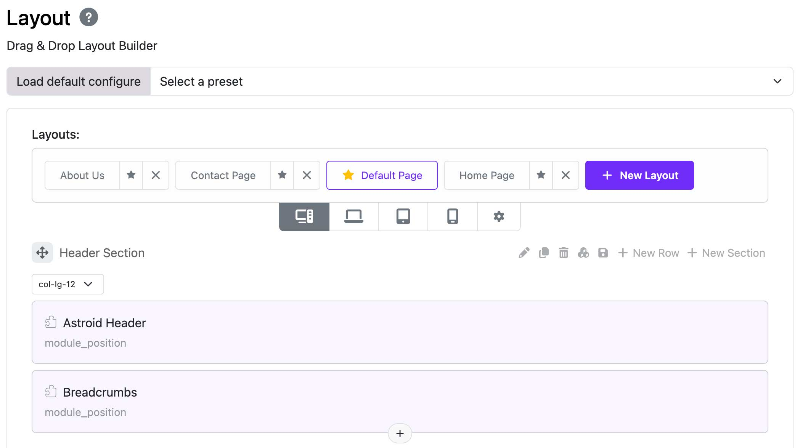
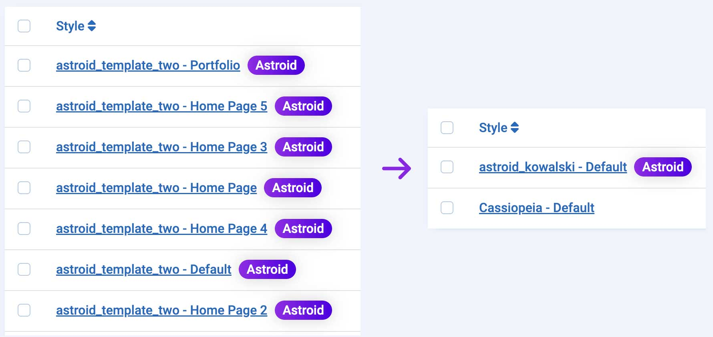
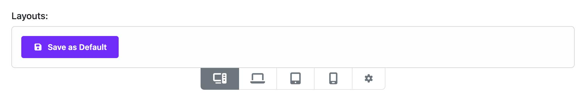
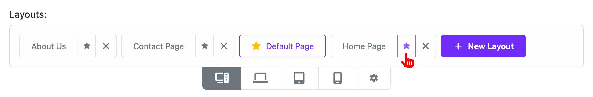
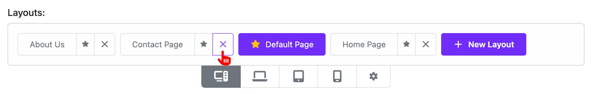
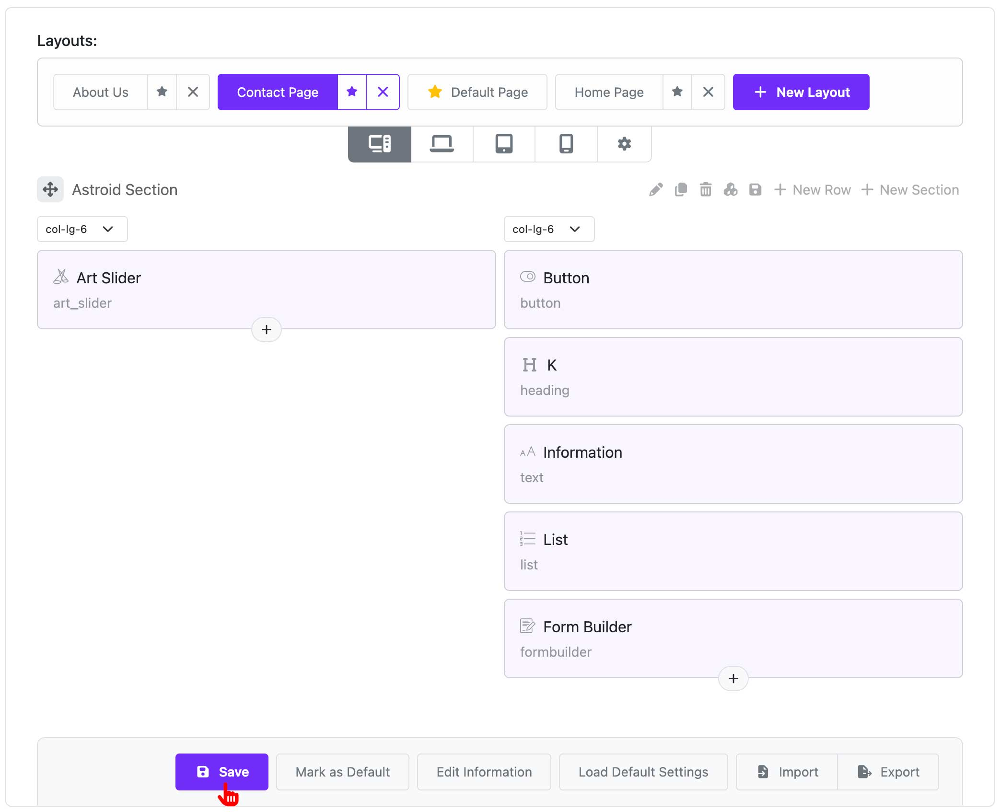
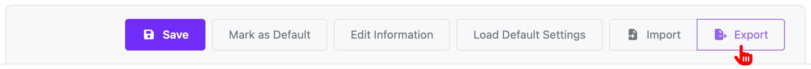
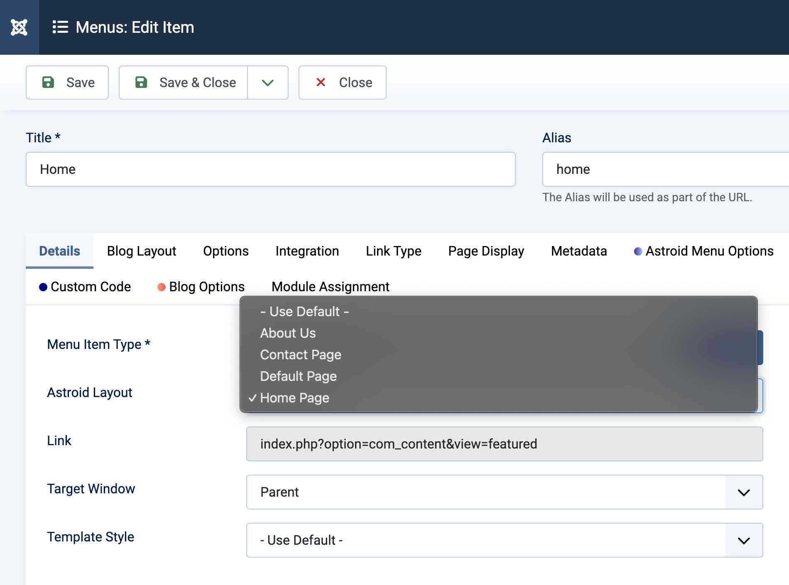

# Multi-Layouts

This solution is given when we need to use multiple layout builder options for different functional pages. For example: Blog, Home Page, About Us, Contact, etc.

:::info[Solution to previous issue]
Previously, to do this, we had to create multiple different style templates for each specific menu. Now, Multi-layout-builder only needs one style template to do that. This helps reduce unnecessary repetitive work and optimize data.
:::

---

## 1. Template Options

### 1.1. Save as Default

When you don't have any layout file yet. You will need to save a default layout first by clicking the "Save as Default" button, then the system will save the current layout as the default layout file of the template.

### 1.2. New Layout

To create a new layout, click on the "New Layout" button, then you can create a new layout. Remember to save the layout so that the system saves that layout as a new layout file for your template.

### 1.3. Mark as Default

To select a layout as the template's default. Select the layout and click the "Mark as Default" button or click the **Star** icon next to the layout's name.

### 1.4. Delete Layout

To delete a layout, click the **Delete** icon next to the layout name. Remember that you cannot delete the default layout of the template.

### 1.5. Edit Layout

To edit a layout, click the layout name. After editing, remember to save the layout.

### 1.6. Import/Export Layout

You can export the layout file to a JSON file by clicking the "Export" button. You can also import a layout file from a JSON file by clicking the "Import" button.

---

## 2. Menu Assignment

You can assign different layouts to different menu items. To do this, follow steps below:

1. Go to Administrator → Menus → Select a menu → Edit a menu item
2. In the **Details** tab → Find "Astroid Layout" → Select a layout you want to assign to that menu item
3. Save the menu item

:::info[Note]
If you do not select any layout. The template will load the data of the default layout.
:::