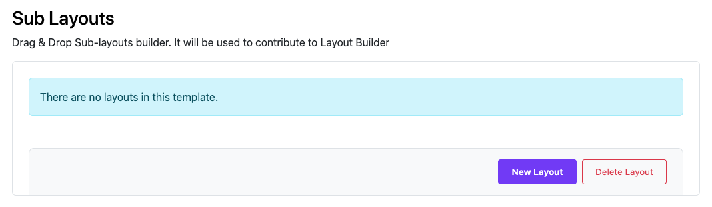
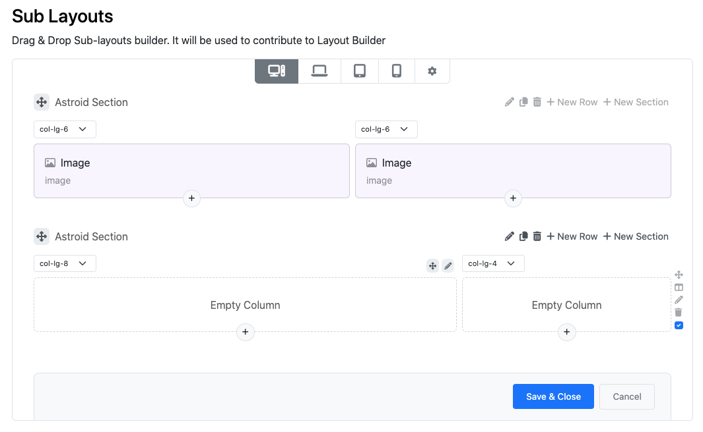
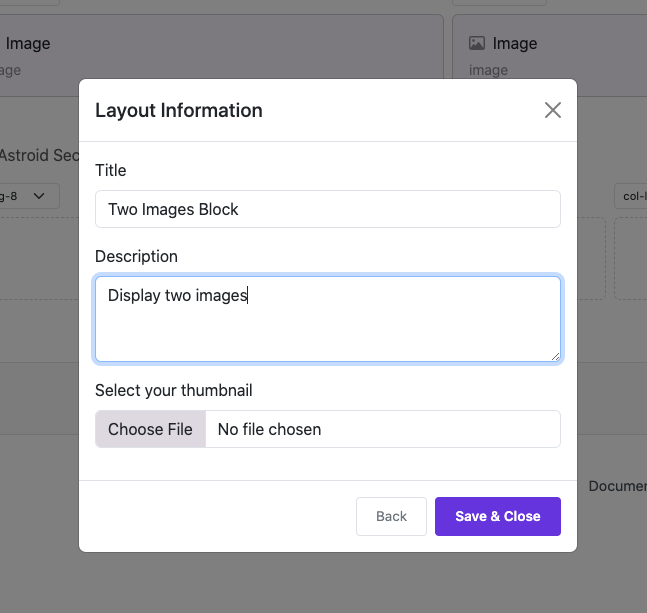
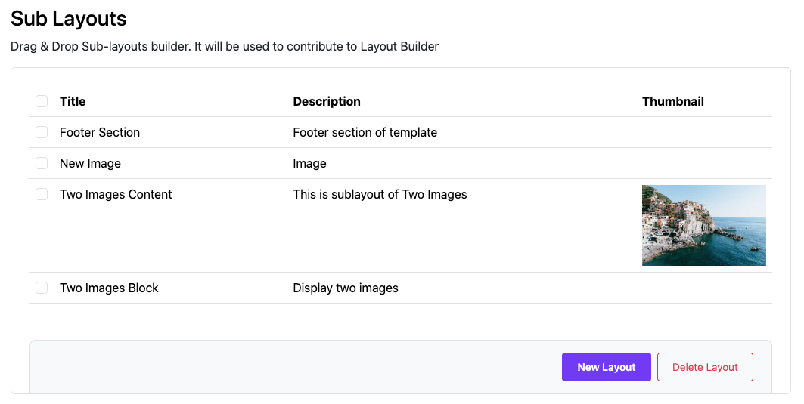
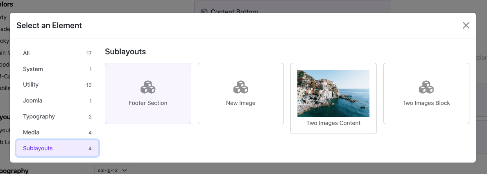
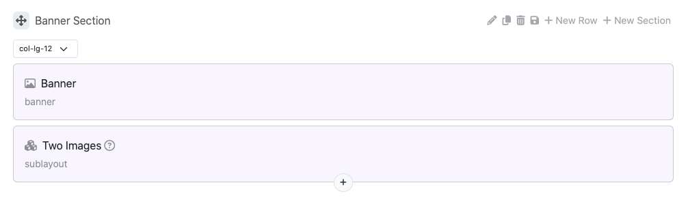
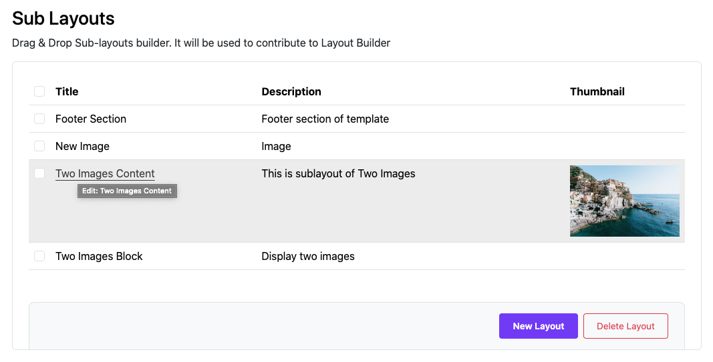
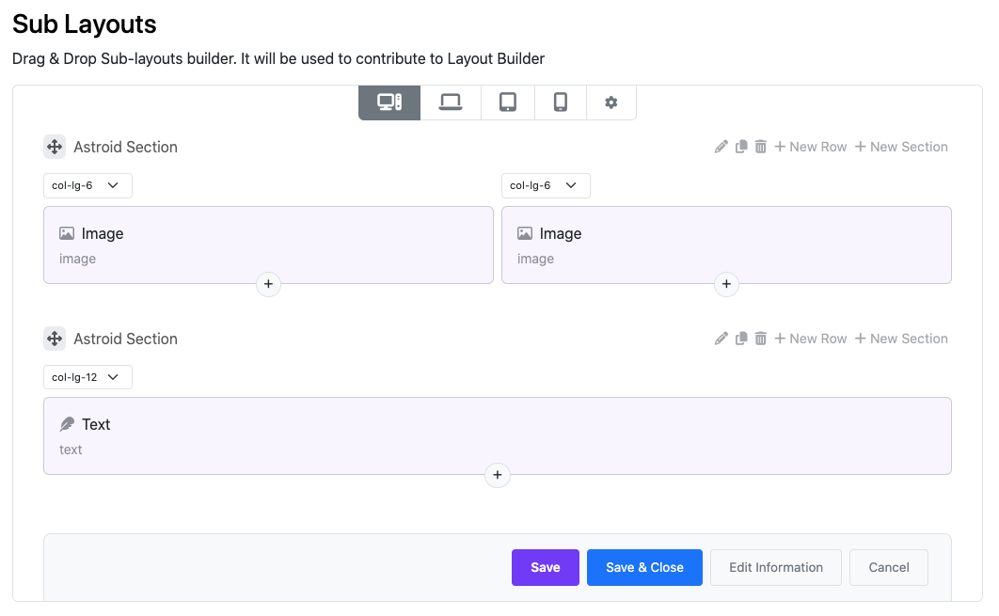
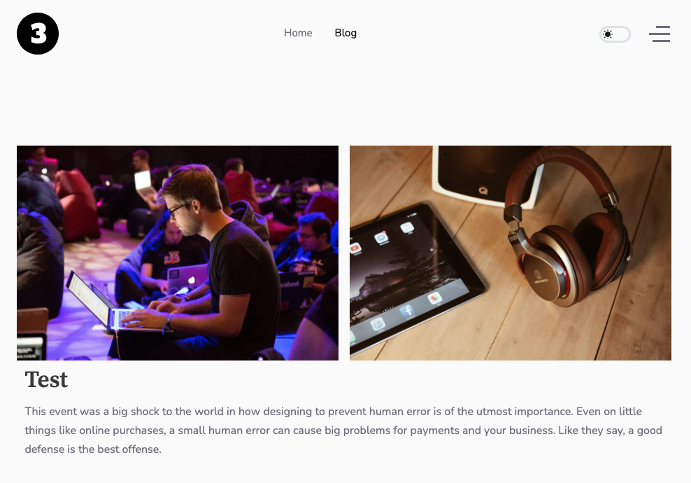

# Sub Layouts

The Sub Layouts feature in the Moon Framework allows you to create reusable layout components that can be easily integrated into different sections of your Joomla website. This feature enhances modularity and consistency across your site.

## Origin of the idea

When you have a template with many different styles. Sometimes you will encounter annoying problems with editing sections such as the footer of the layout on those styles. Repeating the same work on many styles will make us annoyed. That is why Sub-Layouts were born to solve this problem.

Basically, Sub-Layout has the same role as Joomla's Module. It was created to help admins reuse a layout section in many different Template Styles without having to repeat the work of creating same layouts.

## How to Create a Sub Layout

To create sub-layouts, go to:

- Log in to your Joomla Administrator Panel.
- Navigate to `System` → `Templates: Styles`.
- Click on the Astroid template you are using.
- Click the “Template Options” button.
- Go to the `Layout` → `Sub Layouts` tab.
- Click the `New Layout` button.

> First view of the Sub Layout

> Edit view of the Sub Layout

> Insert layout information and Save it.

> Save sub-layout successfully

## How to Use a Sub Layout

To use Sub-Layout. Switch to Layout > Layout.

Add Element >> Select `Sublayout` tab >> Select a `sublayout`

You can see it appear

## How to Edit a Sub Layout

If you want to edit your sublayout. Go back to Layout >> `Sub Layouts` >> Click to title to edit layout

Edit your sub-layout and save it again.

Go to Frontend to see the result.

## Summary

Basically, Sub-Layout has the same role as Joomla's Module. It was created to help admins reuse a layout section in many different Template Styles without having to repeat the work of creating layouts on that style.