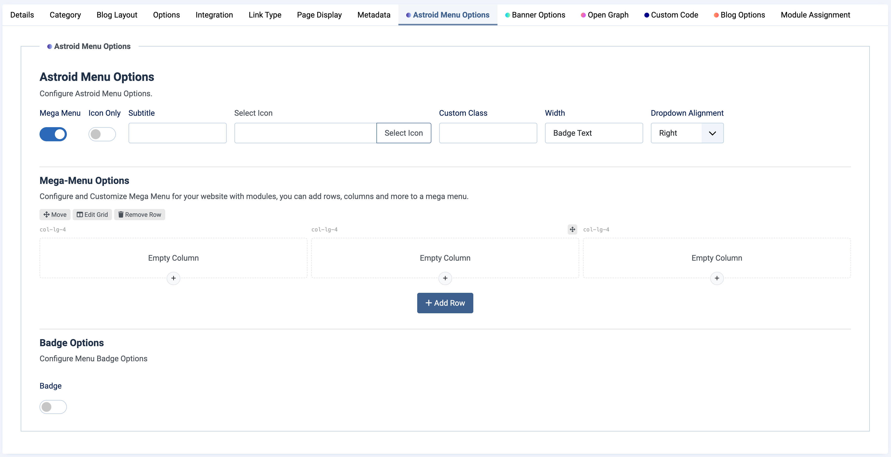
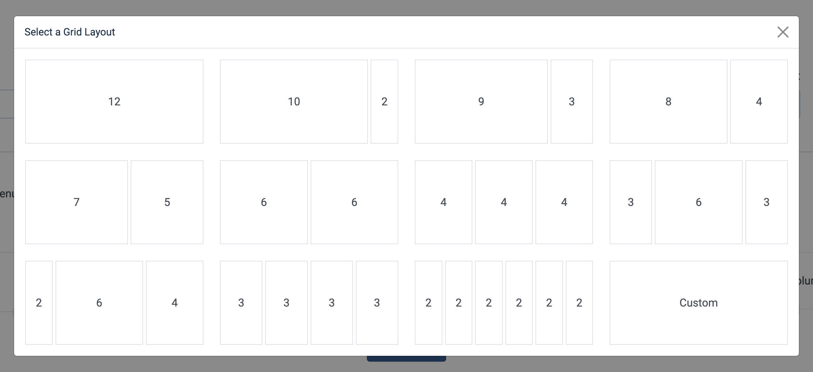
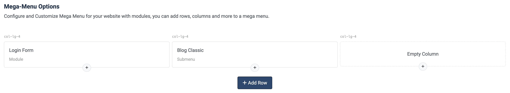

# Mega Menu

Moon Framework provides a powerful Mega Menu feature that allows you to create advanced navigation menus with multiple columns, images, and custom HTML content. This feature is particularly useful for websites with a lot of content or complex navigation structures.

## How to Create a Mega Menu

1. Log in to your Joomla Administrator Panel.
2. Go to: `Menus` → `Manage`.
3. Select the menu you want to edit or create a new one.
4. Click on the menu item you want to convert into a Mega Menu or create a new menu item.
5. In the menu item settings, look for the `Astroid Menu Options` tab and enable `Mega Menu` option.

6. Click on the `Add Row` button to add a new row for your Mega Menu.
7. Select a Grid Layout for the row. You can choose from various layouts like `1 Column`, `2 Columns`, `3 Columns`, etc.

8. For each column, you can add:
   - **Menu Items**: Select existing menu items to display in the column.
   - **Modules**: Load Joomla modules into the Mega Menu column.

Go to the frontend of your website to see the Mega Menu in action. You can hover over the menu item to reveal the Mega Menu with multiple columns and content.

