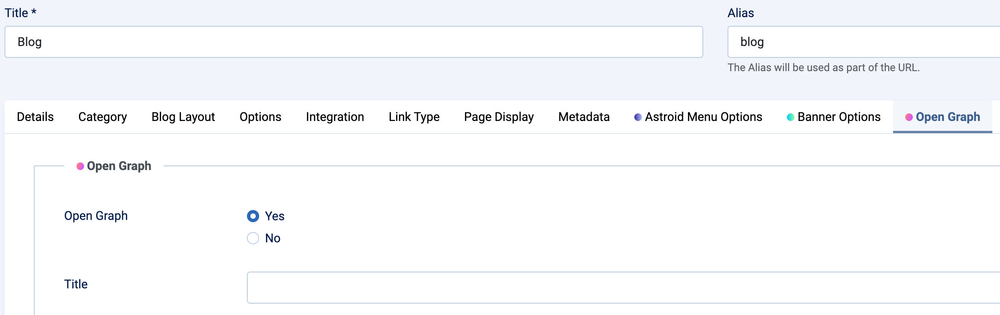
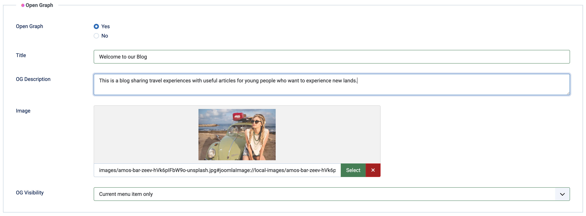

# Open Graph
Moon Framework allows you to add Open Graph meta tags to your Joomla template. Open Graph tags are used to control how your content appears when shared on social media platforms like Facebook, Twitter, and LinkedIn.

## ❓ What is Open Graph?

When you share a **link** on platforms like Facebook, Zalo, LinkedIn, etc., it usually shows:

- A preview image
- A title
- A short description

👉 The **Open Graph** feature lets **you control** what shows up when people share your website.

---

## 🔧 How to Enable Open Graph

### 🪜 Steps:

1. **Log in** to your Joomla Administrator.
2. Go to **Menus > [Select your menu]**.
3. Click on a **Menu Item** (the page you want to edit).
4. Go to the **Open Graph** tab.

---

## ✅ What Do These Options Mean?

| Option | What it Does |
|--------|---------------|
| **Enable Open Graph?** (Yes/No) | Turn the feature on or off for this menu item |
| **Title** | This title will show when the page is shared |
| **Description** | A short message that appears below the title |
| **Image** | The preview image shown when shared (use a wide image!) |
| **Show On** | Choose where this OG info appears: only on this page or on all pages |

> **Note:** These fields only appear **after you select “Yes”** to enable Open Graph.

---

## 📸 Example Walkthrough

### 👉 Step 1: Enable Open Graph

---

### 👉 Step 2: Fill in the details

---

## 💡 Tips for Better Sharing

- Use a **high-quality image** (recommended: **1200 x 630 px**)
- Keep your **title and description short, clear, and catchy**
- Preview your OG display using the Facebook Debugger:  
  👉 [Facebook Sharing Debugger](https://developers.facebook.com/tools/debug/)