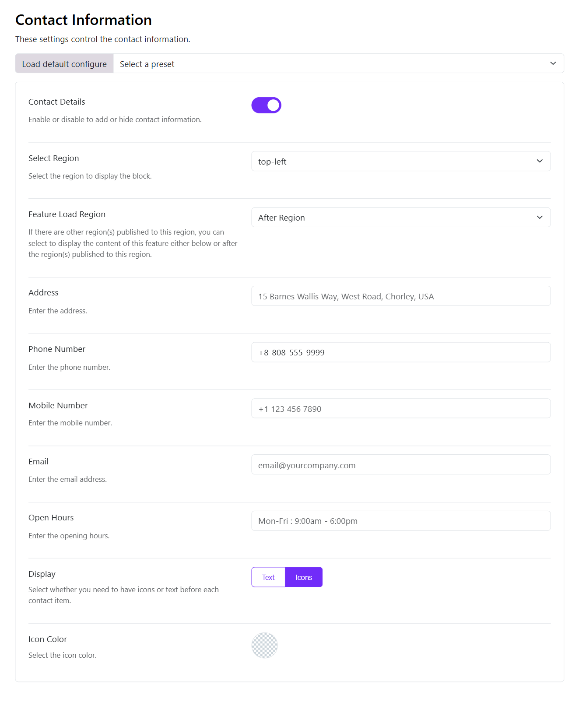

# Contact Information

Moon Framework allows you to add contact information to your Moodle website. This is typically used to display the contact details of your business or organization, such as phone number, email address, and physical address.

These fields can also be customized as per your choice like at which position will they be shown on the website.

You can modify this contact information field using the following options:

1. **Contact Details**:
   Enable/Disable whether you want to show the contact information on your site or not.

2. **Select Region**:
   Select a suitable region (position) where you want to display this feature. 
   Then you should add the selected region to the layout.

3. **Featured Load Region**:
   In case there are other modules published at the same position, then choose where you want to load the details Before Module or After Module.

4. **Phone Number**:
   Write the contact number of either your company or the concerned person to be contacted for any support. You can leave it blank if not required.

5. **Mobile Number**:
   Write the mobile number of the concerned person to be contacted for any support. You can leave it blank if not required.

6. **Email**:
   Add the email address of your company to be contacted for any support. You can leave it blank if not required.

7. **Open Hours**:
   Add your office timings on the website. You can leave it blank if not required.

8. **Address**:
   Add the office address on your website. You can leave it blank if not required.

9. **Display**:
   Here you can choose if you want to display the contact information only as Text or include Icons.

10. **Icon Color**:
    Here you can choose the color of the contact information icons. If you enable the color mode, you'll be able to adjust the icon color of both light and dark modes.
    