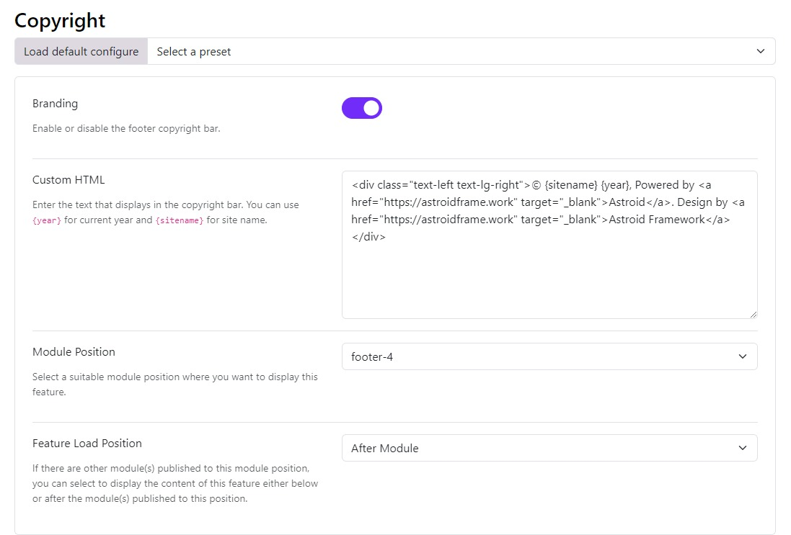

# Copyright

This feature allows you to add a copyright notice to your Joomla website. This is typically used to display the copyright year and the name of the copyright holder.

You can easily Enable or Disable the bar from the backend, after enabling this section you are open to editing the content of the copyright information bar for your site.

1. **Branding**:
   Enable/Disable whether you want to display the copyright bar in the footer or not.

2. **Custom HTML**:
   Here you can enter the text that is displayed in the copyright bar using HTML tags.

3. **Module Position**:
   Select a suitable module position where you want to display the copyright bar.

4. **Feature Load Position**:
   In case there are other modules published at the same position, then choose where you want to load the bar Before Module or After Module.