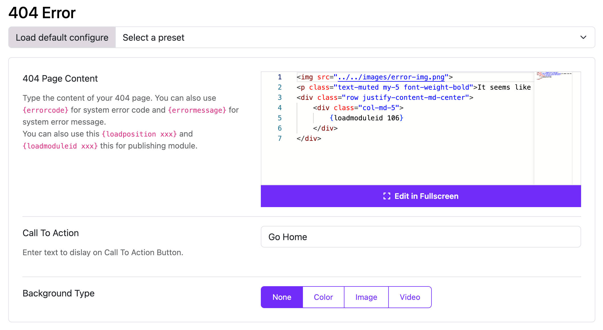

# Error Page

Moon Framework provides a feature to customize the error page of your Joomla website. This is useful for displaying a custom message or design when a user encounters an error, such as a 404 Not Found error.

## How to Customize the Error Page
1. Log in to your Joomla Administrator Panel.
2. Go to: `System` → `Site Templates` → `Templates (Site)`.
3. Click on the Astroid template you are using.
4. Click the “Template Options” button.
5. Go to the `404 Error` tab.
6. Here, you can customize the error page settings:
   - **404 Page Content**: Type the content of your 404 page. You can also use `{errorcode}` for system error code and `{errormessage}` for system error message.
     You can also use this `{loadposition xxx}` and `{loadmoduleid xxx}` this for publishing module.
   - **Call To Action**: Enter text to dislay on Call To Action Button.
   - **Background Type**: Choose the background type for the error page. You can select from options like `Image`, `Color`, or `Video`.