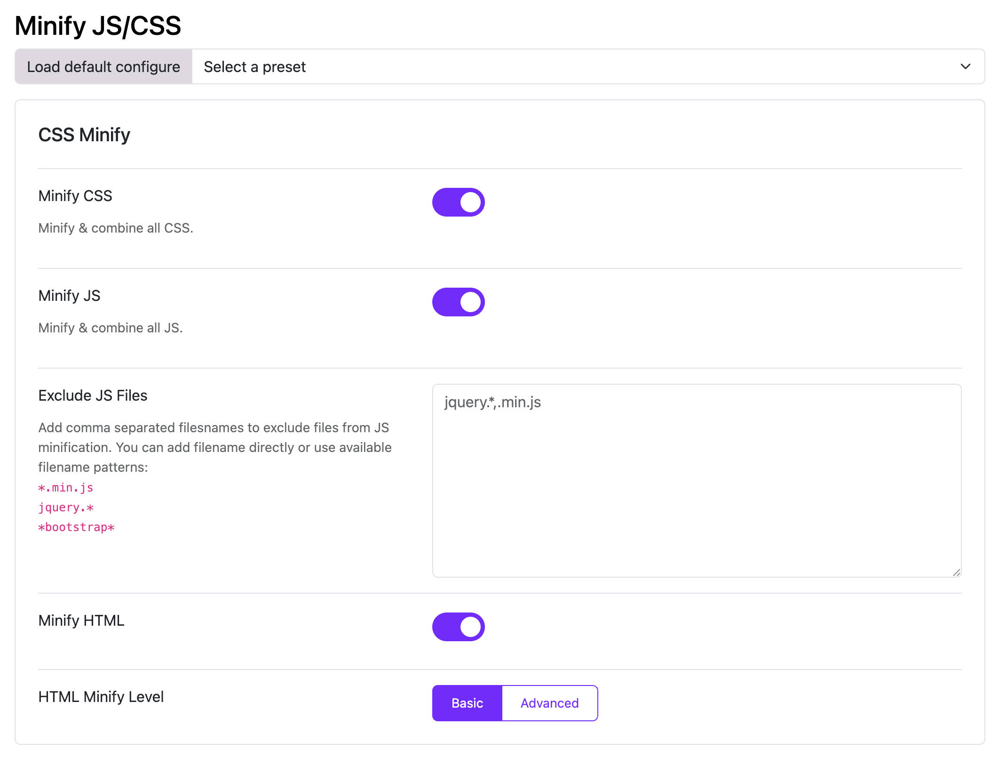

# Minify JS, CSS, and HTML

Moon Framework provides options to minify JavaScript, CSS, and HTML files to improve the performance of your Joomla website. Minification reduces the file size by removing unnecessary characters, comments, and whitespace without affecting functionality.

* **Minify CSS**: Enabling this will combine all the CSS files of your website and load it as combined static content.
* **Minify JS**: Enabling this will combine all the JS files of the website and load it as combined content. You also have the option to write which all js files you wish to exclude in the minification each entered on a new line for eg: .
* **Minify HTML**: Enabling this will determine the level of minification whether Basic (reducing all the whitespaces and line ends to one) or Advanced (reducing all the whitespaces, the line ends, comments and undisplayed elements).

