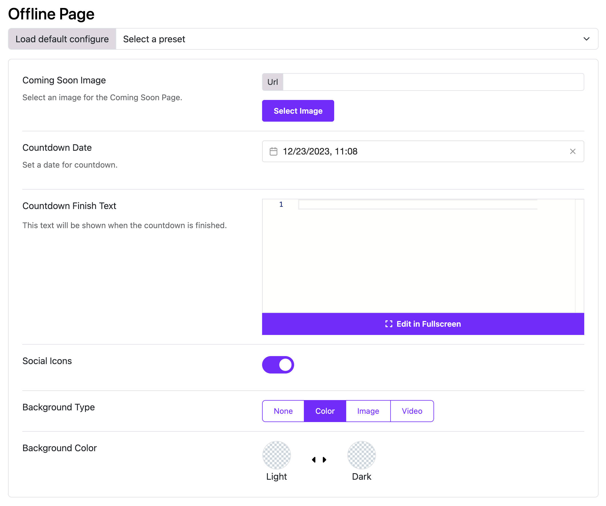

# Offline Page

Moon Framework provides a feature to customize the offline page of your Joomla website. This is useful for displaying a custom message or design when your site is temporarily unavailable.

## How to Customize the Offline Page

1. Log in to your Joomla Administrator Panel.
2. Go to: `System` → `Site Templates` → `Templates (Site)`.
3. Click on the Astroid template you are using.
4. Click the “Template Options” button.
5. Go to the `Offline Page` tab.
6. Here, you can customize the offline page settings:
   - **Coming Soon Image**: Upload an image to be displayed on the offline page. This can be a logo or any other relevant image.
   - **Countdown Date**: Set a date for the countdown timer. This is useful if you want to indicate when the site will be back online.
   - **Countdown Finish Text**: Enter the text to display when the countdown reaches zero. This can be a message like "We are back!" or "Stay tuned!".
   - **Social Icons**: Add links to your social media profiles. This allows visitors to follow you on social platforms while your site is offline.
   - **Background Type**: Choose the background type for the offline page. You can select from options like `Image`, `Color`, or `Video`.

