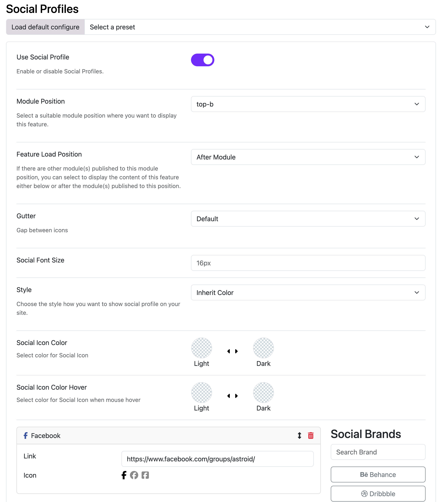

# Social Profile

If you want to show social media icons like **Facebook, YouTube, TikTok, LinkedIn** on your Joomla website, the **Moon Framework** makes it very easy using the built-in **Social Profiler** feature.

---

## Step 1: Go to Your Joomla Template Settings

1. Log in to your **Joomla Administrator** panel
2. On the top menu, go to: → **System** → **Site Template Styles**
3. Select your template (e.g. `Astroid Template Two`)

---

## Step 2: Open the “Options” Tab

1. After opening your template, click on the **“Template Options”** tab at the main content
2. In the left sidebar menu, click on **“Social Profiles”**

---

## Step 3: Enable the Social Profiler

1. Find the switch called **“Use Social Profile”**
2. Click to turn it **ON**

---

## Step 4: Add Your Social Media Profiles

1. You’ll now see a section **Social Brands** to add **social dialog**
2. Click to **“Social Brands”** to add your social media profiles
3. For each profile:
    - Select the icon of social platform (Facebook, Instagram, etc.)
    - Paste your link (e.g. your Facebook page URL)

---

## Step 5: Choose Where to Display the Icons

1. In **Module Position**, select where you want the icons to appear:
    - `astroid-top-social` = Top of page
    - `footer` = Bottom of page
    - Or any module position available in your template
2. Choose to show icons **before** or **after** other modules
3. Customize:
    - **Gutter spacing** (distance between icons)
    - **Icon size** (e.g. `20px`)
    - **Colors**: either use your theme colors or the default brand colors (like Facebook blue)

---

## Final Step: Save and Check Your Website

1. Click **Save** or **Save & Close**
2. Open your website frontend and you’ll see the social media icons displayed as configured.

---

## 💡 Tips

- Show your most-used social platforms first.
- Use consistent icon sizing for a clean layout.
- Choose "Brand Color" for easily recognizable icons (e.g. red for YouTube, blue for Facebook).

---

## ❓ Common Questions

**Q: I turned it on, but nothing appears?**  
→ Make sure you added at least one social link and selected a valid module position.

**Q: Can I place icons in my menu or sidebar?**  
→ Yes! Just pick a module position in that area, or create a custom module and use the same layout.