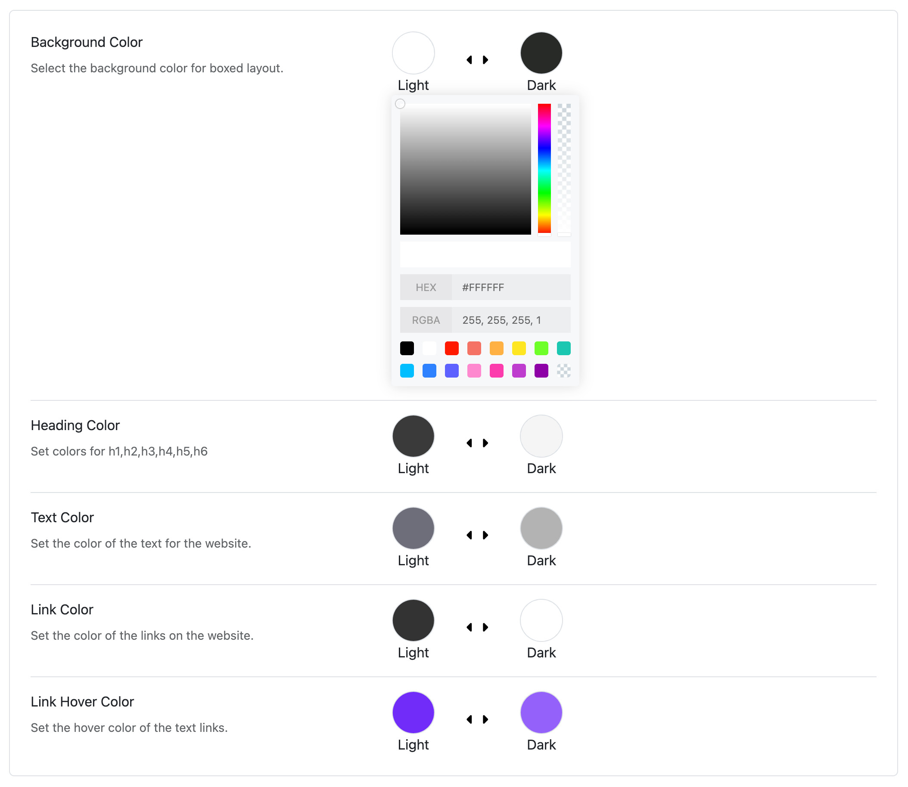

# Color

Moon makes it simple to change the colors of your Moodle website — no coding needed! This guide will help you understand how to update your site’s colors step by step.  
The built-in color picker works with both light mode and dark mode (If you enable the color mode option), so you can preview and adjust colors accordingly.

## 📍 Where to Start?

1.	Log in to your Moodle Site Administrator Panel
2.	Go to: Appearance > Themes
3.	Click the setting icon of the Moon theme
4.	Go to the Colors tab

## 📘 Color Groups You Can Edit

Colors are grouped by different parts of your website. Here’s what each group means:

⸻

### 🧍‍♂️ Body Colors (Main Page Content)
* **Background Color** – The main background of your website.
* **Heading Color** – The color of titles and headings.
* **Text Color** – The regular text color.
* **Link Color** – Color of clickable links.
* **Link Hover Color** – Link color when you hover your mouse.

⸻

### 🧢 Header Colors (Top Section of the Site)
* **Header Background** – Color behind your logo and menu.
* **Header Text & Headings** – Colors of text in the header.
* **Header Link & Hover** – Menu link colors in the header.

⸻

### 📌 Sticky Header Colors (Header Stays at Top on Scroll)
Background, link colors, and mobile icon colors when the sticky header is visible.

⸻

### 📋 Main Menu Colors
* Menu link text color.
* Hover and active (selected) link colors.
* Background colors for hover or active states.

⸻

### 🔽 Dropdown Menu Colors
* Submenu background and text colors.
* Hover and active item colors.

⸻

### 🗄️ BLock Drawer

⸻

### 📱 Mobile Menu Colors

Astroid supports 2 types of mobile menus:
* Off-canvas menu (slides from the side).
* Mobile menu (simple dropdown style).

You can change:
* Background colors
* Text and link colors
* Menu icon color (hamburger menu)
* Active item colors

⸻

### 🖱 How to Change a Color
1.	Click on the color box in any section.
2.	Pick a new color using the color picker or enter a color code (like #ff6600).
3.	Click Save to apply your changes.
4.	Clear cache if you don’t see updates right away.

⸻

### 💡 Tips
* Use your brand colors for a professional look.
* Make sure text and background colors have good contrast for readability.
* Try different combinations and use the Preview to see how it looks.

