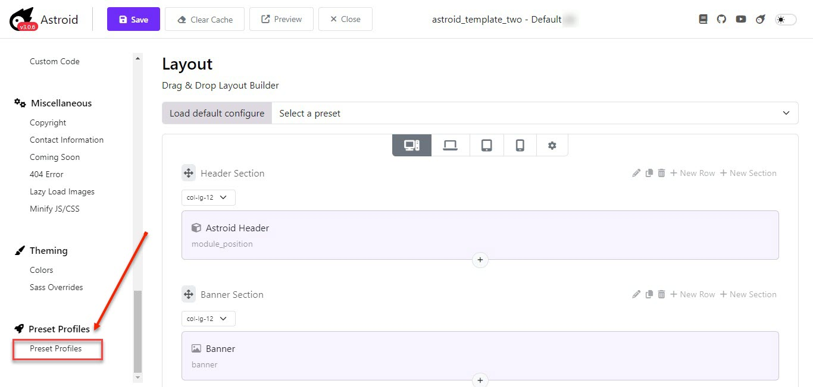
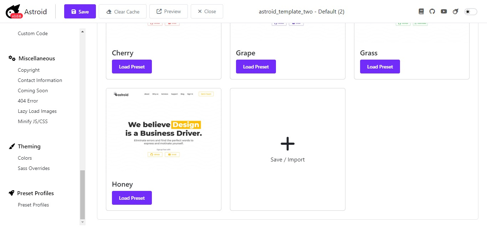
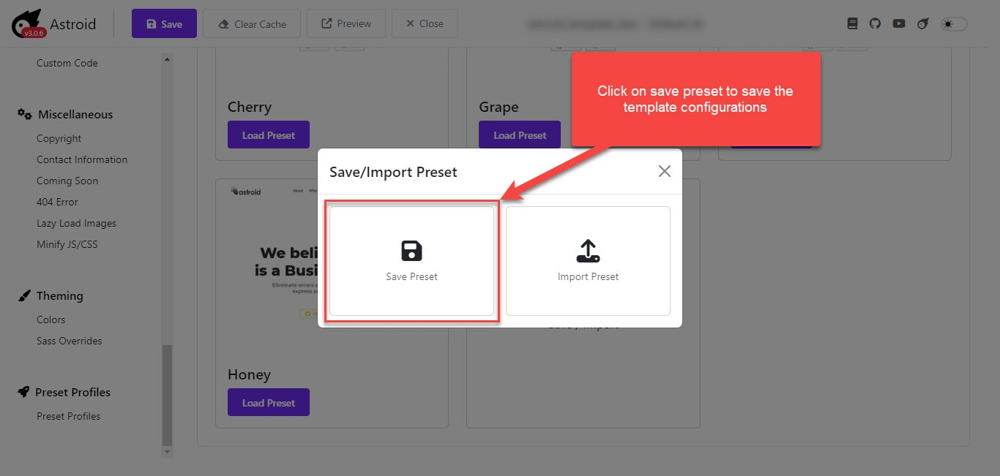
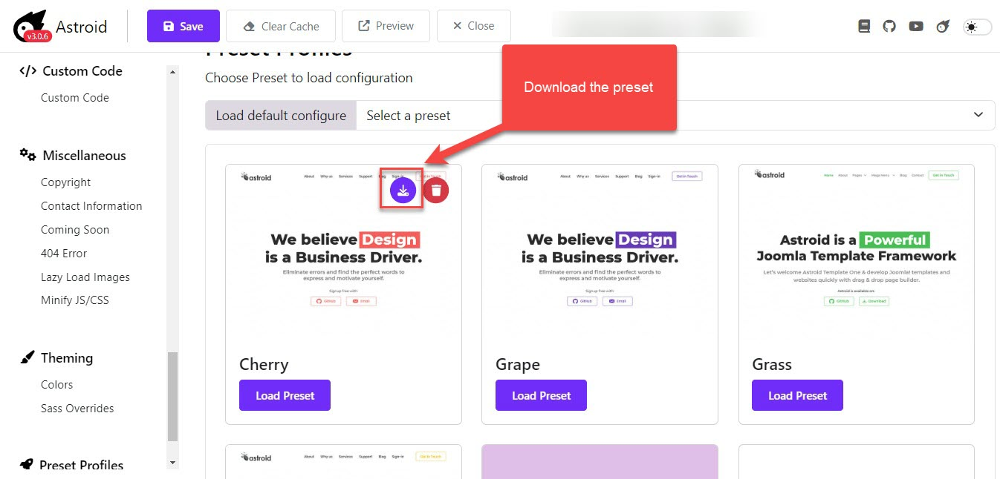
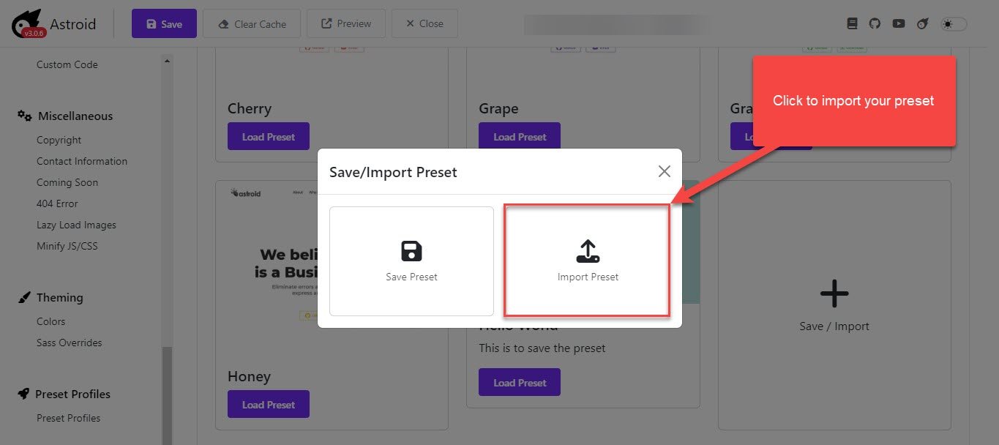
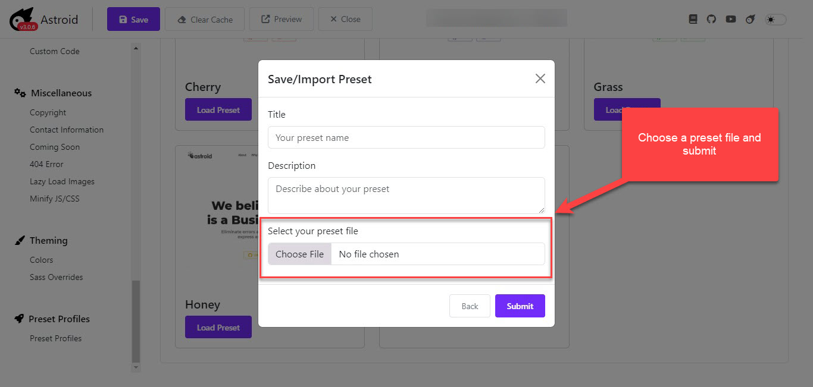

# Preset Profiles

Export & Import template configurations in Astroid 3.x

In the Astroid 2.x, the import and export Astroid settings were separated into 2 sections, but since the Astroid 3.x, the framework offers the Preset Profiles that carry both import and export functions. 

## Loading Presets

To load a preset of a prebuilt style, please click on the Load Preset button to proceed. It will ask you "Your current configure will be lost and overwritten by new data. Are you sure?" Agree Ok and the process will be done > then save. 

## How To Export

You can easily export all your Astroid settings by clicking the Save Preset to save all the template configurations. Then click on the Download Preset to save the preset (JSON file) on your computer.

Downloaded preset files can be imported later to restore your template settings.

## How To Import

Importing is as easy as exporting, just click import and select the JSON file from your computer.

Choose the JSON file you want to import and click Open and Submit. Then the preset file will be successfully imported.

