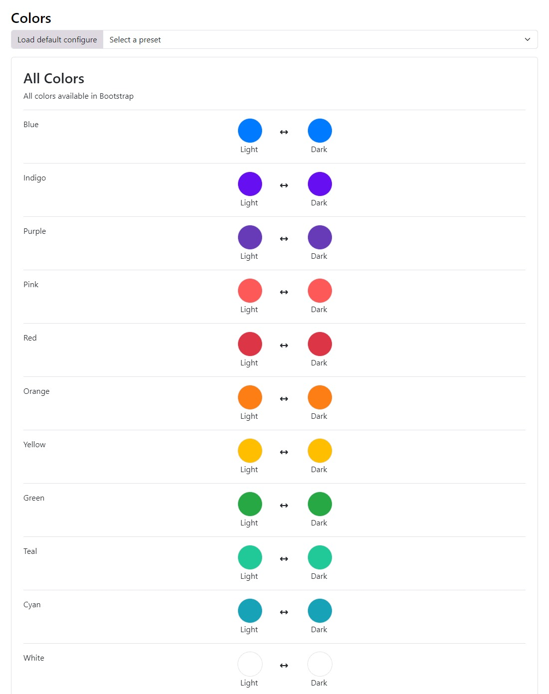
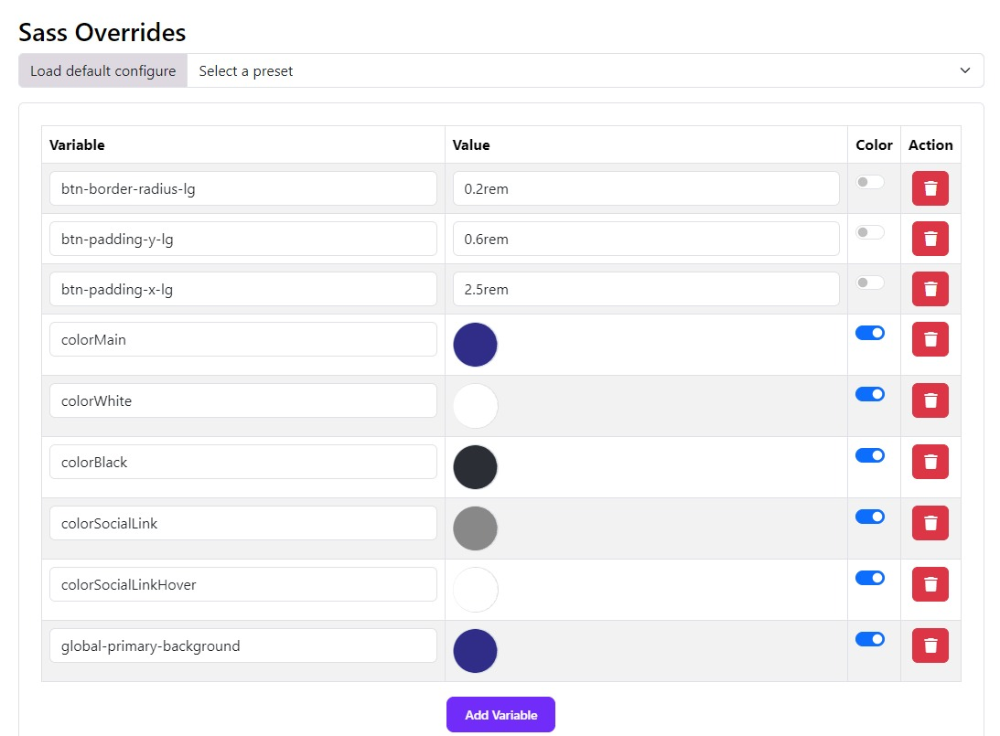

# Theming

Moon Framework provides a powerful theming system that allows you to customize the look and feel of your Joomla template. You can easily change colors, fonts, and other visual elements to match your brand or personal style.

## 📍 Where to Start?
1. Log in to your Joomla Administrator Panel.
2. Go to: System → Site Templates → Templates (Site).
3. Click on the Astroid template you are using.
4. Click the “Template Options” button.
5. Go to the `Theming` tab.
6. Here you can change the default colors and link them with the different areas of your website.
7. Click the `Save` button to apply your changes.

Theming comes with 2 major features.

Select the default colors and link those colors with the default area of your website (i.e. primary, secondary and others).

## 🌈 Color Palette
Moon Framework allows you to define a color palette for your template. This palette can be used throughout your site to maintain a consistent look and feel.

## 🎨 Custom Colors
You can also define custom colors for specific elements of your template. This allows you to create unique styles for different sections of your site.
The SASS Overrides system is the ability to override bootstrap SAAS variables. Assuming you know SAAS and want to override the default bootstrap variables. You can easily do so by modifying the variables in the backend itself.

Default Bootstrap SAAS variables can be found in the file `JOOMLAROOT/media/astroid/assets/vendor/bootstrap/scss/_variables.scss`

You can override it in your template (ex: astroid_template_two) in the file `JOOMLAROOT/media/templates/site/astroid_template_two/scss/variable_overrides.scss`

