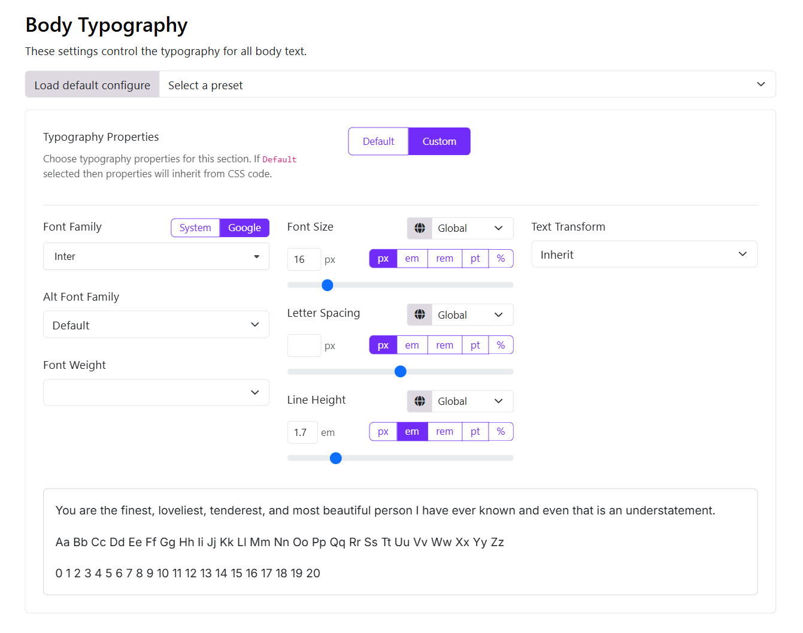

# Typography

The Typography feature in Moon Framework allows you to easily customize fonts and text styles across your entire Joomla! website. With this tool, you can apply System Fonts, Google Fonts, Local font, adjust font sizes, line heights, weights, and more — all without writing custom CSS.

## Accessing the Typography Settings

  - Log in to your Site Administrator Panel.
  - Navigate to Appearance > Themes 
  - Edit the Moon theme's settings > Typography

## Typography Options

- **Font Family**: Choose from System Fonts, Google Fonts, or Local Fonts.
  - **System Fonts**: Select from a list of common system fonts.
  - **Google Fonts**: Browse and select from the extensive Google Fonts library.
  - **Local Font**: Upload and use your own custom font files.
- **Alt Font Family**: Set an alternative font family that will be used if the primary font is unavailable.
- **Font Size**: Set the base font size for your website. This will be applied to all text elements unless overridden by specific styles.
- **Line Height**: Adjust the line height for better readability. This setting affects the vertical spacing between lines of text.
- **Font Weight**: Choose the font weight (e.g., 100, 200,... 900) to control the thickness of the text.
- **Text Transform**: Apply text transformations such as uppercase, lowercase, or capitalize to your text.
- **Letter Spacing**: Adjust the spacing between characters in your text for better legibility.
- **Font Color**: Set the default color for your text. You can choose from a color picker or enter a hex code.
- **Font Style**: Choose between bold, italic, or underline styles for your text.
