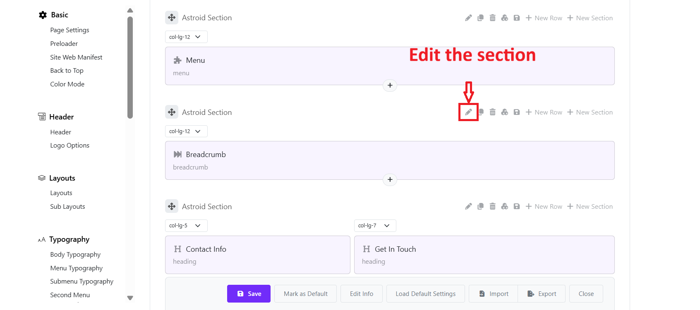
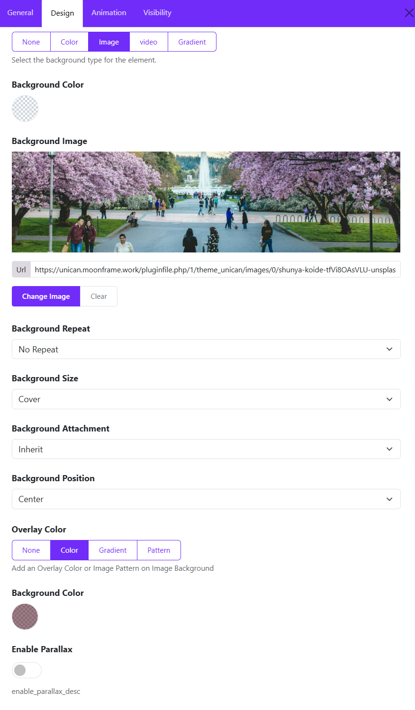

Here below is the way to change a section background image in Moon framework, not only for the Breadcrumb section, but for any other section in the layout.  

---

## 🔧 Change Background Image

### 1. Open Template Settings

* Go to **Moodle Admin → Site Administration → Appearance → Themes → Unican Settings

### 2. Go to Layout Builder and edit the section

* Go to the **“Layout”** tab > Navigate the section containing the Breadcrumb.
* Click edit the section

* Open Design Settings > Choose a background type (Color, Image, Video, or none)
* Under **Background Image** You can click **Change Image**, upload a new image or choose another background type. 

* **Note**: In case you create the Breadcrumb with a Sub-layout, you should go to Layout > Sub-layouts > edit the Breadcrumb sub-layout > edit the section > Design tab and change the background image. 

### 3. Configure Background Options

* **Background Repeat** ex: No Repeat
* **Background Size** → ex: Cover
* **Background Attachment** → ex: Fixed
* **Background Position** → ex: Center Center
* **Overlay** (optional) → Choose an overlay type (None, Color, Gradient, Pattern)

  

