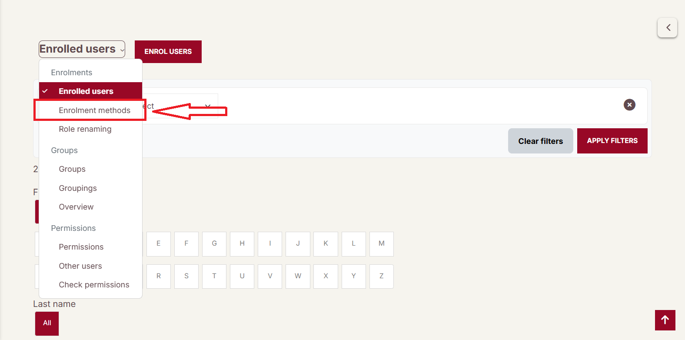
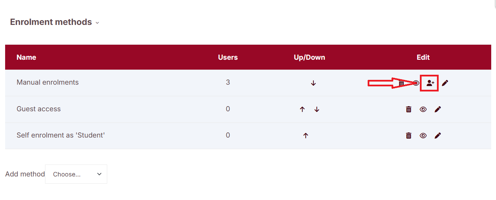
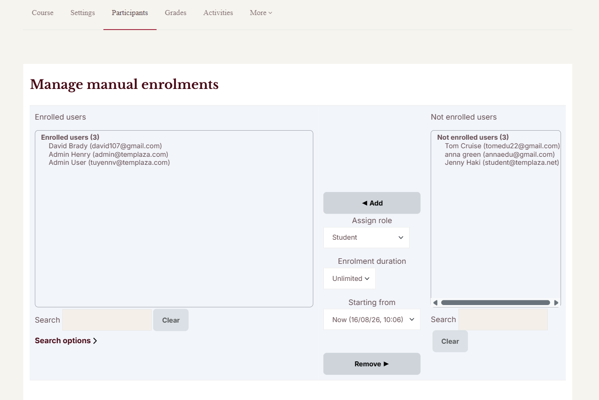

# Course Enrolment Page

Course enrolment in Moodle allows teachers or administrators to control **how users join a course**. Enrolment can be done manually, automatically, or through other methods depending on the course configuration.

## Add the "course content" section

To add the "course content" section:

1. Go to course.
2. Turn Editing On
3. Add course sections, activities and resources, or sub-section. 

>> Moodle documentation: [To add course sections](https://docs.moodle.org/500/en/Course_homepage#To_add_course_sections).

## Accessing the Enrolment Methods Page

1. Open the course.
2. Click **Participants** in the course navigation menu.
3. From the dropdown menu, select **Enrolment methods**. You will see a list of enrolment methods available for the course.

# Common Enrolment Methods

## 1. Manual Enrolment

Manual enrolment allows teachers or administrators to add users individually.

### How to Enrol a User Manually

1. Go to **Participants → Enrolment methods**
2. Locate **Manual enrolments**
3. Click the **Enrol users icon (👤➕)**
4. Search for a user or select users on the right column
5. Select a **Role** (Student, Teacher, etc.)
6. Click **Add**, and the selected users on the right will be moved to the enrolled users column on the left.

The selected user will immediately gain access to the course.

## 2. Self Enrolment

Self enrolment allows users to enrol themselves into a course.

### How It Works

* Users can join the course themselves
* An **enrolment key (password)** may be required
* The teacher controls availability

### Configuring Self Enrolment

1. Go to **Participants → Enrolment methods**
2. Click **Edit (✏️)** next to **Self enrolment**
3. Configure settings such as:

    * **Enrolment key**
    * **Maximum enrolled users**
    * **Start and end date**
    * **Default assigned role**

Click **Save changes** when finished.

## 3. Guest Access

Guest access allows visitors to view course content without enrolling.

Features:

* Users do not appear in the participant list
* Guests typically cannot submit activities or assignments

# Managing Enrolment Methods

## Change Enrolment Order

Use the **Up/Down arrows** to reorder enrolment methods.

This affects which method is used first if multiple enrolment options exist.

## Disable an Enrolment Method

To temporarily stop new enrolments:

1. Click the **eye icon (👁)** to disable the method.
2. The method becomes inactive but existing users remain enrolled.

## Delete an Enrolment Method

To remove an enrolment method completely:

1. Click the **trash icon (🗑)**
2. Confirm the deletion.

Note: Deleting an enrolment method may remove users enrolled through it.
