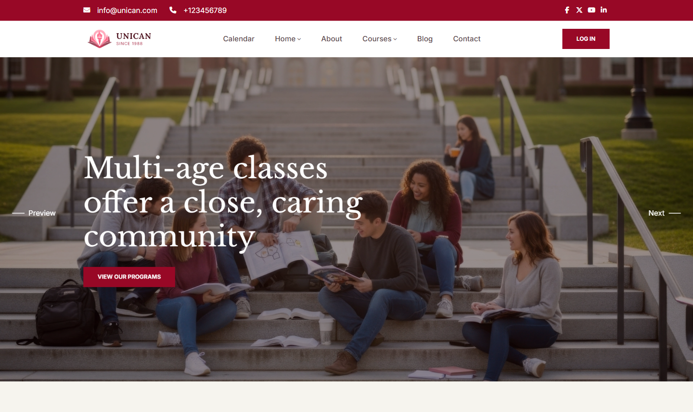

# Unican - Introduction

Unican is a modern and professional Moodle theme designed specifically for universities, colleges, and higher education institutions delivering online and blended learning.

Packed with powerful features and intuitive customization options, Unican makes it easy to create a professional university and eLearning website without any coding complexity. Personalize layouts, color schemes, typography, banners, and more through a user-friendly interface, while comprehensive admin controls give you complete flexibility to tailor every aspect of your learning platform.

Designed with a fully responsive layout, Unican ensures a seamless learning experience across desktops, tablets, and smartphones. Courses, learning materials, and university content automatically adapt to every screen size, providing students and educators with an optimal browsing experience wherever they are.

Whether you're building an online university portal, distance learning platform, or campus LMS, Unican provides everything you need to create a modern, engaging, and impactful Moodle-powered education website.

## Extended Features – Unican University Education Moodle Theme

* **Modern University Design** – Clean, professional, and student-focused design crafted for universities, colleges, and higher education institutions.

* **Fully Responsive Layout** – Delivers a flawless learning experience across desktops, tablets, and mobile devices.

* **Advanced Theme Customizer** – Easily personalize colors, typography, layouts, logos, banners, and branding without coding.

* **Drag & Drop Homepage Builder** – Build engaging homepage layouts with customizable content blocks and sections.

* **Featured Courses Showcase** – Highlight popular, new, or recommended courses to attract student enrollment.

* **University Programs & Departments** – Display faculties, departments, academic programs, and course categories in an organized way.

* **Events & Announcements** – Keep students informed with upcoming events, academic calendars, news, and campus announcements.

* **Instructor & Faculty Profiles** – Introduce lecturers, professors, and academic staff with dedicated profile sections.

* **Student Dashboard** – Provide quick access to enrolled courses, progress tracking, grades, deadlines, and learning activities.

* **Course Search & Filtering** – Help students quickly discover courses using intuitive search and category filters.

* **Custom Promotional Sections** – Create eye-catching hero banners, CTAs, scholarship promotions, and admission campaigns.

* **Multiple Header & Footer Styles** – Choose from flexible layouts to match your university's branding.

* **Mega Menu Navigation** – Build structured navigation menus for faculties, departments, courses, and campus resources.

* **Optimized Course Presentation** – Display courses with attractive cards, thumbnails, instructors, ratings, and key information.

* **Google Fonts Integration** – Choose from hundreds of fonts to create a unique visual identity.

* **Unlimited Color Options** – Customize every major interface element to align with your institution's brand guidelines.

* **SEO-Friendly Structure** – Built with clean, semantic code to improve visibility in search engines.

* **Fast Loading Performance** – Optimized assets and efficient code deliver a smooth browsing experience.

* **Cross-Browser Compatibility** – Works consistently across Chrome, Firefox, Edge, Safari, and other modern browsers.

* **RTL Language Support** – Supports right-to-left languages for international educational institutions.

* **Translation Ready** – Easily localize the theme for multilingual campuses and global learners.

* **Accessibility-Oriented Design** – Designed with usability best practices to provide an inclusive learning experience.

* **Easy Installation & Configuration** – Quick setup process with intuitive administration for Moodle site managers.

* **Regular Updates** – Ongoing improvements, compatibility updates, and feature enhancements.

* **Professional Documentation** – Comprehensive guides to help administrators install, configure, and customize the theme.

