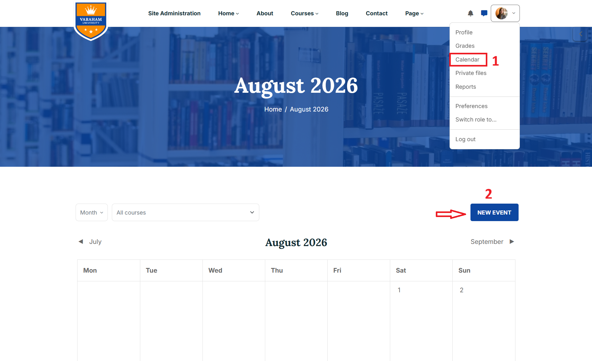
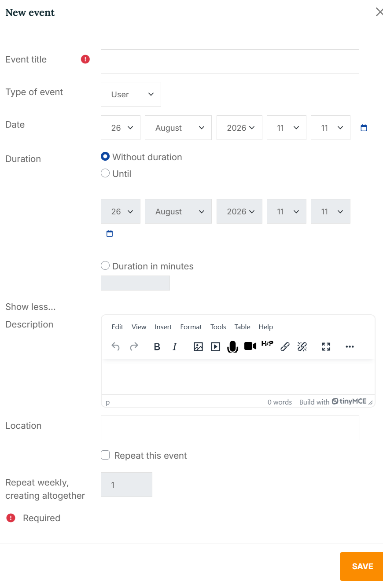

# Education Events

## Access the Calendar

1. Log in to your Moodle site.
2. Click your user profile/avatar in the top-right corner of the page.
3. From the profile dropdown menu, select Calendar.

## Create a New Event

Click the NEW EVENT button on the right side of the page.

In the New Event form, enter the required information:

* Event title:  Enter the name of the event.
* Event type: Use the Type of event dropdown menu to select the appropriate event type.  
* Date: Select the date when the event will take place.
* Duration: Define how long the event lasts.
* Description – Add additional information or instructions about the event.
* Location – Specify where the event will take place, if applicable.
* Repeat weekly, creating altogether: If the event occurs regularly, enable Repeat this event.