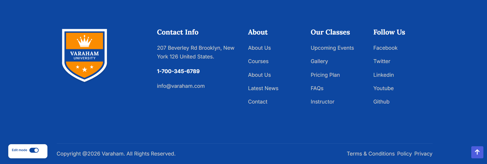
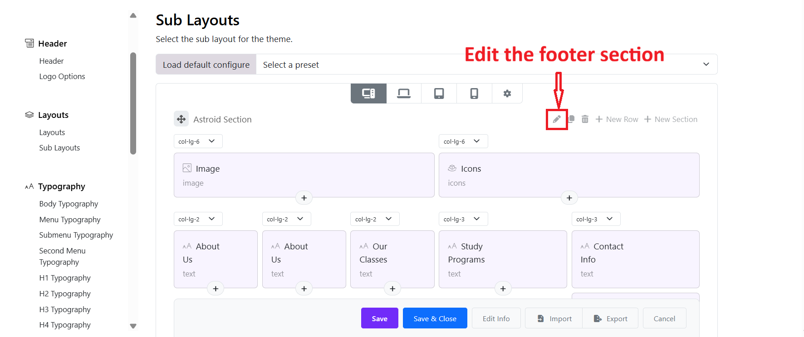
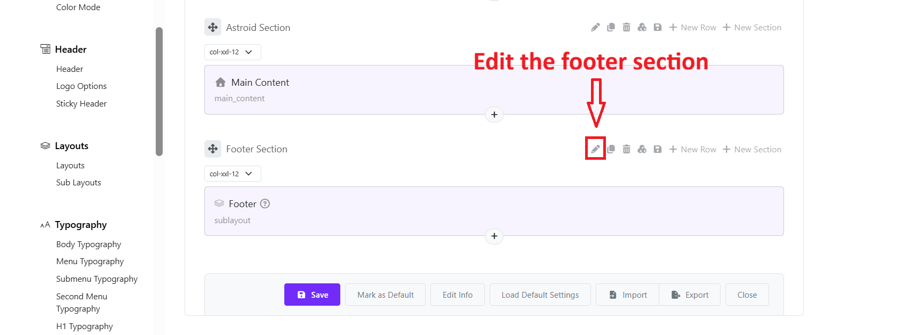
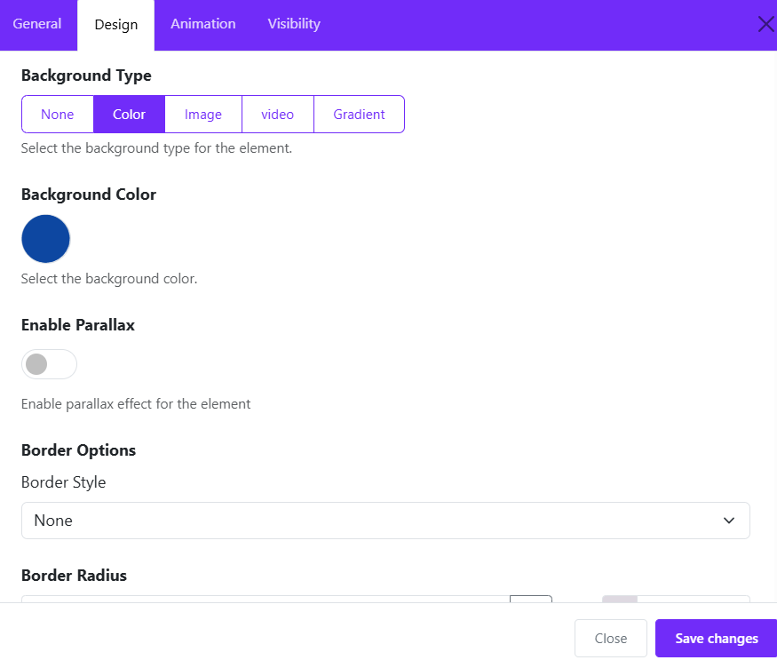

# Theme Footer

The **theme footer** is created using a **Sub-Layout**.
This sub-layout is then inserted into the **Main Layout**, allowing you to reuse and manage the footer content easily.
Please go to Site Administrator > Appearance > Themes > Edit the Varaham theme's settings > Layout > Sub-Layout.

You can:

* Edit footer content (text, links, images, phone number)
* Adjust column widths
* Add or remove footer sections
* Control how the footer appears on desktop, tablet, and mobile

## Understanding the Footer Structure

### Sections

The footer is divided into **sections** (labeled as *Astroid Section*).

Each section can contain:

* One or more rows
* Multiple content blocks (text, image, links, etc.)

### Rows and Columns

Inside each section:

* Content is arranged in **columns**
* Column width is controlled by dropdowns like `col-lg-2`, `col-lg-4`, `col-lg-6`

**Example:**

* `col-lg-2` = small column
* `col-lg-4` = medium column
* `col-lg-6` = half width

👉 Column sizes affect **desktop view**. Tablet and mobile views auto-adjust.

## Footer Content Blocks

Each box inside a column is a **content block**.

### Common footer blocks include:

* **About Us** – Text description
* **Our Classes** – Quick Links
* **Text** – Quick Links
* **Follow Us** - Social Icons  
* **Contact Info** – Contact Address
* **Image** – Logo or footer image
* **List** - Menu Links

## Editing Footer Content

1. Click on a content block (e.g. *About Us*)
2. Update the text, image, or links
3. Click **Save** when finished

Changes apply instantly after saving.

## Adding New Content

### Add a new content block

* Click the **➕ (Plus)** icon inside a column
* Choose the content type (Text, Image, Links, etc.)

### Add a new row

* Click **+ New Row**

### Add a new section

* Click **+ New Section**

## 6. Device Preview

At the top of the editor, you can switch between:

* 🖥 Desktop
* 💻 Laptop
* 📱 Tablet
* 📱 Mobile

Use these to ensure the footer looks good on all devices.

## Footer background

* Go back to Layouts > edit the Footer Section > Design tab. You can see background options: Color, Image, Video, and Gradient. 
* If you don't want to set a background type, choose None.

## How the Footer Appears on the Website

* The footer **sub-layout** is linked to the **main layout**. You just need to edit the Main Layout > add the sub-layout to the footer section > Save. 
* Any changes you make in the sub-layout will be automatically updated in the website footer.
* No additional setup is required.

