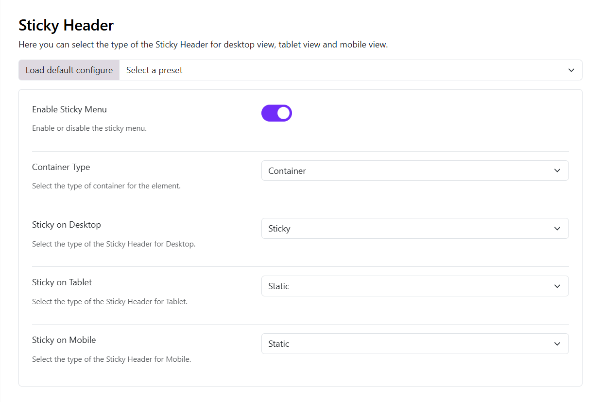

# Header Settings

## 1. Accessing Header Settings

1. Log in to the Admin Panel.
2. Open **Appearance > Themes > Varaham theme > click on the Settings icon**.
3. Navigate **Header** in the left sidebar.

## Enable Header

**Enable Header** (Toggle)

* **On**: Header is visible on the website.
* **Off**: Header is completely hidden.

> Tip: Turn this off if you want a landing page without a header.

# Header Modes

The Moon Header System supports three primary modes, each with its own layout options and configuration parameters.

- Horizontal Header
- Stacked Header
- Sidebar Header

## Horizontal Header

The horizontal header layout arranges elements in a row across the page. It offers three different menu placement options: left, center, and right.

* **Left**: The logo and the menu items are positioned to the left and the header block is to the right
* **Center**: Here the logo is to the left, menu items are in the center and the header block is on the right
* **Right**: Here the logo is to the left, the menu items and header block are to the right

## Stacked Header

The stacked header provides more complex layouts with elements stacked in multiple rows. It supports five layout variants:

* **Center Balance** - Logo centered between left and right sections
* **Center** - Logo and menu centered
* **Separated** - Logo with menu items separated evenly
* **Divided** - Logo on left, menu below
* **Divided** Logo Left - Logo on left in a fixed width column with menu and other elements in adjacent columns

## Sidebar Header

The sidebar header positions elements in a vertical column on the side of the page. It offers three placement options:

* **Left** - Vertical header on the left side
* **Right** - Vertical header on the right side
* **Topbar** - Combination of horizontal topbar with vertical sidebar

## Header Blocks
Choose what you want to display in the header blocks from the given options in the dropdown that is:

* **Blank**: Leave a blank space
* **Region**: Publish a module whose position you can choose in the next option Block Position
* **Custom HTML**: You can also publish a custom HTML in the header block, simply writing your code in the next option Block 1 Custom HTML

:::info[Note]
Some Header Blocks will only work on desktops, not for tablets and mobile.
:::

## Header Breakpoint

Controls **when the header changes layout on smaller screens**.

Available breakpoints:

* Large
* Medium
* Small

Example:

* **Large**: Header switches to mobile layout earlier (on tablets).
* **Small**: Header stays desktop-style longer.

> Recommended setting: **Large** for better mobile usability.

# Sticky Header

The Sticky Header settings allow you to control whether the header remains visible while visitors scroll through your website.

1. **Enable Sticky Menu**

Use this option to enable or disable the Sticky Header.

Enabled: The header can remain visible while the visitor scrolls.
Disabled: The header behaves normally and does not use sticky behavior.

2. **Container Type**

The Container Type determines the container structure used by the Sticky Header.

Choose an appropriate container type based on the layout of your website.

This setting is useful when you want the sticky header content to follow the same container behavior as the rest of your site.

3. **Sticky on Desktop**

Determines how the header behaves on desktop screens.

Available options include:

* Sticky – The header remains fixed at the top of the screen while scrolling.
* Sticky on Scroll Up – The header appears when the visitor scrolls upward and hides when scrolling downward.

For example, select Sticky if you want the navigation to remain permanently accessible while visitors browse a long page.

4. **Sticky on Tablet**

Controls Sticky Header behavior on tablet devices.

You can choose:

* Static – Normal header behavior.
* Sticky – Keeps the header visible while scrolling.
* Sticky on Scroll Up – Shows the header when the user scrolls back up.

This allows you to use a different behavior from desktop. For example, you can keep the header sticky on desktop but use a static header on tablets.

5. **Sticky on Mobile**

Controls Sticky Header behavior on mobile devices.

The available options are:

* Static – The header scrolls normally with the page.
* Sticky – The header remains at the top while scrolling.
* Sticky on Scroll Up – The header becomes visible when the visitor scrolls upward.

