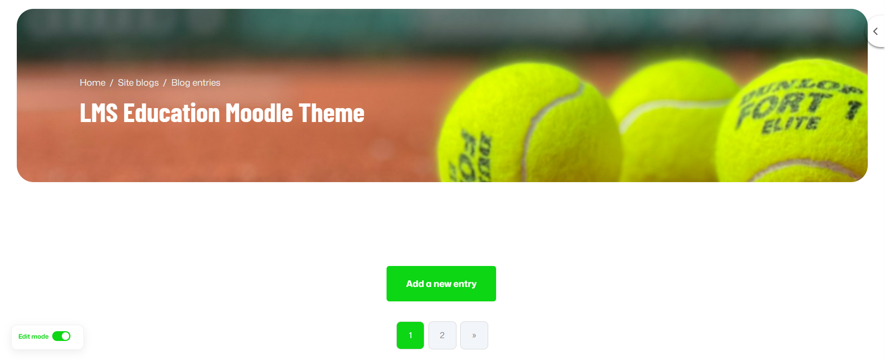
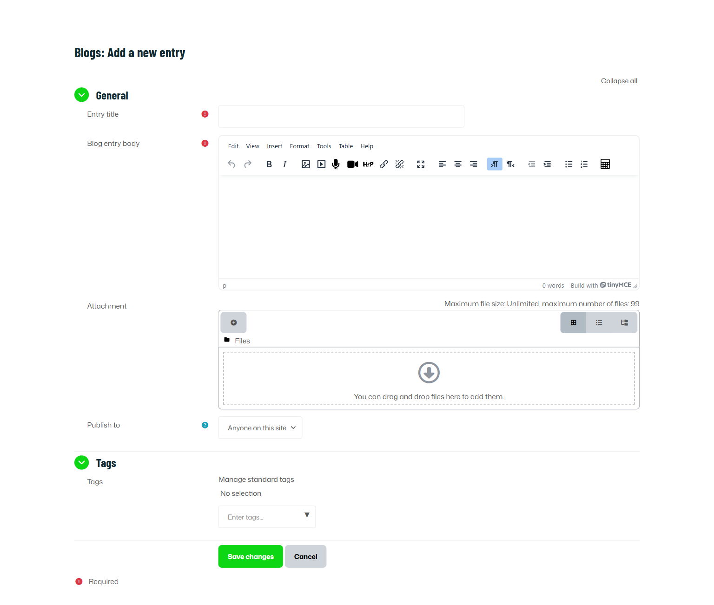

# Blog Settings

**Location:**
`Site administration → Appearance → Blog`

This page allows administrators to control how the blog feature works across the entire site, including visibility, external blog integration, and comment management.
You can also refer to the Moodle Blog Documentation: [Moodle Blog](https://docs.moodle.org/500/en/Blogs) 

## 1. Enable Blog Associations

**Purpose:**
Allows blog posts to be linked (associated) with:

* Courses
* Course activities (modules)

**When enabled:**

* Users can connect their blog posts to specific courses or activities.
* Blog entries may appear in course contexts.

**When disabled:**

* Blog posts cannot be linked to courses or activities.

**Recommended:**
Keep enabled if your LMS uses blogs for learning reflections or course-based discussions.

---

## 2. Blog Visibility

**Purpose:**
Controls who can view blog entries across the platform.

This setting defines the **maximum visibility level for viewers**, not for authors.

Typical options include:

* The world can read entries set to be world-accessible
* All site users can see all blog entries
* Only logged-in users can view blogs
* Disable blogs completely

**Important:**
This controls viewing permissions globally. Individual blog privacy settings still apply within this limit.

**Recommended:**

* For internal LMS: “All site users”
* For public sites: “The world can read world-accessible entries”

---

## 3. Enable External Blogs

**Purpose:**
Allows users to connect external blog feeds (RSS/Atom) to their Moodle blog.

**When enabled:**

* Users can register external blog URLs.
* Moodle automatically imports new entries.

**When disabled:**

* Users cannot link external blogs.

**Use case:**
Helpful when instructors or students maintain blogs outside the LMS and want automatic synchronization.

---

## 4. External Blog Cron Schedule

**Purpose:**
Defines how often Moodle checks external blog feeds for new entries.

**Options:**

* Every hour
* Every 12 hours
* Every 24 hours (default)

**Important:**
This depends on the system cron job being configured correctly.

**Recommendation:**

* 24 hours for normal usage
* 1–12 hours if frequent updates are required

---

## 5. Maximum Number of External Blogs per User

**Default:** 1

**Purpose:**
Limits how many external blog feeds a user can connect.

**Example:**
If set to 3, each user may register up to 3 external blog URLs.

**Recommendation:**
Keep low (1–2) to avoid performance issues and excessive feed checks.

---

## 6. Enable Comments

**Purpose:**
Allows users to comment on blog posts.

**When enabled:**

* Blog entries support discussion.
* Users can reply and interact.

**When disabled:**

* Blogs become read-only.
* No interaction is possible.

**Recommended:**
Enable for collaborative learning environments.

---

## 7. Show Comments Count

**Purpose:**
Displays the number of comments next to blog posts (Default: Yes)

**Note:**
This requires an additional database query when displaying blog listings.

**Performance Consideration:**
On very large sites, disabling this may slightly improve performance.

---

# Adding a blog entry

From the main menu > Blog > Add A new blog entry
Alternatively, if the Blog menu block is enabled in the course, click Add a new entry there.
Write your entry and give it a title.

If you want to attach a file, click the Add button to access the File picker to locate a file. Be sure your document is smaller than the maximum attachment size. Alternatively, drag and drop your file into the box provided.

Choose who you wish to publish the entry to i.e. who may see the entry. There are three options:

- Yourself i.e. your blog entry is a draft
- Anyone on your site
- Anyone in the world

Select appropriate official tags for your entry and/or add one or more user defined tags. If you add more than one, they should be comma separated. 
Click on the "Save changes" button.
