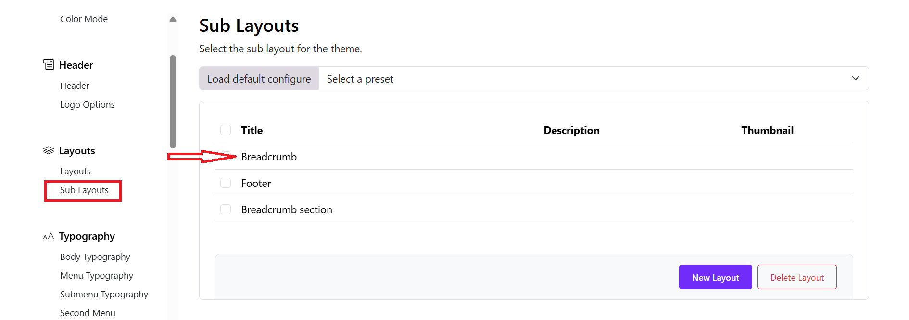
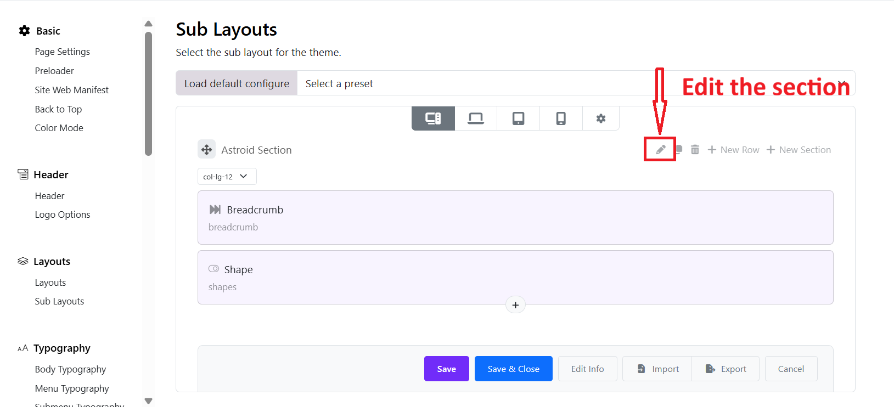
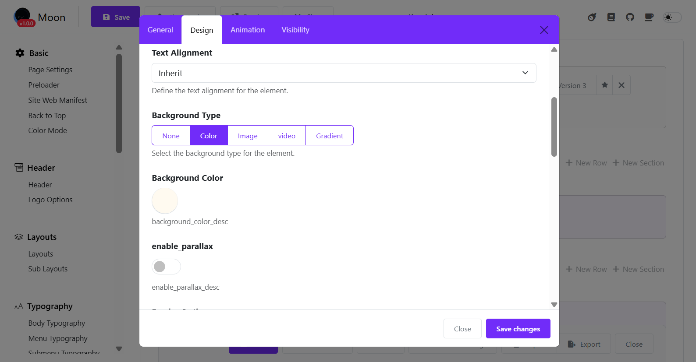
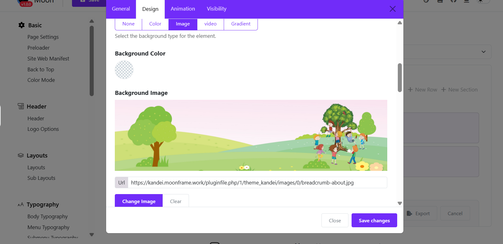

Here below is the way to change a section background image in Moon framework, not only for the Breadcrumb section, but for any other section in the layout.  

---

## 🔧 Change Background Image

### 1. Open Template Settings

* Go to **Moodle Admin → Site Administration → Appearance → Themes → Kandei Settings → Layout → Sublayout
* The **theme breadcrumb** is created using a **Sub-Layout**. This sub-layout is then inserted into the **Main Layout**, allowing you to reuse and manage the breadcrumb content easily.

---

### 2. Go to Sub-Layout Builder

* Open the **“Sub-Layout”** tab > You will see a list of prebuilt sub-layouts, and edit the Footer sub-layout. 
* You’ll see sections like:

---

### 3. Edit the Section

* Click edit the section
* Open Design Settings > Choose a background type (Color, Image, Video, or none)
* Under **Background Image** You can click **Change Image**, upload a new image or choose another background type. 

---

### 4. Configure Background

* **Background Repeat** ex: No Repeat
* **Background Size** → ex: Cover
* **Background Attachment** → ex: Fixed
* **Background Position** → ex: Center Center
* **Overlay** (optional) → Choose an overlay type (None, Color, Gradient, Pattern)

---

### 5. How the Breadcrumb Appears on the Website

* The breadcrumb **sub-layout** is linked to the **main layout**. You just need to edit the Main Layout > add the sub-layout to the footer section > Save.
* Any changes you make in the sub-layout will be automatically updated in the website footer.
* No additional setup is required.

  

